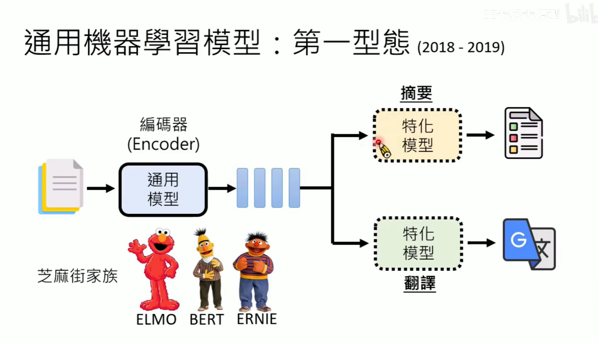

# AI Agent 李宏毅

## 1.资料

[【李宏毅】2025年公认最好的【AI Agent】教程！大模型入门到进阶，一套全解决！2025生成式人工智慧-附带课件代码_哔哩哔哩_bilibili](https://www.bilibili.com/video/BV1bbjvzME7B/?spm_id_from=333.1391.0.0&vd_source=8b69015a784e94f6a869001308d33fa5)

## 2.笔记

### 2.1 aiagent的原理

operator computer use 

world of bit

提供过去提供正确答案的经验比提供过去提供哪些是错误答案好

knowlege graph：

GraphRAG  hippoRAG

****

语言模型常用工具

search engine python other ai 使用工具叫做functioncall

当出现tool这段内容就去掉调用工具

		

使用trove latm creator craft 

模型本身的知识与外部知识的选择

现在发现ai更加倾向于想想ai同类，可能要使用ai生成的内容说服ai

新文章更加相信

并且更加相信好看的文章

planbench

可以讲刚才的思路放到模型的梦境中

### 2.2 生成式ai

claude computer use/chatgpt operator 将屏幕截图传导gpt然后移动鼠标点击

图像，语音，文本都可以拆分成token去做

类神经网络架构 Transformer Mamba

7b b–>billion

参数数量式架构的一部分，参数数值必须通过训练资料学习

类神经网路编辑

### 2.3 AI脑科学 大预言模型内在机制

