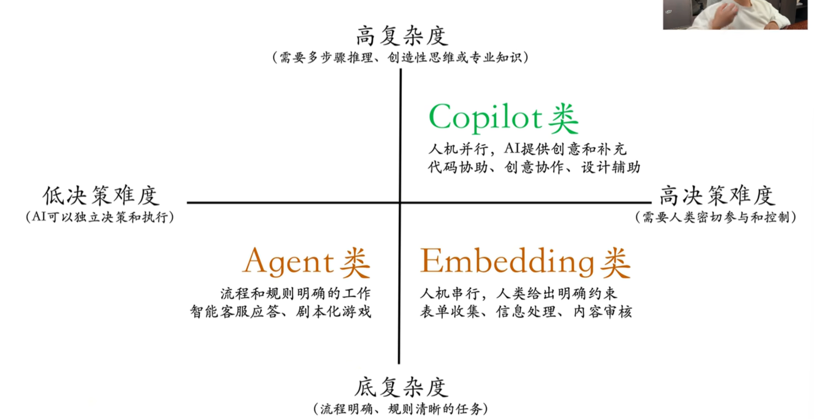
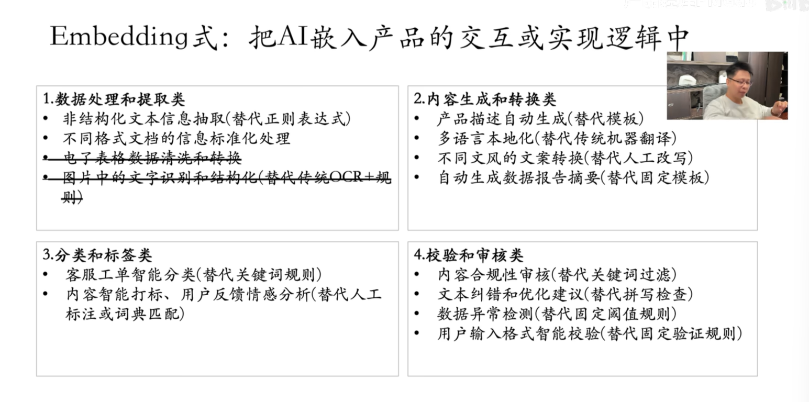
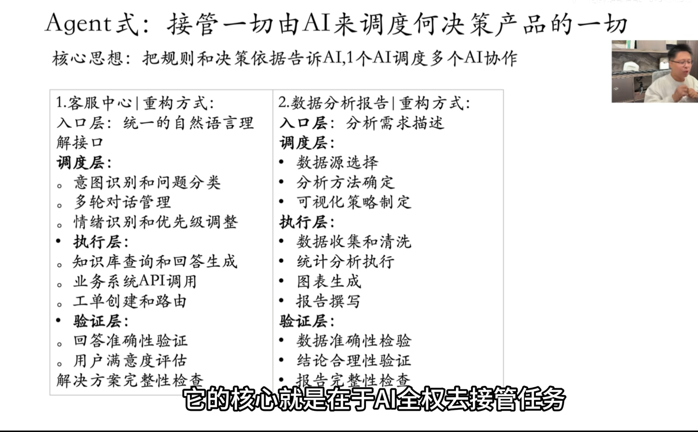
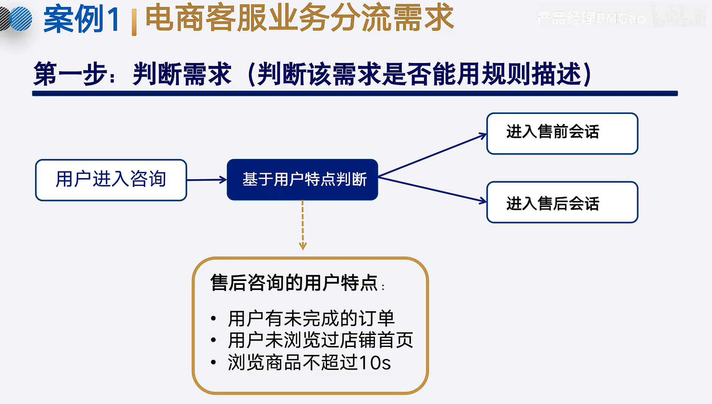
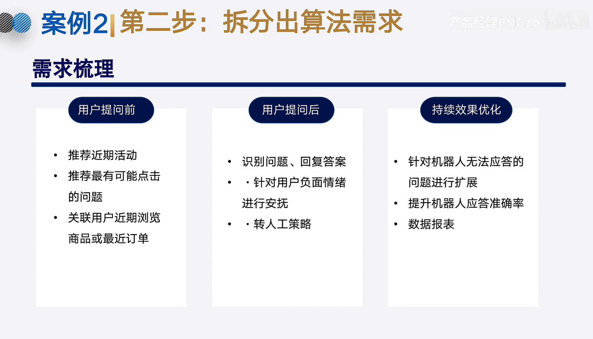
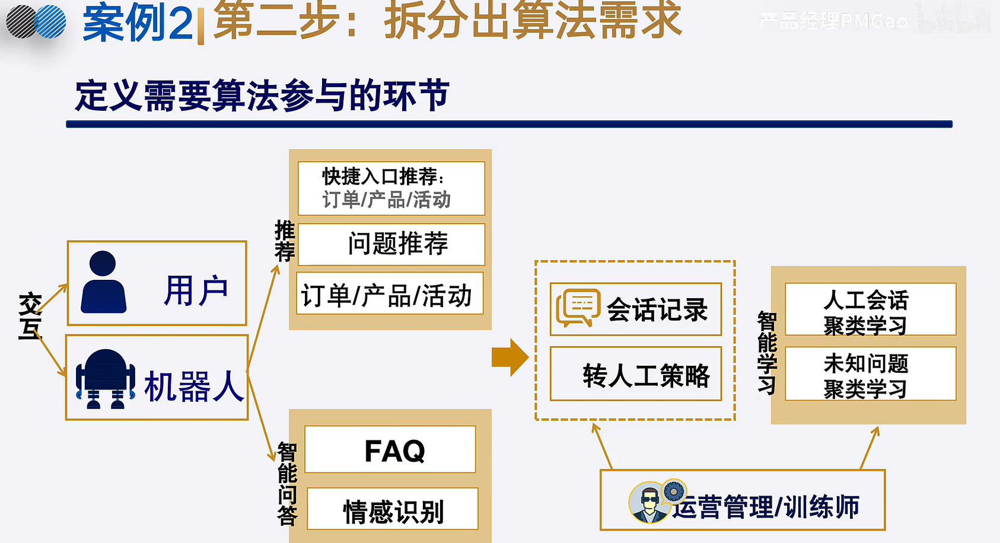
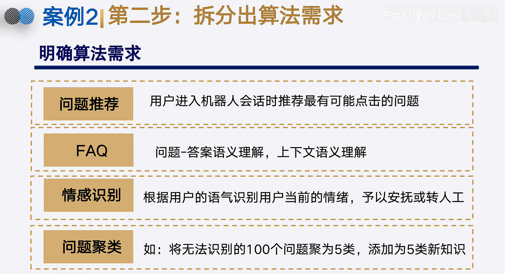
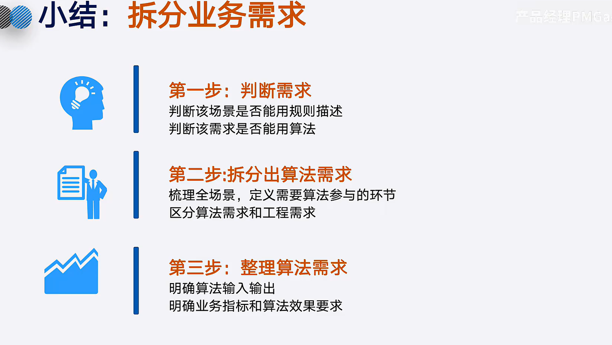
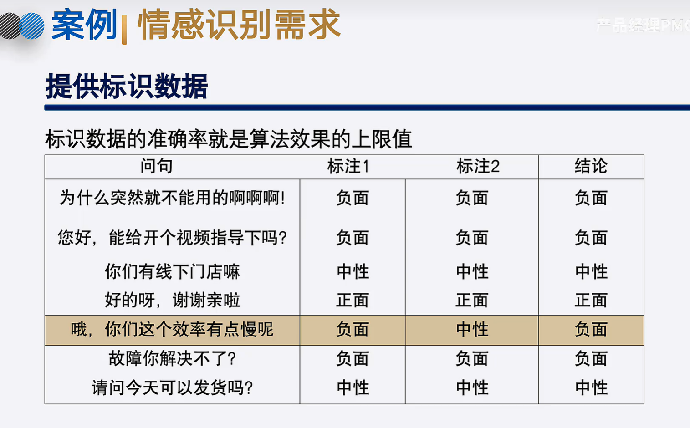
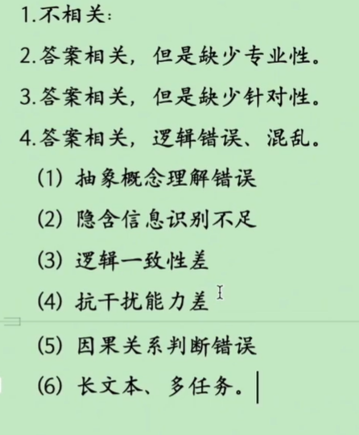

AI产品经理

如果强依赖人就使用copilot，如果可以节点替代就是用embeding，如果是固有流程是agent

## 意图分析

分析用户意图封层然后建立QA库

大模型当前回答问题

5.语气表达输出格式不合适

6.答案输出不稳定

大模型一共有两个问题

一输入信息差，那就得RAG 设计反问掌握context 设计范文

意图过于模糊复杂造成大模型难以回答，可能需要将问题拆解，解答问题需要哪些步骤

1.答案不稳定：模型参数、模型拟合、训练数据

2.逻辑推理相关：

1）逻辑推理约束性训练做到不够

2）逻辑一致性：模型上下文过长，训练数据忠，接触到了自相矛盾的说法

3）因果关系：专业领域训练不足

4）长文本跟多任务

5）抽象概念理解不足：专业领域训练不足，没有知识图谱外挂

6）抗干扰能力差：过长对话，没有根本性的解决方法，信息降噪

指令理解有问题

模型泛化能力不足

1.缺少知识：RAG

2.缺少针对性：反问模块，掌握更全的context，外挂sop

3.问题转化

prompt工程，调整输入

模型输出差一共是两个问题，一个是模型本身能力差一个是输入差

弥补能力差：

1.逻辑推理：逻辑推理引擎

2.逻辑一致性：外部记忆组件

3.因果关系：专有数据集做训练

4.长文本处理与多任务：层次化处理

5.抽象概念：知识图谱

6：抗干扰性差：天生能力，注意力机制问题了

7.预期和输出格式：微调，全参数微调太容易失败，微调不适合知识性问题

2.模型底层问题：

3.输出内容不会有太大变动只能局部调整

4.prompt工程不适合因为会浪费token有成本问题

微调使用场景：

1.文本提取：格式必须要一致，数据精准度方便下游作业，必须微调去做

2.短文本生成：评论，小红书生成，语气的生成

3.报告生成：格式要求

4.角色扮演：语气