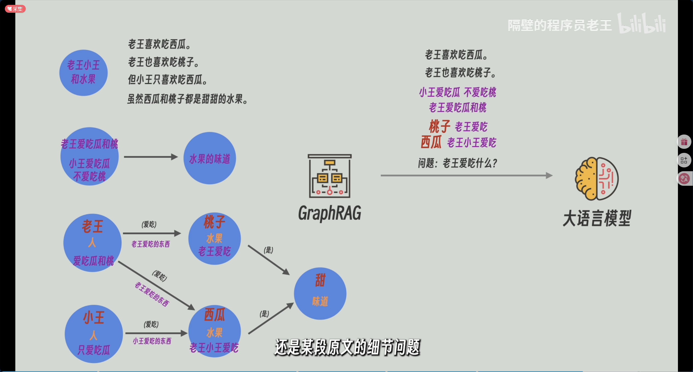
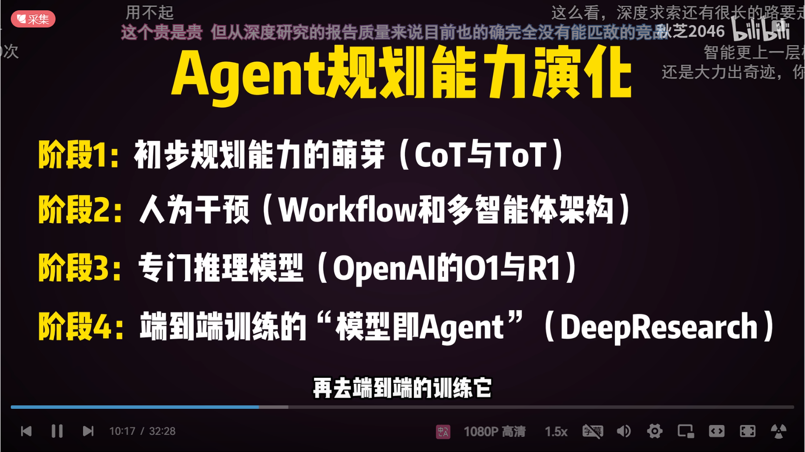
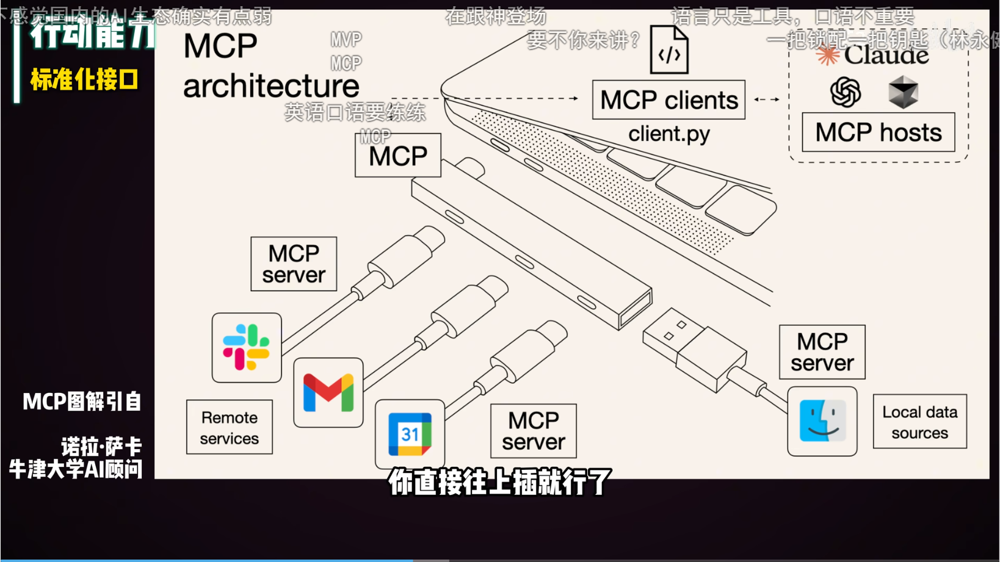
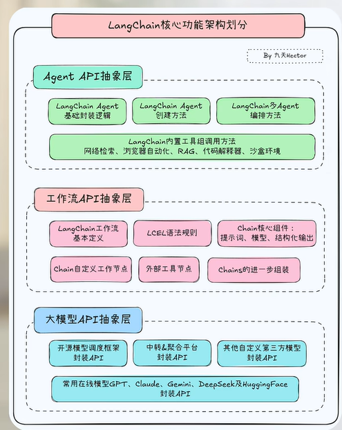
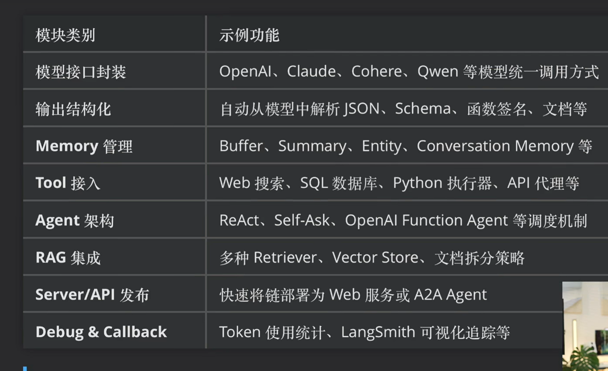
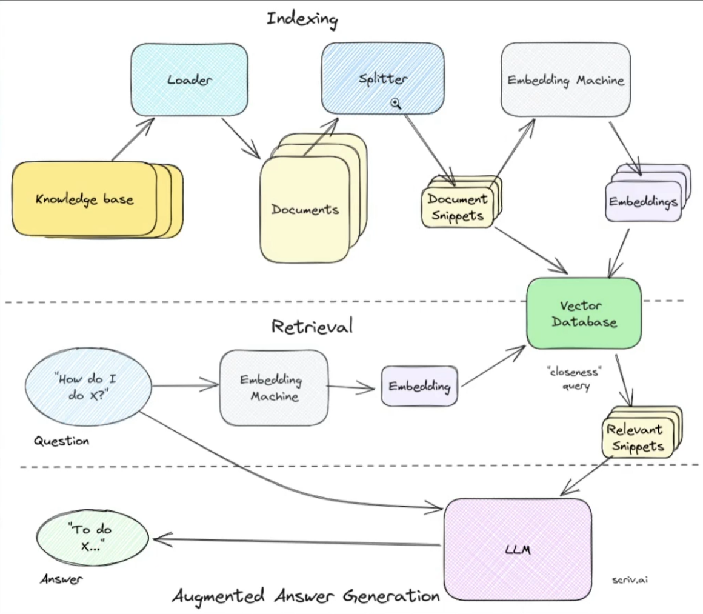

# agengt/rag/langchain应用层

## 1.资料

[【RAGFlow】全由国内镜像源搭建docker版_ragflow docker部署-CSDN博客](https://blog.csdn.net/kewaqi618/article/details/146417611)

## 2.笔记

### 2.1 Agent

agent

promote

mcp

system prompt

graphrag

local search

global search

computer use

browes use

manus 

mcp(模型上下文接口 )

紧急课程学习和面试补救

模型微调 RAG知识库 Agent智能体开发

快速封装的api组成智能体 下游工作流api

工作流的api

langsmith

### 2.2 Rag

