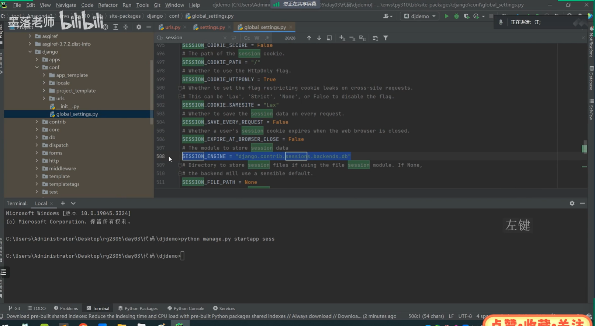

# Django+flask+fastapi

## 1.资料

[04-快速使用django展示数据_哔哩哔哩_bilibili](https://www.bilibili.com/video/BV1nNr7YZESq?spm_id_from=333.788.player.switch&vd_source=8b69015a784e94f6a869001308d33fa5&p=4)

【2025版-零基础玩转Python Django5项目实战-学完可就业】 https://www.bilibili.com/video/BV1N1421U76L/?p=5&share_source=copy_web&vd_source=b1560a316ec9a486cde3dbbfef0ffd0f

## 2.笔记

原生开发：不利用现有框架，从0开始

敏捷开发：使用框架

二次开发：

telnet curl工具

postman apifox

网络知识http协议

put和patch

OA系统开发自动化办公开发

协议升级http——>websocket

http 80端口转向https 443端口

多数情况下304有益 304使用本地缓存但是又更新情况下

阿里郎代码监控

pragma 

请求头

网页静态化 动态化

wsgi协议

****

request.GET[‘pwd’] 如果没写入会报错，速度高但是没高多少

request.GET.get(‘pwd’) 如果没写入就是none

常见的请求头

MIME查看文件content格式

url地址记录用户身份实现多个qq同时登录早期增加用户量目的

itsdangerous

base64 atob btoa

path

str在前面会覆盖调uuid

# fastapi

【黑马程序员PythonWeb开发：FastAPI从入门到实战视频教程，涵盖路由、依赖注入、Pydantic、异步编程、ORM、项目拆分、模型训练、部署、接口测试】 https://www.bilibili.com/video/BV1zV2QBtE39/?p=2&share_source=copy_web&vd_source=b1560a316ec9a486cde3dbbfef0ffd0f

直接改成docs就有测试区域

