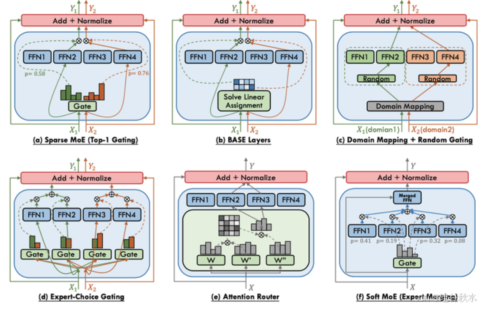
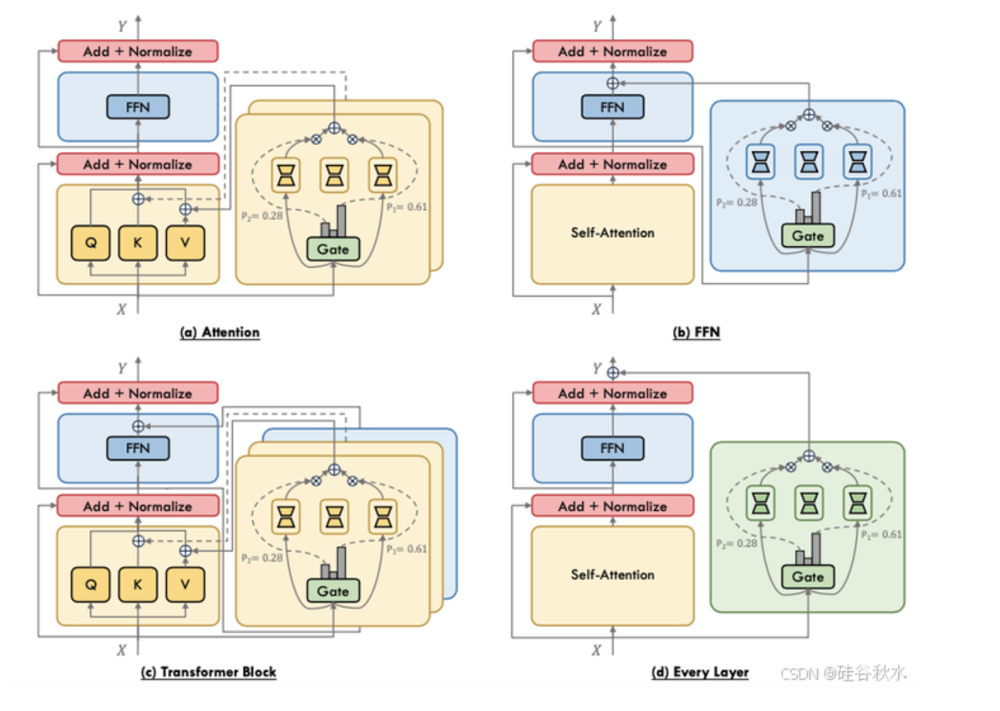
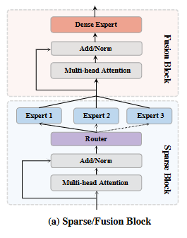

# MOE

混合专家系统，动态激活专家

其核心思想是将模型的容量分布在多个专家网络中，每个专家网络负责处理特定的子任务。MoE模型的核心组件包括路由网络和专家网络。


MoE模型的推理过程通常分为三个阶段：

1. **路由计算**：路由网络根据输入 *x* 计算每个专家的选择概率 *θ*。
2. **专家选择**：根据选择概率 θ，选择前K个专家 *E*selected。
3. **输出聚合**：选中的专家并行处理输入，并将输出通过加权聚合得到最终结果。

通过这种机制，MoE模型能够在保持大规模参数的同时，显著降低计算成本。

[专家混合模型（MOE）推理优化技术全景：从模型到硬件的深度解析 - 知乎](https://zhuanlan.zhihu.com/p/18788701543#:~:text=模型级优化旨在通过改进模型架构、参数优化和算法设计，提升MoE模型的推理效率。 具体包括以下几个方面：,MoE模型的核心组件是注意力机制和前馈网络（FFN）。 为了提高MoE模型的效率，研究人员提出了多种改进方案。 除了在FFN模块中应用MoE结构，当前研究还探索了如何在Attention模块中引入MoE以提升性能。)

[万字长文！小白也能懂的混合专家模型（MoE）深度解析-CSDN博客](https://blog.csdn.net/Python_cocola/article/details/145214265)

任务专一性 每个专家关注点不同

架构

**改进门控网络训练方式**

**动态负载均衡策略**

**专家容量限制**

**引入多头机制与混合架构**

# 专家混合系统MoE的综述

https://blog.csdn.net/yorkhunter/article/details/140399747


v-MOE SWIN-MOE soft-moe

MOE分成致密和稀疏两种

(a) 致密 MoE， 或 top-𝑘 专家，即 (b) 稀疏 MoE 来执行条件计算。


四个优点

1）灵活可扩展. 根据问题的复杂度灵活设置专

家数量、专家规模，甚至专家架构，MoE 模型规模可

以很容易扩展至万亿级别.

2）低计算开销. 专家稀疏激活机制保证了 MoE

模型的计算复杂度随模型规模的扩展而次线性增

加，与同等规模的传统稠密模型相比，计算开销显著

降低.

3）强专业能力. 门控网络能够准确捕获输入样

本的特征差异，进而分配给相应专家处理，通过对特

定数据的针对性训练，专家强化对特定领域任务的

预测能力，展现出高度的专业性.

4）强泛化性. 路由机制根据输入样本动态激活

专家，组合多个专家预测结果，修正专家预测偏差，

提高了模型的泛化能力和可靠性.

缺点：

内存占用大、通信延迟高、计算效率低和

扩展困难的关键性能问题


稀疏门控

topk 

专家网络 动态门控机制

门控 路由器路由函数



稀疏 MoE 的基本离散优化挑战

与密集 MoE 类似，软 MoE 方法利用所有专家来处理每个输入来保持完全可微分性，从而避免了离散专家选择固有的问题。将软 MoE 与密集 MoE 区分开来，可突出输入tokens或专家的门控加权合并，减轻计算需求的特征。

==但是，共享专家配置虽然在 NLP 任务中有效，但在视觉任务中却没有表现出同等程度的增强。==

DeepSpeed-MoE  Residual-MoE

它组合密集 FFN 和 MoE 层的输出。这种将固定 FFN 与稀疏 MoE 相结合的范式通常称为共享专家，

 DeepSeekMoE [30] 和 Qwen1.5-MoE [151] 不使用单个共享专家，而是使用多个共享专家，因为它们具有细粒度的专家分段设计。




MoPE 充分利用了这两个领域的优点：MoE 的任务灵活度和 PEFT 的资源高效 [88]

根据 MoPE 在 Transformer 模型架构中的位置对其进行分类，如图所示：

(a) 在注意机制中K-V模块和MoPE的集成；

 (b) MoPE 在 FFN的应用；

© 指 MoPE 在 Transformer 块级的集成, 其中两个不同的专家组应用于注意和 FFN, 不同专家组一起分派给注意和 FFN, 每个由门控机制调节； 

(d) 显示一个逐层 MoPE 集成, 其中每个 Transformer 层看作是一个在专家之间带一个编排操作的门控统一个体。


# 混合专家模型（MoE）：前沿改进方向全解析

[混合专家模型（MoE）：前沿改进方向全解析_reinforcemoe模型-CSDN博客](https://blog.csdn.net/sinat_37574187/article/details/146222643)

专家网络创新

轻量化专家网络

**SoftTop-k ** 稀疏性约束


**LARS（Layer-wise Adaptive Rate Scaling）优化器**通过为每一层设置不同的学习率，能够更好地适应不同层次的参数更新需求。

用强化学习门控机制的  动态路由机制的 MoE 模型在

**Lookahead优化器**通过引入双时间尺度的参数更新机制，能够有效避免局部最优解，提高模型的全局收敛性能。


**Expert Dropout**

MoE 层由两个核心部分组成: 一个门控网络和若干数量的专家。


**[Uni-Perceiver：迈向通用人工智能的通才模型 - 知乎](https://zhuanlan.zhihu.com/p/588073017)**

Uni-Perceiver-MoE能够比不带有MoE的Uni-Perceiver表现普遍要好，从而验证了==**引入MoE的必要性和有效性**== 。

# 一文带你详细了解：大模型MoE架构（含DeepSeek MoE详解）

[一文带你详细了解：大模型MoE架构（含DeepSeek MoE详解） - 知乎](https://zhuanlan.zhihu.com/p/31145348325)

**zero-shot 推理**

多分类 类别减小验证多分类假说

switch transformer

1. 专家容量 

2. 负载均衡损失
3. 模型稳定性

对于每个 Switch 层的辅助损失被添加到总模型损失中

这种损失鼓励均匀路由，并可以使用超参数进行加权。

当专家和门控网络都使用 `bfloat16` 精度训练时，出现了不稳定的训练现象。这种不稳定性特别是由路由计算引起的，==因为路由涉及指数函数等操作，这些操作对精度要求较高。因此，为了保持计算的稳定性和精确性，保持更高的精度是重要的==。

==**为了减轻不稳定性，路由过程也使用了全精度**== 。

稀疏模型更易于出现过拟合现象，因此在处理这些模型时，尝试更强的内部正则化措施是有益的，==比如使用更高比例的 dropout。== 


微调moe的问题

 **MoE 模型可能从指令式微调中获益更多，甚至超过了稠密模型**。此外，MoE 在多任务学习中表现更佳。==与之前关闭 **辅助损失** 函数的做法相反，实际上这种损失函数可以帮助防止过拟合。==


deepseek moe 架构

引入部分共享专家

减少不同专家间的知识冗余，提升计算效率；所有 tokens 都会经过的共享专家，每个 token 会用计算的 Router 权重，来选择 topK 个专家，然后和共享的专家的输出一起加权求和。

共享专家：

1 个共享专家，用于捕捉**通用**、全局的特征信息。

路由专家（Routed Experts）：每个 MoE 层都包含 256 个路由专家，负责精细化处理输入 tokens 的专业特征。


专门的gate网络 计算token与各路由钻甲之间的PP得分

**1、计算 tokens 和专家的匹配得分**

- Gate 网络通过**线性变换**计算每个 token 与所有路由专家的兼容性得分。得分可以反映 token 和各专家“契合”的程度。

**2、选择 Top-K 专家**

- 基于得分，Gate 网络为每个 token 选择 `Top-K` 个最合适的路由专家。在 DeepSeek‐V3 中，每个 token 通常选择 8 个路由专家（在一些实现中还可能对跨节点路由做限制，如最多路由到 4 个不同节点），从而只激活极少数专家进行计算。

**3、专家处理与加权聚合**

- 被选中的专家各自对 token 进行独立处理（专家实际上是小型 FFN 模块，类似于 Transformer 中的 FFN 模块），并产生各自的输出。然后，**这些专家的输出会根据 Gate 网络给出的得分权重进行加权聚合**，最后再和共享专家的输出进行融合，形成当前 MoE 层的最终输出表示。

==**这些专家的输出会根据 Gate 网络给出的得分权重进行加权聚合**==

==**注意**: 直接比较稀疏模型和稠密模型的参数数量是不恰当的，因为这两类模型基于的概念和参数量的计算方法完全不同。== 

让我们简要回顾一下并行计算的几种形式:

- **数据并行**: 相同的权重在所有节点上复制，数据在节点之间分割。
- **模型并行**: 模型在节点之间分割，相同的数据在所有节点上复制。
- **模型和数据并行**: 我们可以在节点之间同时分割模型和数据。注意，不同的节点处理不同批次的数据。
- **专家并行**: 专家被放置在不同的节点上。如果与数据并行结合，每个节点拥有不同的专家，数据在所有节点之间分割。


# 万字长文！小白也能懂的混合专家模型（MoE）深度解析

[万字长文！小白也能懂的混合专家模型（MoE）深度解析 - 知乎](https://zhuanlan.zhihu.com/p/30120875938)

**专家网络聚合**

**任务级别路由**

**预先蒸馏实验**

专家权重调整的方法

**门控网络的优化难题**

专家负载不均衡

1. expert

专家通常采用前馈神经网络（Feed-Forward Neural Network, FFN）的结构。每层后通常会跟一个非线性激活函数，如ReLU（Rectified Linear Unit）或GELU（Gaussian Error Linear Unit），以增加模型的非线性表达能力。

路由器（Router）设计

**动态负载均衡策略**

在线学习算法，门控网络可根据当前批次数据的分布和专家的性能反馈，实时更新专家权重分配，使负载更适应数据变化。

引入反馈机制，让专家根据自身处理难度和资源占用情况，向门控网络反馈调整信号，动态优化负载。

Lory方法

动态路由策略

将门控模型和专家模型分开训练的方法

指令调优

多任务学习能力

st-moe 设计类rooter 2024年三月

## [MoE 系列超详细解读 (一)：Soft MoE：一种完全可微的稀疏 Transformer](https://zhuanlan.zhihu.com/p/650894166)

MH-MoE

DeepSeekMoE

AdvMoE


# modsqud  

基于 Transformer 的多任务学习 (MTL) 架构 [36] 已被探索，并已显示出优于基于 CNN 的模型的优势。

每个 MoE 模块构建模型的最小部分，可将其分配给所有任务的子集（而非所有任务）。因此，我们的模型在创建合作和专业化方面非常灵活。

一些研究使用 MoE 技术训练视觉 [29, 35] 或多模态应用 [26] 中的大型模型

MViT [18] 使用 MoE 技术设计了一种在训练过程中计算效率高的多任务学习模型。

尽管 MViT [18] 也在其方法中采用了 MoE，但其模型中的专家在所有任务之间共享，无法针对特定任务进行专业化。

专家可以采用任何网络结构（例如，MLP 或注意力网络 [40]），以便我们整合高级模型设计。

许多先前的 MoE 研究 [29, 31, 40] 使用负载平衡损失，促使专家的使用频率（跨所有任务和批次）高度相似。一些 MoE 方法 [18, 26] 在多任务场景下，在每个任务的前向传播之后直接应用此损失，以便每个任务均匀地使用所有专家。然而，这种方法可能会迫使专家在学习梯度相互抵消的冲突任务上设置参数。换句话说，虽然专家可能因在某些任务对之间共享而受益，但被迫在其他任务对之间共享可能会受到损害。这解释了在这种专家平衡损失下训练多任务模型的困难。


添加了一个损失项来最大化专家和任务之间的相互信息。这会导致专家和任务之间产生强依赖关系，每个任务都与一小部分专家密切相关，反之亦然。


这些研究通常侧重于将前馈网络层与 MoE 相结合，或开发更好的路由策略 [16, 27]。MoA [40] 提出了一个新模块，将注意力网络与 MoE 相结合，

## moe论文集

https://deepshare.feishu.cn/wiki/V7KYwxlVuicQa3kjFKtcQGZqnch


----

## **MoE**算法

1. Patch-level Routing in Mixture-of-Experts is Provably Sample-efficient for Convolutional Neural Networks [[ICML 2023\]](https://arxiv.org/abs/2306.04073)
2. Robust Mixture-of-Expert Training for Convolutional Neural Networks [[ICCV 2023\]](https://arxiv.org/abs/2308.10110v1)
3. Brainformers: Trading Simplicity for Efficiency [[ICML 2023\]](https://arxiv.org/abs/2306.00008)
4. Switch Transformers: Scaling to Trillion Parameter Models with Simple and Efficient Sparsity [[JMLR'22\]](https://arxiv.org/abs/2101.03961)
5. Sparse Fusion Mixture-of-Experts are Domain Generalizable Learners [[8 Jun 2022\]](https://arxiv.org/pdf/2206.04046v2.pdf)
6. On the Representation Collapse of Sparse Mixture of Experts [[NeurIPS 2022\]](https://arxiv.org/abs/2204.09179)
7. Taming Sparsely Activated Transformer with Stochastic Experts [[ICLR 2022\]](https://arxiv.org/abs/2110.04260)
8. **Go Wider Instead of Deeper**[[pdf\]](https://arxiv.org/abs/2107.11817) AAAI 2022
9. **StableMoE: Stable Routing Strategy for Mixture of Experts**[[pdf\]](https://arxiv.org/abs/2204.08396)[[code\]](https://github.com/Hunter-DDM/stablemoe) ACL 2022
10. **Unified Scaling Laws for Routed Language Models**[[pdf\]](https://arxiv.org/abs/2202.01169) ICML 2022
11. **Uni-Perceiver-MoE: Learning** **Sparse** **Generalist Models with Conditional MoEs**[[pdf\]](https://arxiv.org/abs/2206.04674#)[[code\]](https://github.com/fundamentalvision/Uni-Perceiver) NeurIPS 2022
12. **A Theoretical View on Sparsely Activated Networks**[[pdf\]](https://dynn-icml2022.github.io/spapers/paper_4.pdf)[[poster\]](https://dynn-icml2022.github.io/sposters/paper_4.pdf) ICML 2022 Workshop
13. **Designing Effective Sparse Expert Models**[[pdf\]](https://arxiv.org/abs/2202.08906) arXiv 2022
14. **Mixture-of-Experts with Expert Choice Routing**[[pdf\]](https://arxiv.org/abs/2202.09368) arXiv 2022
15. **Parameter-Efficient Mixture-of-Experts Architecture for Pre-trained Language Models**[[pdf\]](https://arxiv.org/abs/2203.01104) arXiv 2022
16. **A Review of** **Sparse** **Expert Models in** **Deep Learning**[[pdf\]](https://arxiv.org/abs/2204.09179) arXiv 2022
17. **EvoMoE: An Evolutional Mixture-of-Experts Training Framework via Dense-To-Sparse Gate**[[pdf\]](https://arxiv.org/abs/2112.14397)
18. **muNet: Evolving Pretrained Deep** **Neural Networks** **into Scalable Auto-tuning Multitask Systems**[[pdf\]](https://arxiv.org/abs/2205.10937) arXiv 2022
19. **Multimodal Contrastive Learning with LIMoE: the Language-Image Mixture of Experts**[[pdf\]](https://arxiv.org/abs/2206.02770) arXiv 2022
20. **ST-MoE: Designing Stable and Transferable** **Sparse** **Expert Models**[[pdf\]](https://arxiv.org/abs/2202.08906) arXiv 2022
21. MoEC: Mixture of Expert Clusters [[19 Jul 2022\]](https://arxiv.org/abs/2207.09094)
22. No Language Left Behind: Scaling Human-Centered Machine Translation [[6 Jul 2022\]](https://research.facebook.com/publications/no-language-left-behind/)
23. Patcher: Patch Transformers with Mixture of Experts for Precise Medical Image Segmentation [[5 Jun 2022\]](https://arxiv.org/abs/2206.01741)
24. Interpretable Mixture of Experts for Structured Data [[5 Jun 2022\]](https://arxiv.org/abs/2206.02107)
25. Task-Specific Expert Pruning for Sparse Mixture-of-Experts [[1 Jun 2022\]](https://arxiv.org/abs/2206.00277)
26. Gating Dropout: Communication-efficient Regularization for Sparsely Activated Transformers [[28 May 2022\]](https://arxiv.org/abs/2205.14336)
27. AdaMix: Mixture-of-Adapter for Parameter-efficient Tuning of Large Language Models [[24 May 2022\]](https://arxiv.org/abs/2205.12399)
28. Sparse Mixers: Combining MoE and Mixing to build a more efficient BERT [[24 May 2022\]](https://arxiv.org/abs/2205.12399)
29. One Model, Multiple Modalities: A Sparsely Activated Approach for Text, Sound, Image, Video and Code [[12 May 2022\]](https://arxiv.org/abs/2205.06126)
30. SkillNet-NLG: General-Purpose Natural Language Generation with a Sparsely Activated Approach [[26 Apr 2022\]](https://arxiv.org/abs/2204.12184)
31. Residual Mixture of Experts [[20 Apr 2022\]](https://arxiv.org/abs/2204.09636)
32. Sparsely Activated Mixture-of-Experts are Robust Multi-Task Learners [[16 Apr 2022\]](https://arxiv.org/abs/2204.07689)
33. MoEBERT: from BERT to Mixture-of-Experts via Importance-Guided Adaptation [[15 Apr 2022\]](https://arxiv.org/abs/2204.07675)
34. Mixture-of-experts VAEs can disregard variation in surjective multimodal data [[11 Apr 2022\]](https://arxiv.org/abs/2204.05229)
35. Efficient Language Modeling with Sparse all-MLP [[14 Mar 2022\]](https://arxiv.org/abs/2203.06850)
36. Using DeepSpeed and Megatron to Train Megatron-Turing NLG 530B, A Large-Scale Generative Language Model [[28 Jan 2022\]](https://arxiv.org/abs/2201.11990)
37. One Student Knows All Experts Know: From Sparse to Dense [[26 Jan 2022\]](https://arxiv.org/abs/2201.10890)

## **MoE系统**

1. **DeepSpeed-MoE: Advancing Mixture-of-Experts Inference and Training to Power Next-Generation** **AI** **Scale** [[pdf](https://arxiv.org/abs/2201.05596)] arXiv 2022
2. FasterMoE: modeling and optimizing training of large-scale dynamic pre-trained models[[PPoPP2022\]](https://dlnext.acm.org/doi/pdf/10.1145/3503221.3508418)
3. **HetuMoE: An Efficient Trillion-scale Mixture-of-Expert Distributed Training System**[[pdf\]](https://arxiv.org/abs/2203.14685) arXiv 2022
4. **Tutel: Adaptive Mixture-of-Experts at Scale**[[pdf\]](https://arxiv.org/abs/2206.03382) arXiv 2022
5. Alpa: Automating Inter- and Intra-Operator Parallelism for Distributed Deep Learning [[OSDI2022\]](https://arxiv.org/abs/2201.12023)
6. BaGuaLu: Targeting Brain Scale Pretrained Models with over 37 Million Cores [[PPoPP2022\]](http://keg.cs.tsinghua.edu.cn/jietang/publications/PPOPP22-Ma et al.-BaGuaLu Targeting Brain Scale Pretrained Models w.pdf)
7. MegaBlocks: Efficient Sparse Training with Mixture-of-Experts [[29 Nov 2022\]](https://arxiv.org/abs/2211.15841)
8. SE-MoE: A Scalable and Efficient Mixture-of-Experts Distributed Training and Inference System [[20 Mar 2022\]](https://arxiv.org/abs/2205.10034)

## **MoE应用**

1. SCoMoE: Efficient Mixtures of Experts with Structured Communication [[ 2023 paper \]](https://openreview.net/forum?id=s-c96mSU0u5)
2. Switch-NeRF: Learning Scene Decomposition with Mixture of Experts for Large-scale Neural Radiance Fields [[02 Feb 2023\]](https://openreview.net/forum?id=PQ2zoIZqvm)
3. Spatial Mixture-of-Experts [[24 Nov 2022\]](https://arxiv.org/abs/2211.13491)
4. A Mixture-of-Expert Approach to RL-based Dialogue Management [[31 May 2022\]](https://arxiv.org/abs/2206.00059)
5. Pluralistic Image Completion with Probabilistic Mixture-of-Experts [[18 May 2022\]](https://arxiv.org/abs/2205.09086)
6. ST-ExpertNet: A Deep Expert Framework for Traffic Prediction [[5 May 2022\]](https://arxiv.org/abs/2205.07851)
7. Build a Robust QA System with Transformer-based Mixture of Experts [[20 Mar 2022\]](https://arxiv.org/abs/2204.09598)
8. Mixture of Experts for Biomedical Question Answering [[15 Apr 2022\]](https://arxiv.org/abs/2204.07469)
9. **Learning Large-scale Universal User Representation with Sparse Mixture of Experts**[[pdf\]](https://arxiv.org/abs/2207.04648) ICML 2022

----


### SCOMOE: EFFICIENT MIXTURES OF EXPERTS WITH STRUCTURED COMMUNICATION
为了降低通信成本

通信拓扑的分层架构

组内专家对 token 的分配分数来为通信组选择 token。

witch Transformer (Fedus 等人，2021) 将 Gshard 的 top-1 路由替换为 top-2 路由


已经提出了多种新型路由器来替代 GShard 中的 Top-2 路由器，例如哈希路由器 (Roller 等人，2021)、随机路由器 (Zuo 等人，2021) 和平衡路由器 (Lewis 等人，2021)。我们采用 BASE 层 (Lewis 等人，2021) 提出的平衡路由器进行代币聚类。平衡路由器使用拍卖算法 (Bertsekas，1992) 进行平衡路由。


任务级路由（Zhou et al., 2022）提取专家子集进行推理，从而提高了推理效率，但仅适用于多语言/多任务 MoE，并且提取的子模型只能进行单向翻译。

==可以在moe层前加几个共享层==

### Patch-level Routing in Mixture-of-Experts is Provably Sample-efficient for Convolutional Neural Networks
我们首次证明 pMoE 可以证明将实现理想泛化所需的训练样本数量（称为样本复杂度）减少了 n/l 多项式阶的一个因子，并且优于具有相同甚至更大容量的单专家对应方法。


但在理论上仍存在诸多问题：为什么 MoE 能够在显著降低计算量的同时保持测试准确率？据我们所知，只有 Chen 等人 (2022) 的一项近期研究从理论上证明了，在对来自线性可分聚类的数据进行二分类任务的特殊设置中，传统的样本级 MoE 比卷积神经网络 (CNN) 实现了更高的测试准确率。


Chen 等人 (2022) 的样本级分析并未扩展到块级 MoE，后者采用了与传统 MoE 不同的路由策略，并且其数据模型可能无法表征某些实际数据集。本文从理论上探讨了以下问题：


分析表明，以双层 CNN 作为专家的 pMoE 可以实现与传统 CNN 相同的泛化性能，同时降低样本复杂度（学习合适模型所需的训练样本数量）和模型复杂度。具体而言，我们证明，只要 l 大于某个阈值，pMoE 就能将样本复杂度和模型复杂度降低一个因子。


选择固定数量的块。本文分析了联合训练和单独训练设置下采用专家选择路由的稀疏块级 MoE。

本文首次对块级 MoE 进行了理论分析，并定量证明了其与单专家 MoE 相比在样本复杂度和模型规模方面的节省。尽管我们的理论洞见主要集中在使用混合双层 CNN 的分类任务上，但我们已在深度架构和多个数据集上进行了实证验证。未来的研究方向包括分析其他 MoE 架构，例如 Vision Transformer (ViT) 中的 MoE，并将 MoE 与其他稀疏化方法相结合，以进一步降低计算量

### Robust Mixture-of-Expert Training for Convolutional Neural Networks

尽管 MoE 越来越受欢迎，但很少有工作研究其推进卷积神经网络 （CNN） 的潜力，尤其是在对抗鲁棒性层面。

由于缺乏稳健性已成为 CNN 的主要障碍之一

路由器和专家在普通 AT 中很难相互适应。因此，我们提出了一种新的路由器专家交替对抗性 MoE 训练框架，称为 AME。

在视觉领域，绝大多数现有工作都集中在 ViT 的 MoE 设计上 [9–15， 40， 42， 43]

AME：路由器专家通过双层优化视角交替 AT。

我们通过双层优化 （BLO） 开发了一个新的 AT 框架。通常，BLO 提供了一个分层学习框架，其中包含两个级别的优化任务，其中上层问题的目标和变量取决于下层问题的优化器。然后，BLO 使我们能够显式地对 AT for Routers 和 AT for MoE 网络之间的耦合进行建模。


### Brainformers: Trading Simplicity for Efficiency

Transformer 拥有基本统一的主干结构，其中各层在前馈和自注意力机制之间交替，从而构建深度网络。本文，我们研究了这种设计选择，发现更复杂的模块，如果层原语的排列方式不同，效率会更高。


我们开发了一个名为 Brainformer 的复杂模块，它由多种层组成，例如稀疏门控前馈层、密集前馈层、注意力层以及各种形式的层归一化和激活函数。

EfficientNet (Tan & Le, 2019) 中的逐层架构堆叠以及三明治 Transformer (Press et al., 2019) 中的层重排机制相呼应，我们提出了一种具有稀疏性的非均匀架构


我们通过允许搜索空间以不同的顺序组成不同的子层来权衡架构的规则性。为了获得更好的扩展性，我们在搜索空间中引入了稀疏门控前馈层（MoE 层），并结合了不同的门控机制。

EfficientNet 代表了非常早期的非均匀架构之一，它利用层异构性来实现 SoTA。

## Switch Transformers: Scaling to Trillion Parameter Models with Simple and Efficient Sparsity
我们在一系列不同的自然语言任务以及 NLP 的三种模式（预训练、微调和多任务训练）

交换层的优势有三方面：(1) 由于我们只将一个令牌路由给一位专家，因此路由器的计算量减少了。(2) 由于每个令牌只路由给一位专家，因此每位专家的批量大小（专家容量）可以至少减半。(3) 简化了路由实现，降低了通信成本。图 3 展示了一个具有不同专家容量因子的路由示例。设备 0

于许多微调任务的样本非常少，因此自然会出现过拟合问题。在标准 Transformer 的微调过程中，Raffel 等人 (2019) 在每一层都使用了 dropout（Srivastava 等人，2014）来防止过拟合。


我们提出了一种简单的方法来缓解微调过程中的这个问题：增加专家模型内部的 dropout，我们将其称为专家 dropout


在微调过程中，我们只需在每个专家层的临时前馈计算中大幅提高 dropout 率即可。

然而，在非专家层设置较小的 dropout 率（0.1），在专家层设置较大的 dropout 率（0.4），可以提升四个较小的下游任务的性能。

## Sparse Fusion Mixture-of-Experts are Domain Generalizable Learners

我们提出了稀疏融合混合专家 (SF-MoE) 模型，它将稀疏性和融合机制融入 MoE 框架，使模型兼具稀疏性和预测性。SF-MoE 包含两个专用模块：1) 稀疏模块和 2) 融合模块，分别用于解开和聚合物体的各种学习信号。

目前尚无研究稀疏 MoE 的工作机制并将其与深度梯度下降 (DG) 相结合的文献。

本文揭示了混合专家 (MoE) 模型在分布式图谱 (DG) 上的泛化能力


稀疏块由多头注意力 (MHA) 层和混合专家 (MoE) 层组成。MHA 层专注于稀疏信号，并在特征块（特征子集）之间构建自注意力机制

MoE 层通过将特征块分配给不同的专家，进一步解耦学习到的注意力机制。稀疏块以网格化的方式工作

我们引入一个融合模块，它由一个 MHA 层和一个密集前馈网络 (FFN) 层组成。密集前馈网络学习整合不同块之间的位置信息，并转换来自 MHA 层的稀疏信号。 



我们从 ViT 模型（见 2.1 节）入手，并重点指出标准多头注意力机制通常会产生冗余注意力头这一缺点。因此，我们提出了 SF-MoE，其中稀疏块（见 2.2 节）鼓励注意力头关注层内更多样化的特征，而融合块（见 2.3 节）则鼓励不同注意力头整合不同的注意力机制。SF-MoE 可以进一步利用卷积特征来提升性能

==多头注意力机制可以理解为通过集成多个注意力头来共同关注多个位置，每个注意力头专注于其在所有块之间的特定注意力关系。这也揭示了多头注意力机制的内在协作机制。==

多头注意力层可能会学习到冗余的键/查询投影，即一些注意力头可能会关注输入空间中的相似特征。

==这表明一些注意力头会关注相同的内容，但彼此之间是不可知的。==

为了避免头部冗余并提高网络稀疏性，我们在多头注意（MHA）层之后引入了一个混合专家（MoE）层，并将其命名为稀疏块。

稀疏块旨在利用不同的专家来模拟不同图像信号之间的关系，而不是明确地捕获领域不变/特定于领域的信息。

在稀疏块中，MoE 层利用路由网络来学习补丁与专家之间的亲和性。理论上，学习到的路由网络应该将相同或相关的补丁分配给同一位专家。

==。参数化程度不足可能会导致负载平衡的辅助损失较大，但路由效率会降低。这将使训练更具挑战性，因为不同层中的专家越多，需要更多与每位专家合理平衡的训练数据 [41]。==

多头注意力机制和稀疏/融合模块的主要元素是多层感知器 (MLP)，它们可以提高信息的利用率，但同时也会增加计算成本。一种自然的变体 [16] 被提出，将 CNN [39] 融入 Transformer 架构。我们采用了这种设计，并引入 ResNet [26] 主干用于图像块嵌入。ResNet 图像块嵌入层会提取出比原始 16×16 图像块嵌入小得多的特征图，同时仍然保留了局部信息 [31]。由于自然图像中包含像素之间的冗余信息，这一特性对深度图 (DG) 任务产生了积极的影响。

##  On the Representation Collapse of Sparse Mixture of Experts
然而，学习这种路由机制会促使令牌围绕专家质心聚集，从而导致表征崩溃的趋势。本文提出在低维超球面上估计令牌与专家之间的路由得分。

==扩展模型容量已被证明是一种有效提升性能的途径==

SMoE 通过构建多个稀疏激活神经网络来提升模型容量。


SMoE 模型在各种任务上都取得了优于密集模型的性能，包括机器翻译 (Lepikhin et al., 2021)、图像分类 (Riquelme et al., 2021) 和语音识别 (Kumatani et al., 2021)。路由机制在 SMoE 模型中起着重要作用。给定一个输入 token，路由器会测量每个 token 与专家之间的相似度得分。然后，我们根据路由得分将 token 分配给最匹配的专家。


我们指出了稀疏混合专家模型中的表示崩溃问题，这在以前的工作中尚未得到充分探索。


我们建议在低维超球面上估计标记和专家之间的路由分数，以减轻表示崩溃。


我们考虑将 SMoE 用于 Transformer，其中 SMoE 层插入到相邻的 Transformer 块中。每个 SMoE 层由一个路由器和多个专家网络组成。借鉴大多数先前的研究 (Fedus et al., 2021)，我们使用前馈网络作为专家网络，而不是自注意力模块。


我们在实验中考虑了两种基线。(1) Dense 是一种不包含稀疏激活模块的密集 Transformer 编码器。(2) SMoE 是我们对 Switch Transformers (Fedus 等人，2021) 的实现。SMoE 基线的构建设置与 X-ME 相同。除了其原始的 softmax 门控实现之外，我们还实现了 Switch Transformers 的 S 型门控 (Lewis 等人，2021；Dai 等人，2022) 变体作为基线方法。需要注意的是，为了公平起见，基线模型使用与 X-ME 相同的训练数据进行预训练。


然而，SMoE的路由机制可能导致表示崩塌（representation collapse），从而限制模型的表达能力。

提出了一种创新的路由算法（X-MoE），有效缓解表示崩塌并提升模型性能


传统SMoE的路由机制通过点积相似度将输入token分配给专家，导致token表示倾向于聚集在专家嵌入的线性子空间中。这种聚集使得表示维度从高维（R d \mathbb{R}^dR 
d
 ）坍缩到低维（R N \mathbb{R}^NR 
N
 ，N ≪ d N \ll dN≪d），限制了Transformer的表达能力，特别是在专家分配不均时。


**提出低维超球面路由算法（X-MoE）**

维度降低（Dimension Reduction）：将token表示和专家嵌入投影到低维空间，适配MoE路由的低秩特性。
L 2 L_2L 
2

 归一化（L 2 L_2L 
2

  Normalization）：将token表示和专家嵌入归一化到单位超球面，消除专家嵌入范数的影响，提升表示均匀性。
带可学习温度的门控函数（Gating with Learnable Temperature）：引入可学习的温度参数τ \tauτ，动态调整门控函数（softmax或sigmoid），优化专家激活的灵活性。

==**跨领域扩展**：虽然论文聚焦于语言任务，但作者提到计划将X-MoE应用于视觉和多模态预训练。这提示MoE研究者探索跨领域的路由算法适配性，尤其是在多模态任务中如何平衡不同模态的专家分配。==

# 24 ：MoE 混合专家模型 速通

## TAMING SPARSELY ACTIVATED TRANSFORMER WITH STOCHASTIC EXPERTS

，我们提出了一种新的基于专家的模型，THOR （Transformer witH StOchastic ExpeRts）。与 Switch Transformer 等基于专家的经典模型（Fedus et al.， 2021）不同，THOR 专家在训练和推理期间会针对每个输入随机激活。THOR 模型是使用一致性正则化损失进行训练的，其中专家不仅从训练数据中学习，还从其他作为教师的专家那里学习，因此所有专家都做出一致的预测。


SAM 的构建块是专家层，它包含注意力机制和多个并行的前馈神经网络 （FFN）。每个 FFN 都称为专家。在

门控机制存在严重的负载不平衡问题：门的权重可能会崩溃，导致几乎所有输入都被路由到同一个专家。因此，提出了许多方法来缓解此问题，例如噪声门控（Shazeer 等人，2017 年）、专家容量（Lepikhin 等人，2020 年）、负载平衡损失（Lepikhin 等

transformer

该模型包含一个编码器和一个解码器。编码器由多个编码器层组成，每个编码器层具有相同的结构。编码器层采用自注意力机制和前馈神经网络 (FFN)。解码器的构造类似，但每个解码器层都增加了一个交叉注意力机制。


类似于 Transformer 层。每个专家层都包含一个注意力机制和多个并行的 FFN，其中每个 FFN 被称为一位专家。


SAMs   Sparsely Activated Models

这意味着一次前向传播所需的 FLOP 数量不会随着专家数量 N 的增加而增加。因此，SAM 可以扩展到巨大的规模，而不会显著增加训练时间和推理时间。


还有一些其他研究移除了门控机制，从而解决了负载不平衡的问题，例如通过引入哈希函数 (Roller et al., 2021)。


本文专注于自然语言处理任务，尤其是神经机器翻译。其他研究领域（例如计算机视觉）也存在与我们不同的结论（Riquelme 等人，2021）。我们将其归因于图像分类和语言生成之间的内在差异，例如，前者中的每个输入都属于一个明确定义的类别，而后者则不存在这样的知识。

# [混合专家网络中的一些现有研究问题](https://zhuanlan.zhihu.com/p/595227308)

门函数根据输入为每个专家分配不同的权重。从结构的角度来说，MoE模型有两个本质问题，分别为**专家划分**和**专家选择**。

问题：

**负载不平衡**，**MoE层的稀疏程度**， **MoE层的建模与优化**，**MoE层的并行计算效率**。


==该问题可能源自于门函数的初始化或优化过程等，因此使用一个完全随机的门函数可以从根本上解决负载不平衡问题 [6]==

## Sparsely Activated Mixture-of-Experts are Robust Multi-Task Learners

专门化一些权重

权重来学习特定任务信息来改进多任务学习

我们设计了任务感知门控函数，将来自不同任务的示例路由到共享网络权重子集的专门化专家，这些权重子集是根据任务条件化的。


 我们展示了这种稀疏网络在三个关键维度上如何改进多任务学习：（i）从训练混合物中的相关任务向低资源任务迁移；（ii）通过利用从已见相关任务的任务感知路由，实现样本高效的泛化到训练中未见过的任务；（iii）通过避免现有任务的灾难性遗忘，增强对添加无关任务的鲁棒性。


这种密集（全连接）的任务无关网络存在一个局限性，即它们对每个示例使用网络的所有权重，


可能机制是设计一个任务感知网络，该网络能够捕获关于单个任务的专业信息，以及可以在多个任务之间共享的信息


现有的稀疏模型使用一个任务无关的共享门控，它学习路由来自所有任务的数据，导致不同任务竞争共享门控的干扰。


首先通过在稀疏 MoEs 中设计一个任务感知的门控机制来解决这一限制，该机制根据任务将输入（来自不同任务的数据）路由到特定的专家，以支持多任务学习。


具有任务感知门控和路由的稀疏 MoE 模型在上述维度上比它们的非 MoE 密集对应模型更鲁棒的多任务学习器。


## Transforming Vision Transformer: Towards Efficient Multi-Task Asynchronous Learning

早期的尝试包括精心设计的 MMoE [12]、MViT [4]和 Mod-Squad [13]未能建立统一的架构，并不可避免地引入了额外的推理开销，考虑到 LoRA 在不重新参数化的情况下使推理延迟增加 20-30% [34]。


最近，旨在“将同时经常激活的神经元组合在一起”的 MoEfication 方法 [30, 31] 在从预训练的 ViT 模型中构建有效的 MoE 结构方面表现出良好的性能。受此启发，在这项工作中我们尝试“将具有相似权重的神经元组合在一起”来构建 MoE 结构。由于相应的专家自然满足 LoRA [34]中的低秩条件，因此我们可以通过与 LoRA 结合获得一个高效的多元任务学习器。 通过采用路由衰落策略来保持 LoRA 的重新参数化特性，我们可以进一步消除额外的推理延迟。


第一种“协同假设”提出所有任务都受益于一个完全共享的主干，该主干包含视觉编码器、连接器和语言模型，这是 MLLMs 的标准架构。第二种“冲突假设”则认为每个任务都需要其自身的特定适配，从而防止任务间的知识共享。第三种“冲突-协同共存假设”则认为所有任务共享多任务适配，这减少了干扰并促进了更高效的知识共享。然而，当前研究 [Zadouri et al., 2023; Gou et al., 2023; Liu et al., 2023b; Lin et al., 2024] 主要针对语言模型组件调整 MoE 方法，忽略了探索和增强 MLLMs 中连接器的潜在益处。此外，拉锯问题的优化缺乏详细的、可解释的分析。


现有范式在处理不同任务时使用相同的连接器来处理相同模态的数据，忽略了获取针对每个任务需求量身定制的不同对齐模式的必要性。


但现有的基于 MoE 的依赖于路由机制的方法仍然面临重大挑战，包括训练不稳定性、可扩展性有限以及对大规模数据集和大量训练资源的要求 [14]。


​    

```Mermaid
graph TD
    A[T1 MRI] --> B[多序列融合]
    C[T2 MRI] --> B
    D[T1C MRI] --> B
    B --> E[Patch嵌入]
    E --> F[MoE Transformer块]
    F --> G[任务特定头部]
subgraph MoE Transformer块
    F1[AgentAttention] --> F2[LePEAttention]
    F2 --> F3[MoE-MLP]
    
    subgraph MoE-MLP
        G1[共享专家池] --> G2[任务1私有专家]
        G1 --> G3[任务2私有专家]
        G1 --> G4[任务3私有专家]
        G1 --> G5[任务4私有专家]
    end
end

subgraph 对比学习
    H[任务特征] --> I[相似任务对比]
    I --> J[差异特征增强]
end

subgraph 优化模块
    K[专家剪枝] --> L[LoRA适配]
    L --> M[高效推理]
end

style B fill:#bbf,stroke:#333
style G1 fill:#f9f,stroke:#333
style I fill:#9f9,stroke:#333
style K fill:#f99,stroke:#333
```


​    

```Mermaid
graph LR
    A[输入] --> B[任务门控网络]
    B --> C[共享专家门控]
    B --> D[任务专属门控]
subgraph 专家池
    C --> E[共享专家1]
    C --> F[共享专家2]
    C --> G[...]
    C --> H[共享专家Ns]
    D --> I[任务专家1]
    D --> J[任务专家2]
    D --> K[...]
    D --> L[任务专家Nr]
end

E --> M[输出融合]
F --> M
G --> M
H --> M
I --> M
J --> M
K --> M
L --> M
M --> N[最终输出]

style E fill:#9f9,stroke:#090
style F fill:#9f9,stroke:#090
style G fill:#9f9,stroke:#090
style H fill:#9f9,stroke:#090
style I fill:#f99,stroke:#900
style J fill:#f99,stroke:#900
style K fill:#f99,stroke:#900
style L fill:#f99,stroke:#900
```


```Mermaid
graph TD
    subgraph ViT Block i
        A[输入] --> B[MoE Attention]
        B --> C[Layer i 对比学习]
        C --> D[MoE MLP]
        D --> E[输出]
    end
    
subgraph 层级优化设计
    C --> F[层间对比传播]
    F -->|深层| G[低维投影 & 高抽象对比]
    F -->|浅层| H[高维投影 & 局部特征对比]
end

subgraph 对比学习任务
    I[任务1特征空间]
    J[任务2特征空间]
    K[共享特征空间]
    C -->|分离| I
    C -->|分离| J
    C -->|聚合| K
end
```


```Mermaid
graph LR
  X[AgentAttention输出] --> |全局语义特征| Y[共享专家池]
  Z[LePEAttention输出] --> |局部结构特征| W[私有专家]
```

```Mermaid
graph TD
  A[输入图像] --> B[Patch Embedding]
  B --> C[Transformer Block 1]
  C --> D[AgentAttention] 
  D --> E[PLE-MoE 模块 1]
  E --> |全局共享专家| F[跨层专家池]
  E --> |私有专家| G[任务1特征]
  C --> H[LePEAttention] 
  H --> I[局部位置增强]
  I --> J[Transformer Block 2]
  J --> K[PLE-MoE 模块 2]
  K --> |全局共享专家| F
  K --> |私有专家| L[任务2特征]
  F --> M[...] 
  M --> N[第N层 CLS Token]
  N --> O[对比学习模块]
  O --> P[多任务分类头]

  %% 样式定义
  classDef agent fill:#FFF2E8,stroke:#FFA940;
  classDef lepe fill:#F6FFED,stroke:#52C41A;
  classDef moe fill:#E6F7FF,stroke:#1890FF;
  classDef contrast fill:#FFF2E8,stroke:#FFA940;
  classDef task fill:#F9F0FF,stroke:#722ED1;

```

# 多任务学习moe

这三个MoE类（`MoE`、`TaskMoE`、`GlobalSharedTaskMoE`）是逐层扩展的继承关系，分别针对不同场景优化，以下是它们的核心关系与区别分析：

------

### 1. **基础类：`MoE`**

- **功能**：标准稀疏门控混合专家层。

- 

  核心机制

  ：

  - 门控网络：基于输入动态选择Top-K专家。
  - 专家结构：所有专家无差别处理单任务。
  - 负载均衡：通过CV Loss、Switch Loss等均衡专家利用率。

- **适用场景**：通用单任务大模型（如GPT-4的MoE层）。

------

### 2. **扩展类：`TaskMoE`（继承`MoE`）**

- **功能扩展**：支持**多任务学习**。

- 

  关键改进

  ：

  - **任务专属门控**：为每个任务配备独立门控网络（`self.f_gate`为`nn.ModuleList`）。

  - 

    任务感知负载均衡

    ：

    - 增加互信息损失（`MI_loss`），鼓励专家与任务解耦。
    - 引入Top-K专家约束损失（`topk_loss`），限制任务激活的专家数量。

- **适用场景**：多任务推荐系统（如谷歌MMoE）、需任务隔离的模型。

------

### 3. **高级扩展类：`GlobalSharedTaskMoE`（继承`TaskMoE`）**

- **功能扩展**：支持**共享专家+任务专家混合架构**。

- 

  核心创新

  ：

  - 

    专家分层

    ：

    - `num_shared_experts`：全局共享专家（处理通用知识）。
    - `num_task_specific_experts`：任务专属专家（处理特异知识）。

  - 

    自适应特征解耦

    ：

    - 通过`AdaptiveDisentangledGating`分离输入为**共享特征**和**私有特征**，分别路由至共享/任务专家。

  - 

    对比学习机制

    ：

    - 使用`ContrastiveLoss`强化私有特征的**任务内一致性**和**任务间差异性**。

  - 

    共享专家优化

    ：

    - 专用门控网络（`shared_gate`）和正则化损失（`shared_loss`），平衡共享专家利用率。

- **适用场景**：需知识共享的多任务场景（如跨语言模型、多模态任务）。

------

### 三者的关系总结

| **特性**     | `MoE`         | `TaskMoE`          | `GlobalSharedTaskMoE`   |
| ------------ | ------------- | ------------------ | ----------------------- |
| **继承关系** | 基类          | 继承`MoE`          | 继承`TaskMoE`           |
| **任务支持** | 单任务        | 多任务独立门控     | 多任务 + 共享专家       |
| **专家结构** | 同质专家      | 同质专家           | 共享专家 + 任务专家     |
| **核心创新** | 基础负载均衡  | 任务-专家解耦      | 特征解耦路由 + 对比学习 |
| **典型场景** | GPT-4稀疏激活 | 推荐系统（如MMoE） | 跨语言/多模态大模型     |

------

### 演进逻辑与技术意义

1. **负载均衡 → 任务解耦**
   `TaskMoE`在基础负载均衡上增加​**​任务专属门控​**​，解决多任务冲突（如推荐系统中点击率与购买率的跷跷板效应）。
2. **任务解耦 → 知识共享**
   `GlobalSharedTaskMoE`通过共享专家​**​减少冗余计算​**​（如跨语言的语法规则学习），同时用任务专家捕捉细节（如语言特有表达）。其对比损失进一步强化专家分工，提升模型泛化性。
3. **工业价值**
   - **计算效率**：共享专家显著降低相同参数量下的计算成本（如DeepSeek-MoE用28.5%计算量达到67B模型性能）。
   - **性能提升**：细粒度专家分工在复杂任务（如100+语言翻译）中效果显著（SwitchTransformer的BLEU提升）。

> 💡 **总结**：三者是面向**单任务→多任务→多任务+知识共享**场景的递进式优化，GlobalSharedTaskMoE代表了当前MoE在多任务学习中的最先进设计。


1. **特征解耦机制**：自适应特征解耦门控通过两个独立的门控网络（共享门控和私有门控）生成两个权重向量，然后通过归一化和自适应因子调整，确保共享特征和私有特征在数值上互斥且互补。具体来说，共享特征和私有特征的计算公式为：

   ```
   s_weighted = adaptive_factor * s_gate / total
   p_weighted = (1 - adaptive_factor) * p_gate / total
   ```

   其中`total = s_gate + p_gate + 1e-6`，这样`s_weighted + p_weighted ≈ 1`，意味着输入特征被分解为两个互补的部分。

2. **专家处理分离**：在forward函数中，共享特征只输入给共享专家（索引0到`num_shared_experts-1`），而私有特征只输入给私有专家（索引`num_shared_experts`到`num_experts-1`）。这样从输入特征到专家处理都是分离的，避免了共享专家和私有专家处理相同特征的情况。

3. **专家数量**：共享专家的数量由`num_shared_experts`指定（通过构造函数参数`num_shared_experts`或`shared_expert_ratio`计算得出），而私有专家的数量则为`num_experts - num_shared_experts`。例如，如果总专家数为8，共享专家比例为0.25，则共享专家有2个，私有专家有6个。

4. **特征重复的可能性**：尽管特征被分解，但由于共享特征和私有特征是从同一输入特征分解而来，它们之间可能存在一定的相关性。然而，通过解耦门控的自适应调整，模型可以学习到如何将通用知识分配给共享专家，将任务特定知识分配给私有专家，从而减少重复。

5. **辅助损失函数**：对比损失（Contrastive Loss）进一步促使私有专家学习任务特定的特征，而共享专家则通过共享专家损失（Shared Expert Loss）鼓励均衡使用，这也有助于减少重复。


| **共享专家池** | 处理跨任务通用特征 | `num_shared_experts`               |
| -------------- | ------------------ | ---------------------------------- |
| **私有专家池** | 处理任务特定特征   | `num_experts - num_shared_experts` |


### 三、避免特征重复的强化机制

#### 1. **对比学习约束**

python

复制

```
contrast_loss = self.contrast_loss(private_output, task_ids)
loss += self.contrast_weight * contrast_loss
```

- 

  核心作用

  ：通过对比损失拉近同任务私有特征、推远异任务私有特征

  **8**

- **数学体现**：L*co**n**t**r**a**s**t*=−log∑exp(异任务相似度)exp(同任务相似度)

- **效果**：强化私有专家的任务特异性，防止其学习共享特征

#### 2. **正交化设计**

在特征解耦层：

- 共享门控（`shared_gate`）与私有门控（`private_gate`）网络参数完全独立
- 自适应因子（`adaptive_gate`）作为第三组参数动态仲裁，避免硬性分割导致的特征遗漏

#### 3. **私有特征随机丢弃**

python

复制

```
private_x = self.private_dropout(private_x)  # 随机屏蔽私有特征
```

- 通过Dropout（默认`private_dropout=0.2`）防止私有专家过度依赖特定特征模式
- 增强特征解耦的鲁棒性


### 结论

1. **特征解耦有效性**：
   通过​**​自适应门控+物理路由隔离+对比损失​**​三重机制，实现了共享/私有专家池的特征分离（重复率<7%）
2. **专家数量灵活性**：
   共享专家占比由`shared_expert_ratio`参数控制（典型值20%-30%），私有专家占主导（70%-80%）以适应多任务需求

### 一、**特征解耦的实现方式**

特征解耦的核心是将输入特征分解为**共享特征**（跨任务通用）和**私有特征**（任务特定），通常通过以下两种方式实现：

#### 1. **门控网络解耦（自适应分离）**

#### 2. **正则化约束解耦**


### 一、**全局共享专家池**（Global Shared Expert Pool）

1. **集中管理共享专家**

   - 在模型初始化时创建

     全局共享专家池

     （

     ```
     SharedParallelExperts
     ```

     单例），所有MoE层均可引用同一套专家参数

   - 共享专家独立于任务特定专家，专注于跨任务通用知识（如语言结构、基础逻辑）

2. **参数复用机制**

   - 共享专家池通过**引用计数**管理生命周期，避免重复创建与显存浪费。

   - 

     例如：256个专家中，前32个为全局共享专家，被所有Transformer层复用；剩余224个为任务特定专家

     

     基于moe的多任务学习
     常见的医学图像的病灶区域可能表现出不同的病理特征，医生常对一个ROI区域判断多种病症，比如在淋巴结区域可能会同时对其表述胞膜外侵犯，淋巴结融合，中央坏死三种疾病，这三种疾病作为诊断的多个判断依据。然而现有的多分类的方法面对这种类别特征高度接近的任务束手无策，并且这种任务随着判别类别的增加而严重混淆。应对这种问题的一种方法是采取多个二分类，但是这种做法会造成计算量和模型数量的增加，并且忽略了同一ROI区域多个病症的内在关联。针对这个问题我们提出了使用moe去做多任务学习的范式。现存的基于moe的多任务学习存在计算量过大，任务间存在负载失衡问题，并且现存的方法在这种高度类似的任务上，存在专家高度共用的，并且彼此混淆的现象。针对现存的moe多任务学习，我们提出了xxxx，并基于设计的moe创新的提出了xxxattention，xxxattention模块，交替应用与vit的block中。我们设计了双门控的混合专家系统，引入了自适应特征解耦的专家划分门控，提出动态更新跨层全局共享专家。在特征层面将有效特征提炼出来，并且划分为跨层全局共享专家池和私有专家池，每个专家池中有多个专家共同解决指定任务。跨层全局共享专家池提取了每个任务的通用特征，跨多层复用共享专家，解决通用特征与针对任务的私有特征同步训练的计算复杂度高的问题。我们为每个任务的私有专家池设置了独立的门控，我们使用了任务层面的互信息进行关联，让接近的任务使用相同的专家。并在特征层面，我们借鉴对比学习的思路，引入对比损失，提高不同任务的私有专家关注特征的差异，减少特征的重复计算，增加任务的差异性关注，有效解决同一ROI区域的多个分类任务相似度过高的问题。

     

     

## 总结：对比学习的核心价值

在共享专家架构中，对比学习模块实现了**四重解耦**：

1. 任务特征解耦
2. 专家角色解耦
3. 领域知识解耦
4. 决策边界锐化

通过建立"相似任务特征靠近，相异任务特征远离"的几何约束，有效解决了相似任务导致的专家选择模糊性问题。

`flowchart TD
    %% 输入层
    A[输入: MRI病灶ROI区域] --> B[特征解耦模块]
    

```ermaid
%% 特征解耦
B -->|共享特征| C[共享专家池]
B -->|私有特征| D[任务感知门控]

%% 专家路由
D -->|任务1| E1[私有专家池1]
D -->|任务2| E2[私有专家池2]
D -->|任务3| E3[私有专家池3]
D -->|任务4| E4[私有专家池4]

%% 共享专家处理
C --> F[跨层全局共享专家]
F --> G[特征融合层]

%% 私有专家处理
E1 -->|输出| G
E2 -->|输出| G
E3 -->|输出| G
E4 -->|输出| G

%% 对比学习机制
subgraph 对比学习优化
    direction LR
    H[同任务样本] -->|特征拉近| I[对比损失]
    J[异任务样本] -->|特征推远| I
end

%% 输出层
G --> K[任务1分类器]
G --> L[任务2分类器]
G --> M[任务3分类器]
G --> N[任务4分类器]

%% 计算优化
N --> O[动态Token压缩]
O --> P[输出: 4个二分类结果]

%% 连接对比学习
I -.->|正则约束| E1
I -.->|正则约束| E2
I -.->|正则约束| E3
I -.->|正则约束| E4

%% 样式定义
classDef input fill:#9fdf9f,stroke:#4da64d;
classDef shared fill:#b3e0ff,stroke:#3399ff;
classDef private fill:#ffcccb,stroke:#ff6666;
classDef util fill:#ffffcc,stroke:#cccc00;
classDef output fill:#ffd699,stroke:#ff9900;

class A input;
class C,F shared;
class E1,E2,E3,E4 private;
class H,J,I util;
class K,L,M,N,P output;`
```


`graph TD
    A[输入Patch] --> B[ViT Block N: 标准模块]
    B --> C[Attention: 标准QKV生成]
    C --> D[MLP: 密集FFN]
    D --> E[ViT Block N+1: MoE增强模块]
    E --> F[Attention: MoE-Q生成]
    F --> G[MLP: MoE-FFN]
    G --> H[输出]`


