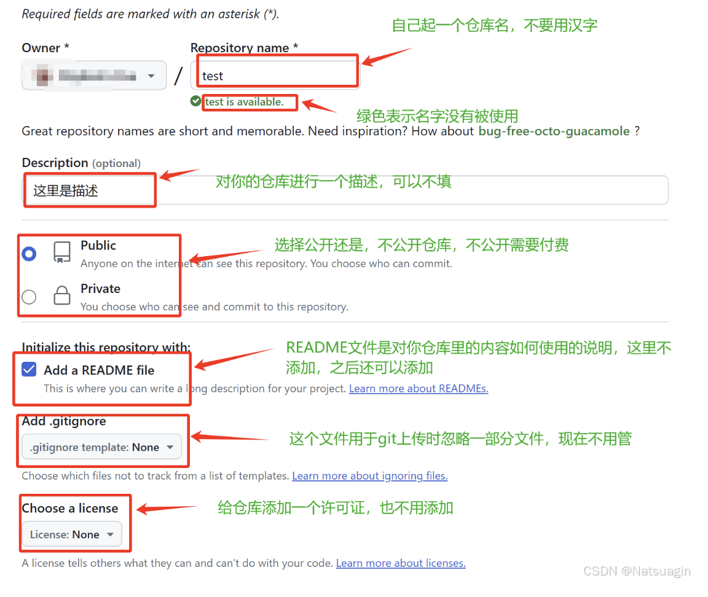

# git使用教程

主流程教程：[Windows下如何将一个文件夹通过Git上传到GitHub上？_git for windows怎么上传文件夹-CSDN博客](https://blog.csdn.net/geerniya/article/details/79552247)

[Git 本地项目上传 GitHub 全指南（SSH & Token 两种上传方式详细讲解）_git ssh github-CSDN博客](https://blog.csdn.net/Natsuago/article/details/145646982) -->解决的是ssh和http上传的问题



## 步骤

第一次使用仓库时需要将代码完整pull下来，当然也有针对一个文件夹拉取的方法

稀疏化检出：

git pull --rebase origin master 2020年设置的代码仓库都是main不是master了

[git pull origin master 错误记录 fatal: couldn‘t find remote ref master_git pull origin master fatal: couldn’t find remote-CSDN博客](https://blog.csdn.net/flyconley/article/details/120579503)

稀疏化检出：

\# 1. 创建新目录并初始化

mkdir postgresql-work

cd postgresql-work

git init

\# 2. 添加远程仓库

git remote add origin https://github.com/markbunee/lifelonglearnning.git

\# 3. 启用稀疏检出功能

git config core.sparseCheckout true

\# 4. 指定只检出postgresql文件夹

echo "postgresql/*" >> .git/info/sparse-checkout

\# 5. 拉取远程内容（只下载postgresql文件夹）

git pull origin main

使用命令下载直接下载单个文件夹：https://download-directory.github.io/?url=https://github.com/markbunee/lifelonglearnning/tree/main/postgresql

日常使用和更新时只需要

git add postgresql/

git commit -m "更新postgresql相关内容"

git push origin main


代理问题

取消代理

git config --global --unset https.proxy

git config --global --unset http.proxy

git config --global http.proxy http://127.0.0.1:7890

git config --global -l

添加远程仓库

git remote add origin https://github.com/markbunee/lifelonglearnning.git

添加提交和推送

类似于先打包商品然后说明信息最后确认推送


对整个仓库更改指令：

pwd

git init

git pull --rebase origin main

git status

git log --oneline

git add .

git commit -m 'the initial edition'

 git config --global user.email 3195824330@qq.com

git config --global user.name "markbunee"

git remote add origin https://github.com/markbunee/lifelonglearnning.git

 git remote add origin http://192.168.5.221:8081/shuzhuan_git/zhishiku/rapid_platform/kd_algo.git

 git remote add origin https://github.com/markbunee/VitaFlow.git

其他知识点：

```
git config --global https.proxy http://127.0.0.1:7897
git config --global http.proxy http://127.0.0.1:7897

```

1.换行符warning

LF (Line Feed)：Unix/Linux/macOS 使用的换行符 (\n)

CRLF (Carriage Return + Line Feed)：Windows 使用的换行符 (\r\n)

git config --global core.autocrlf true 自动转换行符

2.完全覆盖原仓库强制按照本地版本：

git add .

 git commit -m "完全用本地内容覆盖远程仓库" 

git push --force origin master

git push origin main 非强制

git branch -M main

3.切换本地分支以匹配远程

ASUS@mark-bunee MINGW64 /d/PROJIECT/lifelonglearning (master)

$ git push origin main
error: src refspec main does not match any
error: failed to push some refs to 'https://github.com/qazwsx2323ppp/EEG_encoder'出现这种报错：

git branch -M main

git push --force origin main

检查远程分支：

git branch -r

检查远程分支与本地分支对应情况

git branch -vv