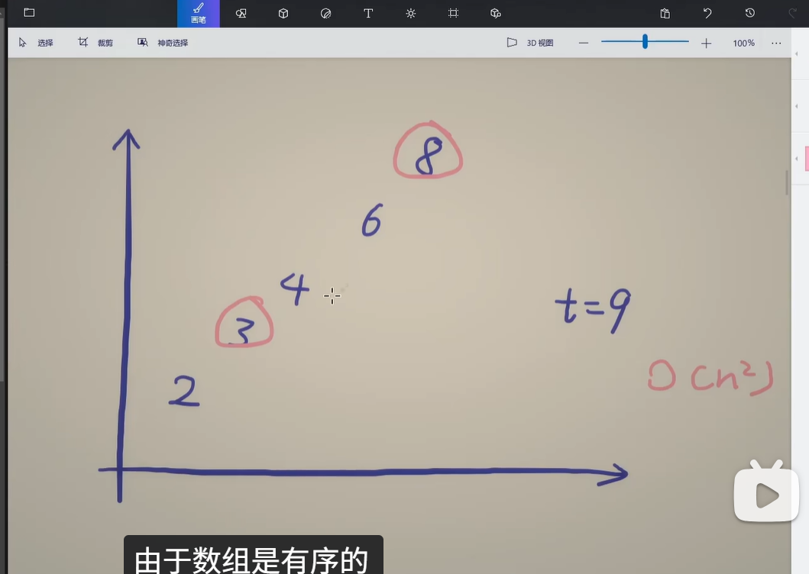

# 2026

## 01月14日 周三

### 哈希

#### 两数之和

```
# 暴力
class Solution:
    def twoSum(self, nums: List[int], target: int) -> List[int]:
         n = len(nums)
         for i in range(n):
             for j in range(i+1,n):
                 if nums[i] + nums[j] == target:
                     return [i,j]
        

# 哈希
class Solution:
    def twoSum(self, nums: List[int], target: int) -> List[int]:        
        hashtable = dict()
        for i,num in enumerate(nums):
            if target - num in hashtable:
                return [hashtable[target - num],i]
            hashtable[nums[i]] = i
        return [] 
```

#### 字母异位词

```
# 初始方法
class Solution:
    def groupAnagrams(self, strs: List[str]) -> List[List[str]]:
        final_answer = []
        used = set()

        for word in strs:
            if word in used:
                continue
            answer = []
            for i in strs:
                if sorted(word) == sorted(i):
                    answer.append(i)
                    used.add(i)
            final_answer.append(answer)
                
        return final_answer
        
        
# 使用排序的方法 使用哈希思想
class Solution:
    def groupAnagrams(self, strs: List[str]) -> List[List[str]]:
        mp = defaultdict(list)
        for s in strs:
            key = ''.join(sorted(s))
            mp[key].append(s)
        return list(mp.values())


```

####  最长序列

```
class Solution:
    def longestConsecutive(self, nums: List[int]) -> int:
        st = set(nums)  # 把 nums 转成哈希集合
        ans = 0
        for x in st:  # 遍历哈希集合
            if x - 1 in st:  # 如果 x 不是序列的起点，直接跳过
                continue
            # x 是序列的起点
            y = x + 1
            while y in st:  # 不断查找下一个数是否在哈希集合中
                y += 1
            # 循环结束后，y-1 是最后一个在哈希集合中的数
            ans = max(ans, y - x)  # 从 x 到 y-1 一共 y-x 个数
        return ans


```

https://blog.csdn.net/wjj2586590669/article/details/126392080

分类讨论

不同数字

相同数字

## 01月22日 周四

### 双指针



因为有序，最大加最小小于目标值，说明最小太小；最大加最小大于目标值说明目标值太大

#### 移动零

```
class Solution:
    def moveZeroes(self, nums: List[int]) -> None:
        """
        Do not return anything, modify nums in-place instead.
        """
      ## 把 nums 当作栈方法一
        stack_size = 0
        for x in nums:
            if x:
                nums[stack_size] = x
                stack_size += 1
        for i in range(stack_size,len(nums)):
            nums[i] = 0
       ## 双指针+交换元素
       
```

#### 盛最多水容器

```
class Solution:
    def maxArea(self, height: List[int]) -> int:
    
    ## 超时
        # n = len(height)
        # final_S = 0
        # for i in range(n):
        #     for j in range(i+1,n):
        #         lower_num = min(height[i],height[j])
        #         S = (lower_num * (j - i))
        #         final_S = max(final_S,S)   
        # return final_S  
        
        
     ## 双指针
        ans = left = 0
        right = len(height) - 1
        while left < right:
            area = (right - left) * min(height[left], height[right])
            ans = max(ans,area)
            if height[left] < height[right]:
                left += 1
            else:
                right -= 1
        return ans
```

#### 三数之和

```

```


