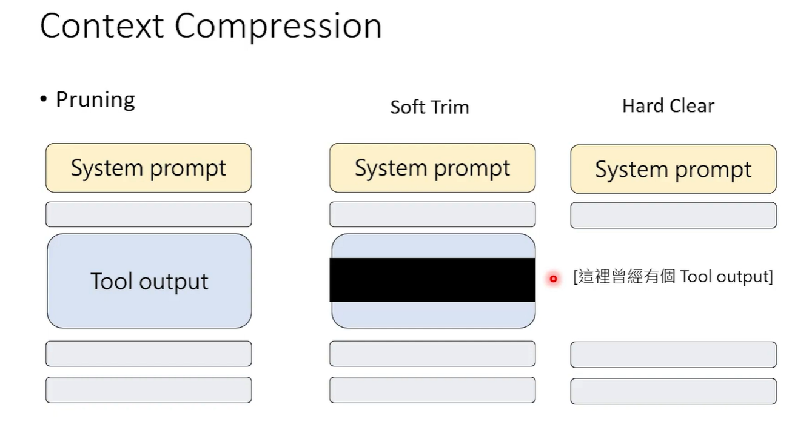
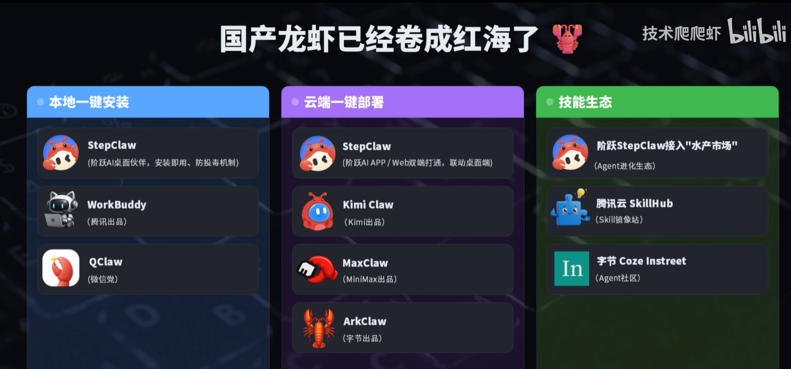
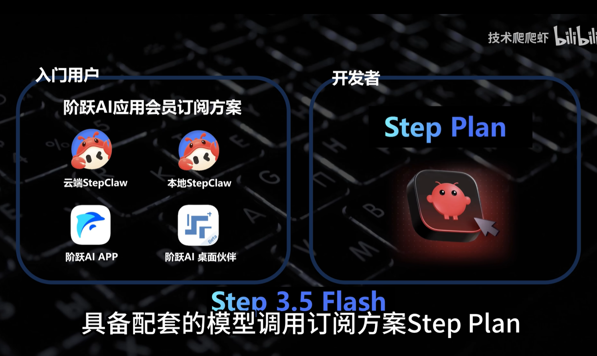
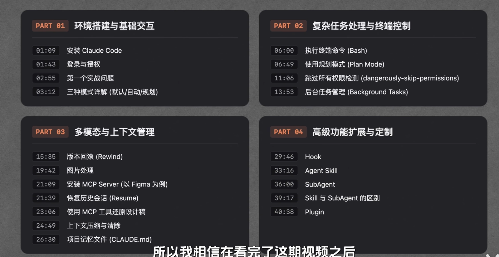
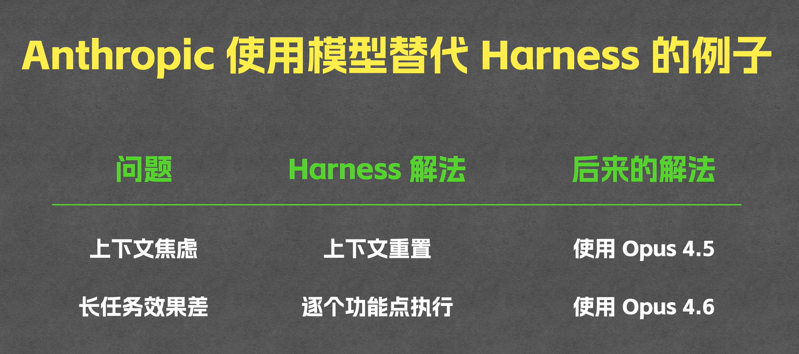

# AIagent研究笔记

AIagent框架

mcp host

claude desktop 

cursor

cline

cherry studio

uvx

nanobot picoclaw zeroclaw noclaw

subagent cronjob 心跳机制 contextcompression压缩成小的摘要 

workbuddy qclaw clawbot

stepclaw kimiclaw maxclaw

安全配置模板 身份验证 数据隔离 提示词注入防护

上下文记忆管理

# openAI 研究实验

上下文管理

文件和数据太多，效果变差

文件增多造成维护非常难

最后AGENTS.md改成结构化目录用到那块读哪块

数据和内容无法完全感知，全部都放到代码仓库

验证和反馈

codex+tools+skills

分层管理 UI runtime service repo config types 严格从上依赖下面

技术债垃圾回收 定期扫描代码和文档

# Anthropic 实战

任务规划和质量评估

需求工作量过大 

initializer 拆解用户需求编写启动脚本添加进度文件

planer 规划和分析

generator 

evaluator

## 1. **Hosted MCP（托管型 MCP）**

- **特点**：将完整的工具调用往返过程推送到 OpenAI 的基础设施中执行
- **适用场景**：需要让 OpenAI 的 Responses API 代表模型调用可公开访问的外部 MCP 服务器
- **工作方式**：通过 `HostedMCPTool` 将服务器标签（和可选的连接器元数据）转发给 Responses API，模型自行列出并调用远程服务器的工具，无需额外的 Python 进程回调
- **额外功能**：支持可选的审批流程（`require_approval`），支持 OpenAI Connectors 连接器

## 2. **Streamable HTTP MCP**

- **特点**：基于 Streamable HTTP 协议的传输方式
- **适用场景**：自己管理网络连接，或者在自有基础设施中运行服务器以保持低延迟
- **工作方式**：通过 `MCPServerStreamableHttp` 建立连接，可配置超时、自动重试、工具过滤等
- **优势**：适合本地或远程部署，提供完整的连接控制

## 3. **HTTP with SSE MCP**

- **特点**：基于 HTTP + Server-Sent Events（服务器推送事件）的传输方式
- **适用场景**：MCP 服务器实现了 HTTP with SSE 传输协议
- **工作方式**：通过 `MCPServerSse` 进行通信，API 与 Streamable HTTP 服务器基本相同
- **配置项**：支持 URL、自定义请求头、工具列表缓存等

## 4. **stdio MCP**

- **特点**：基于标准输入/输出（stdin/stdout）的本地进程间通信
- **适用场景**：MCP 服务器作为本地子进程运行，或者服务器只暴露命令行入口点
- **工作方式**：通过 `MCPServerStdio` 启动本地进程，SDK 负责维护管道并在上下文管理器退出时自动关闭
- **优势**：适合快速原型验证和本地文件系统类工具

------

**总结对比**：

| 协议类型        | 执行位置    | 通信方式      | 适用场景                     |
| :-------------- | :---------- | :------------ | :--------------------------- |
| Hosted          | OpenAI 云端 | Responses API | 外部公开服务器，无需本地处理 |
| Streamable HTTP | 本地/远程   | HTTP 流式     | 自建基础设施，低延迟需求     |
| SSE             | 本地/远程   | HTTP + SSE    | 兼容 SSE 的服务器            |
| stdio           | 本地        | 标准输入输出  | 本地命令行工具、快速验证     |