# 脑机

## 1.资料

[(90 封私信 / 64 条消息) 【脑电波与LLM】Thought2Text: Text Generation from EEG Signal using Large Language Models (LLMs) - 知乎](https://zhuanlan.zhihu.com/p/19134219322)

[清华&腾讯提出DreamDiffusion：你大脑中的画面，可以高清还原了！-CSDN博客](https://blog.csdn.net/amusi1994/article/details/131651269)

Brain2Qwerty：https://mp.weixin.qq.com/s/avxYI8VYOYpg-3FoEUrHfA

DreamDiffusion：https://mp.weixin.qq.com/s/YY_7HtXKjMzr9S_rqfwGTA

AI+脑科学：EEG × 深度学习的五大前沿应用全解析：https://mp.weixin.qq.com/s/LqdCGwHalqrOJIClgeBfMg

Are EEG-to-Text Models Working？：https://mp.weixin.qq.com/s/aVKJFco18wam0DTlUUuqWQ

[(95 封私信 / 82 条消息) 【AI论文学习笔记】看穿大脑：从人脑信号中重建视觉感知的图像 - 知乎](https://zhuanlan.zhihu.com/p/650910933)

## 2.笔记

### 2.1 EEG-CLIP：

https://arxiv.org/abs/2503.16531

https://github.com/tidiane-camaret/EEGClip 

用于匹配图像及其文本说明，随后利用文本类别提示成功实现了零样本解码，一种对比学习框架 EEG-CLIP，该框架将 EEG 时间序列和相应的临床文本描述对齐到共享的嵌入空间中

#### 2.1.1研究内容：

EEG-CLIP 旨在解决脑电图（EEG）解码中的任务特定性问题，即传统深度学习方法通常只能针对单一任务（如病理检测或年龄预测）进行训练，缺乏通用性。本研究提出一种任务无关的方法，通过对比学习框架对齐EEG时间序列和临床文本描述（如医疗报告），在共享嵌入空间中学习通用的EEG表示。核心目标是实现EEG信号的零样本和少样本解码，从而降低对标注数据的依赖，并提升模型在多种下游任务（如病理分类、年龄和性别预测）中的泛化能力。

#### 2.1.2相关研究的不足：

**基于深度学习的EEG解码**：传统方法依赖任务特定模型（如CNN、RNN），虽在特定任务（如运动想象分类）中表现良好，但表示缺乏通用性。近期工作开始探索多模态融合（如EEG与fNIRS结合），但未充分利用文本监督。

**对比学习与多模态对齐**：受CLIP（Contrastive Language-Image Pre-training）启发，本研究将图像-文本对齐范式扩展到EEG领域。CLIP通过对比损失对齐海量图像-文本对，实现零样本推理，EEG-CLIP借鉴此思路，利用临床报告作为自然语言监督源。

**EEG与文本结合的新进展**：类似工作如Gijsen & Ritter (2024) 的EEG-语言模型专注于病理检测，而EEG-CLIP首次系统评估多任务解码（包括年龄、性别和药物预测），强调通用表示学习。

#### 2.1.3方法模块及对应解决的问题

**EEG编码器**：

- **模块描述**：采用Deep4 CNN架构（四层卷积-池化块），输入为预处理后的EEG信号，输出128维嵌入。该网络专为EEG的时空特征优化，包含批归一化和丢弃层以提升鲁棒性。
- **解决问题**：克服EEG信号的高噪声、低空间分辨率及个体差异问题，通过深层网络提取鲁棒的时空表示。

**文本编码器**：

- **模块描述**：基于预训练的BERT模型（如ClinicalBERT），将临床报告转换为嵌入。文本输入为医疗报告的分段（如"IMPRESSION"章节），输出128维嵌入。
- **解决问题**：利用预训练语言模型的语义理解能力，处理临床文本的多样性和复杂性，实现EEG与文本的语义对齐。

#### 2.1.4实验内容

**分类任务性能**：

**零样本分类**：

**少样本学习**：

**消融与分析**：

**可解释性分析**：

#### 2.1.5创新点

首次将CLIP风格的对比学习应用于EEG-文本对齐，突破任务特定模型的限制。

#### 2.1.6其他

选择21个通用电极，排除首分钟数据，使用后续2分钟片段。

裁剪幅度至±800μV，重采样至100Hz，归一化方差。

- EEG编码器（Deep4 CNN）处理信号，输出嵌入。
- 文本编码器（BERT）处理报告分段，输出嵌入。
- 双模态嵌入经投影头映射至64维共享空间。

最小化对比损失，拉近匹配的EEG-文本对。

投影头在对比学习中的作用：

投影头（Projection Head）在多模态对比学习中是关键组件，负责将不同模态（如EEG信号和文本）的嵌入映射到统一的共享嵌入空间，使对比损失能够有效对齐异构数据。其设计直接影响模态间语义对齐的精度和泛化能力。

EEG-CLIP的投影头方法：

**结构设计**：采用多层感知机（MLP），包含3个全连接层，每层使用ReLU激活函数，最终输出64维嵌入向量。这种深层非线性结构旨在捕捉EEG信号与文本描述间的复杂映射关系。

**维度选择**：共享嵌入空间被压缩至64维（见第4.3.2节），实验表明较小维度（32-128）比更大维度（256-512）更有效，因压缩过程能过滤噪声，强化关键特征对齐。

**训练细节**：投影头与双编码器联合训练，通过对比损失优化。文本编码器（如ClinicalBERT）的微调学习率被设置为EEG编码器的10^-3倍，以平衡语言知识的保留与域适应（第4.3.1节）。

| **特征**         | **EEG-CLIP**                           | **原始CLIP**                       | **区别意义**                                                 |
| :--------------- | :------------------------------------- | :--------------------------------- | :----------------------------------------------------------- |
| **投影头结构**   | 3层MLP（非线性，ReLU激活）             | 通常为2层MLP或线性层               | EEG-CLIP的更深层结构适应EEG信号的时序复杂性和临床文本的专业性，需更强非线性变换。 |
| **输出维度**     | 64维（小维度）                         | 通常512维（大维度）                | EEG数据噪声高、维度低，小维度压缩能提炼本质特征；CLIP的大维度保留图像丰富细节。 |
| **模态特性适配** | 针对EEG的时空局部性和文本的临床术语    | 针对图像的全局特征和文本的通用描述 | EEG-CLIP需处理生理信号的细粒度模式（如频段特征），而CLIP关注视觉语义的宏观对齐。 |
| **数据规模与域** | 临床EEG数据集（TUAB，数千样本）        | 互联网图像-文本对（4亿样本）       | EEG-CLIP在有限数据下依赖投影头的强正则化（如维度压缩）防止过拟合；CLIP依赖大数据容量。 |
| **优化策略**     | 文本编码器低学习率微调（防灾难性遗忘） | 端到端均衡优化                     | 临床文本编码器需保留领域知识，故EEG-CLIP采用非对称学习率；CLIP的通用文本编码器可充分更新。 |

脑机：

创新点1：

目标是“输入 EEG，同时输出高质量图像与对应文本”，并且希望用多任务或更创新的联合训练方式。

建议采用“共享 EEG 编码器 + 两个任务头”的多任务结构：

- 图像头：沿用当前的 Stable Diffusion 条件分支（EEG→cross-attn tokens），生成图像
- 文本头：新增一个文本生成分支（EEG→文本），与图像头共享 EEG 表征，并联合训练

共享表征

继续用 eeg_encoder 提供序列特征（ code/sc_mbm/mae_for_eeg.py:337 ），沿用 Stage A 的自监督预训练以确保鲁棒性

图像生成头

保持现有 cond_stage_model 中的 EEG→SD 条件映射（ code/dc_ldm/ldm_for_eeg.py:29 ）

通过 channel_mapper 将序列长度映射到 77 tokens，通过 dim_mapper 将维度映射到 context_dim=768 （ code/dc_ldm/ldm_for_eeg.py:48 、 code/dc_ldm/ldm_for_eeg.py:52 ）

文本生成头（新增）

两条实现路线可选：

- 轻量映射+检索：把 EEG pooled 特征映射到 CLIP 文本嵌入（768），做最近邻检索或分类到一组模板（如 ImageNet 类名的短句），输出文本
- 自回归文本生成：用一个小型语言模型（如 DistilGPT2 / T5-small ）作为 decoder，将 EEG特征作为前缀或 cross-attn 条件，直接按 token 生成句子

与图像头共享 eeg_encoder ，在训练中加语言建模损失

多任务联合：

扩散损失：SD 路径的标准噪声预测损失（现有 DDPM.p_losses ， code/dc_ldm/models/diffusion/ddpm.py:311 ）

文本损失：
- 检索式：对齐损失， eeg→CLIP_text_embed 与目标文本嵌入的余弦相似度
- 生成式：交叉熵语言建模损失（teacher-forcing）

多模态对齐：

- 现有 clip_tune ： eeg 与图像 CLIP 嵌入的对齐（ code/dc_ldm/ldm_for_eeg.py:83 ），建议保留
- 额外增加 eeg↔text 对齐，稳定文本任务的学习

一致性约束（可选创新）：
- 图像-文本一致：用预训练图像描述器（BLIP）从生成图像得到 caption，与文本头输出做相似度（如 CLIP 文本空间或 token 级教师信号），提高跨任务一致性

数据集：

MOABB、CVPR2017

指标：

BLEU、FID

**DreamDiffusion**:

提出直接从EEG信号生成高质量图像的方法，无需中间文本转换。

采用时间掩码信号建模（Temporal Masked Signal Modeling）预训练EEG编码器，解决EEG噪声和个体差异问题。

利用CLIP图像编码器提供额外监督，对齐EEG、文本和图像嵌入空间。

Step 1: 掩码信号预训练（解决特征学习）

采用**时序掩码信号建模**。不同于对图像进行空间掩码，该方法在EEG的时间域上随机掩蔽部分数据，然后训练模型重建。这迫使编码器深入理解EEG信号的上下文语义，从而获得对不同人和不同任务都鲁棒的特征表示。

Step 2: 与预训练Stable Diffusion微调（解决生成问题）

将预训练好的EEG编码器的输出，通过一个投影层映射成与Stable Diffusion的文本嵌入空间维度相同的向量。然后将此向量通过**交叉注意力机制**注入模型，替代传统的文本提示词。这样，模型就能利用其强大的图像生成能力，根据EEG特征来生成图像。

Step 3: CLIP空间对齐（提升生成质量）

增加一个辅助的**CLIP对齐损失**。在微调时，不仅要求生成的图像看起来逼真（扩散模型损失），还要求EEG特征的嵌入与对应真实图像的CLIP图像嵌入在语义空间里尽可能接近。这相当于给模型增加了一个“语义校对器”，确保了生成图像的内容与EEG信号所代表的语义高度相关。


**Thought2Text**

首次使用指令调优的大型语言模型（LLMs）从EEG信号直接生成文本，实现“思维到文本”转换。

设计三阶段流程：EEG编码器训练、LLM多模态微调、EEG嵌入优化，强调语言无关的视觉刺激避免语言处理复杂性。

通过CLIP对齐EEG和图像嵌入，提升文本生成的准确性和流畅性。

**Stage 1: 训练EEG编码器（建立视觉语义桥梁）**

**创新点**：采用**多任务学习**训练EEG编码器。同时要求它： 

**任务A**：预测所看图像的类别标签（交叉熵损失）。 

**任务B**：其输出的EEG嵌入要与对应图像的CLIP嵌入尽可能相似（MSE损失）。

**目的**：这个阶段后，EEG编码器已经学会了输出一个既包含具体对象信息，又与通用视觉语义空间（CLIP）对齐的特征。这为后续与LLM对接打下了坚实基础。

**Stage 2: 用图像嵌入“预热”LLM和投影器** **创新点**：

此阶段**不使用EEG数据**。而是直接用高质量的CLIP图像嵌入和物体标签来微调LLM。 

**目的**：让投影器和LLM先学会一个相对简单的任务：如何根据视觉语义信息（CLIP嵌入）来生成描述。这相当于在教LLM一门新的“视觉语言”，避免了从一开始就处理嘈杂的EEG信号。

**Stage 3: 切换到EEG嵌入进行微调** **创新点**：

在Stage 2的基础上，**将输入从CLIP图像嵌入替换为Stage 1训练好的EEG编码器输出的EEG嵌入**，继续微调投影器。 

**目的**：由于EEG嵌入已经和CLIP图像嵌入在空间中对齐，这个切换对模型来说相对平滑。投影器只需要学习一个轻微的“偏移校正”，就能将EEG嵌入有效地映射到LLM的文本空间，从而最终实现从EEG到文本的生成。

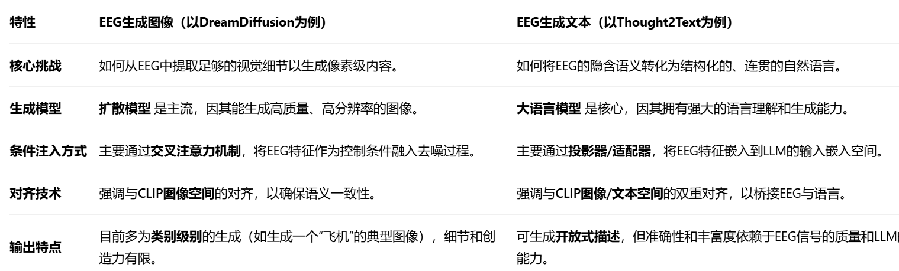


**EEG-CLIP**

首创对比学习框架，对齐EEG时间序列和临床文本描述，学习通用EEG表示。

支持零样本和少样本分类，通过自然语言提示实现任务无关解码（如病理、年龄、性别预测）

证明小嵌入维度（32-128）优于大维度，强调紧凑空间中的语义蒸馏

**跨模态生成统一化**：DreamDiffusion（图像生成）和Thought2Text（文本生成）均依赖EEG编码和CLIP对齐，可合并为单一管道，实现EEG到多模态输出（如图像+文本描述）。

**表示学习增强**：EEG-CLIP的对比学习机制可提升DreamDiffusion和Thought2Text的嵌入对齐质量，减少对配对数据的依赖。

**解决共性挑战**：所有文档提及EEG的噪声、个体差异和数据稀缺问题，结合后可通过共享预训练策略（如掩码建模）提升鲁棒性。

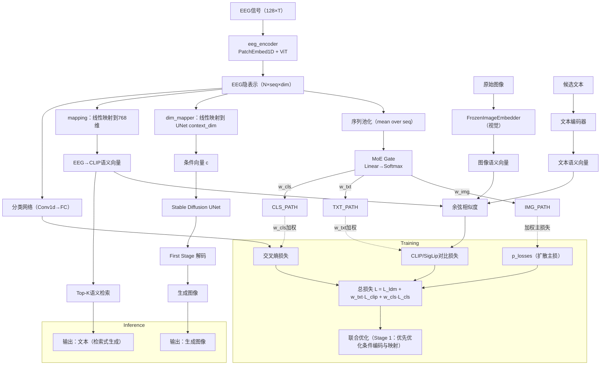


```mermaid
flowchart LR
  %% 数据与预处理
  DSET[EEGDataset<br/>(eeg,label,image,image_raw)] --> EEG_IN[EEG信号]
  DSET --> IMG_RAW[image_raw]
  DSET --> LABEL[label]

  %% 编码器层
  EEG_IN -->|流1| MAE[eeg_encoder (MAE/ViT)]
  EEG_IN -->|流2| CNN[Deep4Net/Conv Stem]
  MAE --> FUSE[特征融合<br/>Concat + 投影]
  CNN --> FUSE
  FUSE --> LATENT[EEG隐表示<br/>(seq×dim)]

  %% MoE 路由
  LATENT --> POOL[序列池化]
  POOL --> GATE[MoE Gate<br/>Linear→Softmax]
  GATE -->|w_img| HEAD_IMG
  GATE -->|w_txt| HEAD_TXT
  GATE -->|w_cls| HEAD_CLS

  %% 图像生成头（DC-LDM）
  subgraph Image Generation
    LATENT --> DIM_MAP[dim_mapper→context_dim]
    DIM_MAP --> C[cross-attn 条件 c]
    C --> UNET[Stable Diffusion UNet]
    UNET --> FIRST[First-Stage 解码]
    FIRST --> IMG_OUT[生成图像]
    HEAD_IMG -.权重 w_img 加到主损.-> LDM_LOSS[p_losses]
  end

  %% 语义对齐头（EEG-CLIP 风格）
  subgraph Text/Image Alignment
    LATENT --> MAP768[mapping→768维]
    MAP768 --> EEG_EMB[EEG→CLIP语义向量]
    IMG_RAW --> CLIP_V[FrozenImageEmbedder]
    CLIP_V --> IMG_EMB[图像语义向量]
    TXT_CAND[候选文本] --> TXT_ENC[TextEncoder]
    TXT_ENC --> TXT_EMB[文本语义向量]
    EEG_EMB --> SIM[余弦/对比相似度]
    IMG_EMB --> SIM
    TXT_EMB --> SIM
    SIM --> LOSS_CLIP[ClipLoss/SigLipLoss]
    HEAD_TXT -.权重 w_txt 加到辅助损.-> LOSS_CLIP
  end

  %% 分类头（可选）
  subgraph Classification
    LATENT --> CLS_NET[classify_network]
    CLS_NET --> LOSS_CE[交叉熵损失]
    HEAD_CLS -.权重 w_cls 加到辅助损.-> LOSS_CE
  end

  %% 训练与推理
  LDM_LOSS --> L_TOTAL[总损失 L = L_ldm + w_txt·L_clip + w_cls·L_ce]
  LOSS_CLIP --> L_TOTAL
  LOSS_CE --> L_TOTAL
  L_TOTAL --> OPT[联合优化/阶段化微调]
  IMG_OUT --> OUT_IMG[输出图像]
  EEG_EMB --> RETR[Top-K检索] --> OUT_TXT[输出文本（检索式）]
```

四、实验设置

对比实验

reamDiffusion 在定性上与Brain2Image（一个基于GAN/VAE的方法）对比。具体地，在少数类别（如Airliner、Jack-o-Lantern、Panda）上进行了主观评估，显示DreamDiffusion生成图像质量显著更高（Figure 5）。

DreamDiffusion生成的图像更真实、细节更丰富，而Brain2Image输出模糊且语义不一致。

消融实验

DreamDiffusion

通过Table 1评估不同组件的影响，包括掩码信号建模（MSM）预训练、CLIP微调、掩码比率和模型参数。

- 无预训练（模型1-4）导致准确率骤降（如从45.8%降至4.2%），凸显预训练必要性。
- 掩码比率0.75时性能最优（模型6），过高或过低比率均有害（模型5、7）。
- CLIP对齐至关重要：无CLIP监督（模型13-14）时性能下降约10-15%。
- 同时微调编码器和注意力头（E+A）比仅微调编码器（E only）效果更好。

实验设置

- **数据集**：EEG预训练：约120,000个EEG样本（来自MOABB平台），覆盖400+受试者，通道数30-128。配对数据：ImageNet-EEG数据集，6名受试者观看2000张图像（40类），EEG记录为128通道、0.5秒刺激。
- **模型配置**：EEG编码器：基于ViT-Large的时序掩码建模，掩码比率75%，预训练500轮。生成模型：Stable Diffusion v1.5，微调300轮，使用交叉注意力机制集成EEG嵌入。优化：AdamW，学习率1e-4，批量大小16。
- **预处理**：EEG信号过滤（5-95 Hz），截取长度512，通道数统一为128（填充处理）。

评估指标

- **主要指标**：50-way top-1分类准确率——使用ImageNet预训练分类器评估生成图像的语义正确性（生成与真实图像分类一致视为正确）。
- **辅助指标**：定性视觉比较（如Figure 4、5、6）、失败案例分析（Figure 7）。
- **消融指标**：准确率百分比，直接反映组件贡献（Table 1）。


Thought2Text

**多基线比较**：在Table 2中，与多种基线方法对比：

- ONLY_OBJ：仅使用对象标签生成文本。
- OBJ+RAND_EMB：对象标签加随机嵌入。
- NO_STAGE2：省略第二阶段（LLM图像嵌入微调）。
- ONLY_EEG：仅使用EEG嵌入，忽略对象标签。

完整模型（ALL）在ROUGE、BLEU等指标上显著优于基线。例如，LLaMA3-8B-ALL的ROUGE-1为30.0%，而ONLY_OBJ仅9.8%。

消融实验

### 2.2 eeg情感分类

EmT: A Novel Transformer for Generalized Cross-subject EEG Emotion Recognition

1）**对情绪认知过程中关键的长时程上下文信息建模不足**

情绪是一种高级认知过程，涉及注意、感知、记忆等多个基本脑系统的协作，并且其状态在短时间内连续稳定，但在长时刺激下会发生变化。现有许多EEG情绪识别方法侧重于学习空间和短时时序模式，未能充分捕捉和利用这种与情绪动态变化相关的**长短期时序上下文信息**。

2）**无法有效建模情绪背后复杂的多脑区协作连接模式**

现有基于图神经网络（GNN）的方法通常依赖于单一的、预定义的或全局可学习的邻接矩阵，难以捕捉到情绪背后**多种基本认知过程所对应的特定脑区连接模式**。

**如何设计一个能同时有效捕捉情绪相关的复杂空间脑区连接和长短期时序上下文信息的神经网络架构，并使其能自适应地服务于分类和回归两种不同的情绪识别任务。** EmT模型通过其创新的RMPG和TCT模块，为这些关键问题提供了有效的解决方案，在跨被试EEG情绪识别领域取得了显著的性能提升。

| **方法名称**  | **核心思想**                                         | **优点**                         | **缺点**                                   |
| ------------- | ---------------------------------------------------- | -------------------------------- | ------------------------------------------ |
| **DGCNN**     | 动态学习EEG通道间的图连接，增强特征判别性。          | 能自适应捕获空间关系。           | 忽略时间上下文；依赖平均特征作为节点属性。 |
| **GCB-Net**   | 在DGCNN基础上引入宽学习系统（BLS），提升分类性能。   | 改善情绪分类结果。               | 未显式学习时间动态。                       |
| **RGNN**      | 使用神经科学启发的稀疏对称邻接矩阵，约束图卷积。     | 结合脑区先验，提升鲁棒性。       | 忽视情感的长短期变化特性。                 |
| **TSception** | 多尺度时空核提取频率和空间不对称模式。               | 同时捕获短时序和空间特征。       | 未强调长期上下文信息。                     |
| **TESANet**   | 自注意力机制提取时间动态，用于气味情感识别。         | 擅长时序建模。                   | 对空间信息学习不足。                       |
| **Conformer** | 结合CNN和Transformer，捕获短长期时间动态。           | 在情感和运动想象任务中表现优异。 | 未针对EEG时空异构性优化。                  |
| **AMDET**     | 在频谱-空间-时间维度进行注意力加权，强调关键时间帧。 | 多维度特征融合。                 | 空间拓扑学习依赖简单卷积。                 |


| 研究内容          | 总体要解决的问题                                             | 模型名字                                                     | 子问题（其中关键科学问题用**加粗**表示）                     | 子理论的名字                                                 | 总体算法的名字                                      |
| :---------------- | :----------------------------------------------------------- | :----------------------------------------------------------- | :----------------------------------------------------------- | :----------------------------------------------------------- | :-------------------------------------------------- |
| **EEG信号处理**   | EEG信号存在高维性、非平稳性、低信噪比等挑战                  | 端到端的EEG时空特征融合模型                                  | 1. 空间协方差矩阵因预处理降维为半正定矩阵，无法直接使用黎曼度量的问题 2. **EEG时空表征的异构几何空间融合效率优化问题** 3. 黎曼方法计算复杂度高，模型效率低的问题 | 1. 空间信息处理理论 2. 时间信息处理理论                      | 基于黎曼流形和欧几里得空间的EEG时空表示学习算法     |
| **EEG多任务学习** | 脑电预训练模型存在任务隔离、跨任务零样本泛化能力弱。         | NeuroLM-MoE多任务脑电基础模型                                | 1. EEG连续信号与大语言模型离散文本嵌入空间的高效对齐问题 2. 多通道EEG的通用时空因果表征学习问题 3. **EEG多任务学习中的高效参数适配与跨任务泛化问题** | 1. 文本对齐神经分词器理论 2. 多通道自回归预训练理论 3. 任务导向的稀疏MoE动态路由与专家协作机制理论 | 基于多任务学习和跨模态对齐的EEG信号图像文本生成算法 |
| **EEG图像生成**   | EEG与图像/文本嵌入空间难以对齐的挑战，导致生成质量与实时性难以兼顾。 | 基于掩码预训练与CLIP监督对齐的EEG图像生成算法                | 1. EEG信号噪声大、数据有限，表征预训练问题 2. **生成的“脑电-图像”轻量化跨模态对齐问题** 3. 条件特征注入和端到端微调效果不佳的问题 | 1. 基于时序掩码信号建模的EEG表征预训练理论 2. 基于CLIP空间的跨模态语义对齐目标理论 3. 条件化Stable Diffusion的定向微调理论 | 基于高效脑电图像生成的层次化算法                    |
| **EEG情绪分析**   | 在空间建模上依赖单一邻接矩阵，难以捕捉情感多认知过程的全局脑区交互 | EmT算法（基于多视图金字塔图卷积与时序上下文转换器的EEG情感识别算法） | 1. EEG信号时空特征有效表征问题 2. 复杂脑区动态连接捕获问题 3. **任务特异性时序上下文学习问题** | 1. 时序图构建方法理论 2. 残差多视图金字塔图卷积网络理论 3. 时序上下文转换器理论 | 基于时空上下文金字塔网络的脑电情绪解码算法          |
| **EEG可解释模型** | 模型决策过程仍呈“黑箱”特性，缺乏神经生理可解释性             | 融合动态掩码与概念映射的EEG时序表征解析算法                  | 1. EEG信号与视觉概念在跨模态空间中的对齐问题 2. **EEG的视觉概念表征时空耦合问题** 3. 概念激活时序模式的识别与归类问题 | 1. 基于岭回归的跨模态语义对齐理论 2. 基于皮尔逊相关的时序贡献量化理论 3. 基于动态时间规整的原型模式聚类理论 | 基于动态掩码与概念映射的脑电时序概念表征解析算法    |

MTSL-TimesNet：基于TimesNet的EEG情感识别多任务自监督学习模型https://mp.weixin.qq.com/s/g8D5Fh-QD7LgXBHwo6unkg

NeuroLM: A Universal Multi-task Foundation Model for Bridging the Gap between Language and EEG Signals：

## 多模态

[(99+ 封私信 / 82 条消息) 统一多模态理解与生成模型综述：突破、挑战与未来 - 知乎](https://zhuanlan.zhihu.com/p/1903366322307440885)

#### **CLIP（Contrastive Language–Image Pre-training）**

- **核心思想**：虽然CLIP本身不直接“生成”内容，但它为多模态生成提供了强大的“对齐语义空间”。通过对比学习，它将图像和文本描述映射到同一个向量空间，使得相似的语义在空间中靠近。
- **实现方式**：分别使用图像编码器和文本编码器，通过计算大批量图像-文本对的相似度，使用对比损失进行训练。
- **对统一生成的贡献**：CLIP学到的共享语义空间成为了连接不同模态的“桥梁”。例如，后续的生成模型（如DALL·E）可以利用CLIP的文本嵌入作为条件，生成语义一致的图像。
- **局限性**：它是一个理解/判别模型，而非生成模型。

#### **DALL·E & DALL·E 2**

- **核心思想**：将文本生成图像的任务视为一个序列到序列的建模问题。它将图像（通过VQ-VAE离散化）和文本都视为一种统一的“token序列”。
- **实现方式**： **DALL·E 1**：使用自回归Transformer，同时接收文本token和图像token作为输入，并自回归地预测下一个图像token。 **DALL·E 2**：采用两阶段方式。首先，一个先验模型（可以是自回归或扩散模型）根据文本描述生成一个CLIP图像嵌入。然后，一个解码器（扩散模型）根据这个CLIP嵌入生成图像。这体现了将不同模型“链接”起来实现统一任务的思路。
- **对统一生成的贡献**：证明了将图像视为token序列，可以用类似于语言建模的方式统一处理。
- **局限性**：主要专注于文生图任务，并非严格意义上的“多输入、多输出”统一框架。

#### **CM3leon（CM3: A Causal Masked Multimodal Model）**

- **核心思想**：将多种多模态任务（如文生图、图生文、图像修复、文生图+指令编辑）统一为一个**因果掩码语言建模**任务。它将所有模态（文本、图像）的数据都转换为一个统一的token序列。
- **实现方式**： **Tokenization**：文本使用标准BPE tokenizer，图像使用VQ-GAN离散化为视觉token。 **序列构建**：将指令（如“生成图像”）、输入模态（文本或图像token）和目标模态（图像或文本token）拼接成一个长序列。在训练时，随机掩码掉序列中的一部分（可能是文本或图像token），然后训练模型去预测被掩码的部分。 **推理**：给定指令和输入，模型就能自回归地生成目标模态的token。
- **优势**：真正的“一个模型，多种任务”，架构简洁统一。
- **局限性**：生成质量在某些任务上可能仍不如专用的顶尖模型。

#### **Emu: 生成式多模态智能体**

- **核心思想**：与KOSMOS类似，也采用“所有模态皆可token化”的思路，并强调高质量的生成能力。其核心是一个“多模态上下文学习”框架。
- **实现方式**： **模态编码**：使用强大的编码器（如EVA-CLIP）将图像/视频等编码为特征序列。 **因果建模**：将所有输入（文本、图像特征）和输出（文本、图像token）拼接成一个序列，训练一个因果Transformer来预测下一个token。 **多功能性**：通过改变输入序列的构成，同一个模型可以无缝切换于文生图、图生文、多轮对话、图像编辑等任务。
- **优势**：在统一框架下实现了与专用模型相媲美的生成质量。
- **局限性**：同样面临计算挑战。

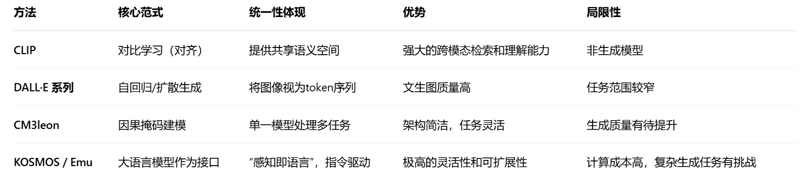

这些统一框架的共同技术特点：

**Tokenization是一切的基础**：无论是VQ-VAE、VQ-GAN还是其他方法，将连续信号（图像、音频、EEG）离散化为token序列是实现统一处理的关键第一步。

**自回归生成是统一的工具**：一旦所有模态都变成了序列，强大的自回归Transformer就能被用来建模和生成任何模态的内容。

**指令微调**：通过在大规模指令数据上微调，模型学会根据自然语言指令来执行不同的任务。

构建一个**统一的EEG多模态生成框架**完全可以借鉴上述范式：

- **第一步：EEG Tokenization**。借鉴DreamDiffusion或Thought2Text中的方法，设计一个有效的EEG编码器，将EEG信号离散化为有意义的token序列。这是将EEG“语言化”的关键。

- **第二步：选择核心架构**。 

  **方案A（仿CM3leon）**：构建一个包含EEG token、图像token、文本token的词汇表。训练一个因果掩码模型，学习预测被掩码的EEG、图像或文本部分。 

  **方案B（仿KOSMOS/Emu）**：训练一个强大的多模态LLM。将EEG token（通过一个适配器）、图像特征和文本token一起输入LLM。通过指令（如“根据这段脑电信号生成一张图像”）来引导模型生成目标内容。


高质量的EEG-图像/文本配对数据极少，且EEG信号本身噪声大、个体差异显著

如何从低维、时序的EEG信号中提取出足够的高级语义信息，以指导高质量的图像或文本生成

1.EEG特征学习：（简单地将原始EEG信号输入生成模型效果很差。必须通过预训练来提取鲁棒的、包含语义的特征。）

**方法1（监督学习）**：在配有图像标签的EEG数据上，训练一个编码器来预测图像类别（例如，是“狗”还是“猫”）。这样编码器就能学会提取与视觉概念相关的特征。

**方法2（自监督学习/对比学习）**：这是更先进的思路。利用大量无标注的EEG数据，通过掩码建模（如DreamDiffusion）或对比学习（如EEG-CLIP），让模型学习EEG信号的上下文信息，从而获得更具泛化性的特征表示。

**特征与生成模型的对接**：（将学习到的EEG特征嵌入到预训练的图像生成模型（如GANs或扩散模型）中。）

利用扩散模型（如Stable Diffusion）的**交叉注意力机制**。将EEG特征作为条件注入到UNet的去噪过程中，引导图像生成。

## EEG → 文本与图像的统一生成框架，有哪些典型路线

### 路线 1：MiniCPM-O / Qwen-Omni 风格（Unified Omni Large Model）

任意模态输入 → 投影成 LLM token → LLM → 输出文本/图像/语音

Omni 模型（如 Qwen2.5-Omni、MiniCPM-O）具有一个统一的 LLM backbone：

```
任意模态输入 → 投影成 LLM token → LLM → 输出文本/图像/语音
```


```
EEGEncoder (可训练)
     ↓
Projector (线性层/MLP)
     ↓
LLM (Omni backbone)
     ↓
 ├── 文本输出（LM head）
 └── 图像输出（Diffusion head）
```

构建 EEGEncoder

### 路线 2：LLaVA / LLaVA-Omni 风格（LLM + 特征投影器）

LLaVA 结构：

```
Vision Encoder (ViT)  EEGEncoder 代替 Vision Encoder
     ↓
Projection Layer
     ↓
LLaMA

EEGEncoder → Projector → LLaMA → text/image
```

## 路线 3：BLIP-2 / Q-Former 风格（最适合结构化推理）

BLIP-2 的 Q-former 能从视觉特征中抽取 **“若干 Query Token”**。

```
EEGEncoder
     ↓
Q-Former（cross-attention）
     ↓
K 个 query tokens（如 32）
     ↓
LLM
     ↓
文本/图像生成
```

最容易做 chain-of-thought

最容易抽象出结构化表征（objects, attributes, relations）

当前科研界做脑解码最常用结构

## 路线 4：PaLM-E / RT-2（机器人 unified 模型）

EEGEncoder → Continuous State Embedding → PaLM → 文本/图像生成

PaLM-E 对“非视觉模态”建模比 LLaVA 更强。

```
EEGEncoder → Continuous State Embedding → PaLM → 文本/图像生成
```

## 路线 5：CLIP-style + Diffusion（传统路线）

最接近 DreamDiffusion / Thought2Text

```
EEGEncoder → EEG latent
       ├→ Text LLM prompt → 文本描述
       └→ Stable Diffusion → 图像
```

优点：实现简单
 缺点：文本与图像是 **割裂的**，不是统一模型
 不支持 chain-of-thought 推理

EEG编码器的核心确实是将原始的、嘈杂的EEG信号转换为高层次的语义特征。

训练方法主要有自监督学习（如掩码信号建模）和有监督对齐（如使用CLIP模型）。

这些方法的目标是让编码器学会提取鲁棒的、通用的特征，从而能够适配不同的下游任务，比如图像生成或文本生成。

训练一个优秀的EEG编码器，本质上是追求两个目标：

1. **不变性**：对EEG信号中的噪声、个体差异、非任务相关的脑活动等干扰因素不敏感。
2. **区分性**：对与任务相关的、有意义的语义内容高度敏感。


```
EEG → EEGEncoder → Q-former → EEG Query Tokens
                        ↓
                    LLM (Omni)
                        ↓
        ┌─────── Text Decoder
        └─────── Diffusion Image Decoder

```

✔ **多任务对齐**确保 EEG latent 是“可解释有语义的”
 ✔ **CLIP 对齐**确保 EEG latent ≈ 图像语义 latent
 ✔ **Q-former**把 EEG 的多维语义结构拆成 K 个 query tokens
 ✔ **Projector**把这些 tokens 精准放入 LLM embedding space
 ✔ **LLM (Omni)**本身具有强大的语义推理能力
 ✔ **Diffusion**基于 LLM 语义和 EEG latent 合作生成图像

| **特性**          | **AWQ (Activation-aware Weight Quantization)**               | **GPTQ (Generative Pre-trained Transformer Quantization)**   |
| ----------------- | ------------------------------------------------------------ | ------------------------------------------------------------ |
| **量化库**        | `awq` (或相关实现)                                           | `gptqmodel`                                                  |
| **量化原理**      | **激活感知**: 识别并保护高激活值权重，只对不重要权重进行量化。 | **二阶优化**: 使用近似的 Hessian 信息，一次性找到最优量化权重，以最小化量化误差。 |
| **压缩率**        | 较高（通常 Int4 或 Int8），性能损失极小。                    | 极高（通常 Int4），性能损失通常也极小。                      |
| **VRAM 节省**     | 高效，但通常所有层都常驻 GPU。                               | 极高效，模型核心量化后体积很小。 **支持动态 CPU/GPU 卸载**（Offloading）。 |
| **Qwen 代码适配** | 需要自定义 `BaseAWQForCausalLM` 类，定义缩放层。             | 需要自定义 `BaseGPTQModel` 类，定义量化模块和 VRAM 优化 Hooks。 |
| **目标场景**      | 需要高性能且 VRAM 略紧张的场景。                             | VRAM 极度紧张的场景，需要最大限度压缩和 Offloading。         |


​    

    graph TD
        Input[输入 Hidden States + Timestep] --> AdaLN[AdaLayerNormZero]
        AdaLN -->|生成| Params[调制参数: gate_msa, shift_mlp, scale_mlp, gate_mlp]
        AdaLN -->|输出| NormedX[归一化后的 X]
    NormedX --> Attn[DiTAttention]
    Attn -->|输出 * gate_msa| Res1[残差连接 1]
    Input --> Res1
    
    Res1 --> Norm2[LayerNorm]
    Norm2 -->|应用 shift_mlp & scale_mlp| Mod2[调制后的 X]
    Mod2 --> MLP[DiTMLP]
    MLP -->|输出 * gate_mlp| Res2[残差连接 2]
    
    Res1 --> Res2
    Res2 --> Output[输出 Hidden States]


# 260109脑机整理

这些创新点采用了学术论文的叙述风格，分别从 特征编码（Encoder） 、 语义桥接（Bridge/Injection） 、**统一生成架构（Framework）**三个维度进行了归纳：

### 创新点一：基于 MoE 架构的多专家 EEG 语义-视觉解耦编码器
Title: Disentangled EEG Representation via Mixture-of-Experts (MoE) with Triple Contrastive Alignment

- 针对问题 (Problem): 脑电信号（EEG）不仅信噪比低（Low SNR），而且包含高度纠缠的信息。传统的单一编码器难以同时提取出适合图像生成的“细粒度视觉结构特征”和适合文本生成的“高层语义抽象特征”，导致多模态生成时经常出现图文不匹配或特征丢失的问题。
- 解决方案与贡献 (Method & Contribution):
  - 架构设计： 在 clip_models.py 中，我们提出了一种基于 SpatialMoEEncoder 的编码策略。利用 DreamDiffusion 的预训练权重作为强大的特征提取骨干（Backbone），并在其后引入了三个轻量级专家模块（Adapter Experts）： 视觉专家 (Visual Expert) 、 语义专家 (Semantic Expert) 和 全局融合专家 (Fusion Expert) 。
  - 三重对比学习： 通过设计三重对比学习目标，我们将 EEG 特征分别与 CLIP 空间的 Image Embedding 和 Text Embedding 进行强对齐。
  - 核心价值： 这种 MoE 机制成功实现了脑电信号的 特征解耦 。视觉专家专注于恢复图像的空间布局，语义专家专注于提取语言描述信息，从而为下游的双分支生成提供了更纯净、更具针对性的特征输入。

### 创新点二：以 LLM 为核心的 Q-Former 语义枢纽与时序查询注入机制
Title: LLM-Centric EEG Query Injection via Q-Former for Robust Semantic Interpretation

- 针对问题 (Problem): EEG 是变长的连续时序信号，而 LLM（如 Qwen2.5）是离散的 Token 处理系统。直接将长序列 EEG 映射为 Token 会导致上下文窗口爆炸且引入大量噪声；简单的池化操作则会丢失时序细节。如何有效地将连续脑电信号“翻译”为 LLM 可理解的语义提示是一个巨大的挑战。
- 解决方案与贡献 (Method & Contribution):
  - 架构设计： 在 out_qformer.py 和主模型逻辑中，我们引入了 EEGQFormer 。它不直接压缩信号，而是定义了一组可学习的 Latent Queries 。这些查询向量通过 Cross-Attention 机制，从 Encoder 输出的变长 EEG 特征中动态抓取关键信息，并压缩为固定长度的 $K$ 个查询嵌入（Query Embeddings）。
  - 注入策略： 这些查询嵌入直接替换 <eeg> 占位符注入到 Thinker (LLM) 的输入层。
  - 核心价值： 确立了 LLM 作为“语义枢纽” (Semantic Hub) 的地位。Q-Former 充当了“软连接”桥梁，不仅解决了模态对齐的维度问题，还利用 LLM 强大的推理能力，对充满噪声的 EEG 信号进行了二次语义清洗和逻辑补全，显著提高了意图解码的准确率。


### 创新点三：语义增强的“Thinker-Painter”双流协同生成框架 (EEGOmni)
Title: EEGOmni: A Unified Dual-Branch Framework for Coherent Multi-Modal Brain-to-World Generation

- 针对问题 (Problem): 现有的脑电解码工作通常是单模态的（仅生成图像或仅生成文本）。而在多模态场景下，如果两个生成过程是独立的，往往会导致生成的文本描述与生成的图像内容不一致（Inconsistency）。此外，仅靠 EEG 信号直接生成图像，往往因为语义缺失导致画面模糊或物体错位。
- 解决方案与贡献 (Method & Contribution):
  - 架构设计： 我们提出了 EEGOmni 端到端框架。该框架包含两个核心角色： Thinker (基于 Qwen2.5 的 LLM) 和 Painter (基于 Diffusion 的生成模型，替换了原有的 Talker)。
  - 协同机制： 这是一个**同源条件（Same-Source Conditioned）**的双分支系统。
    1. Thinker 首先基于 EEG 查询生成精确的文本描述（Caption/Description）。
    2. Painter 创新性地采用 双重调节（Dual Conditioning） ：它同时接收来自 Encoder 的视觉对齐向量（Visual Embedding）和来自 Thinker 生成的文本描述（Text Prompt）。
  - 核心价值： 实现了 语义引导的图像生成 。Thinker 生成的文本为 Painter 提供了清晰的语义蓝图，而 Encoder 的向量补充了视觉细节。这种“以文辅图、图文共生”的机制，解决了单一模态生成信息匮乏的问题，大幅提升了生成内容的一致性和质量，并展示了该框架未来扩展更多模态的潜力。


让 Q-Former跨注意到“序列化的 EEG patch tokens”而非两个池化向量：

- 目前 kv_tokens 是 [emb_img, emb_txt] 这两个512维向量，Q-Former只能做很弱的提示映射，无法利用时序细节。
- 更优做法：将 SpatialMoEEncoder 返回 backbone latent 的 patch 序列（例如 latent[:, 1:, :]），再线性映射到 512 维作为 KV 输入，让 Q-Former真正“压缩变长时序”为固定 K 查询。
- 可选实现路径：在 SpatialMoEEncoder 增加一个方法返回 patch-level tokens；或直接在训练脚本中调用 backbone.forward_encoder 并用线性层转到 512 维。


### train_qformer.py的情况

train_qformer.py 的数据加载方式与 dataset.py 的 TripletDataset 定义是一致的，字段与形状能正确对接，路径插值也能被解析到绝对路径。

返回字段一致：TripletDataset 在 return_text=True 时返回四元组 (eeg_signal, image_vector, text_vector, raw_text)，训练代码也按四项解包为 (eeg_signal, img_vecs, txt_vecs, text_captions)。

EEG 形状一致：dataset.py 将 EEG 先裁剪到 440ms 再插值到 512，最终形状为 [Channels=128, Time=512]，与 SpatialMoEEncoder 输入 [B, 128, 512] 完全匹配。


为保证 EEG→Thinker 的传达准确，核心要点是：构造正确的因果语言建模目标、保证序列拼接与位置编码对齐、确保 Q-Former 能收到非零梯度。


- 位置编码对齐：为拼接后的 [EEG 查询 + 文本] 显式构造 position_ids，避免不同实现下的自动推断失败导致 loss 异常。
- 标签稳定化：将文本首 token（通常是 BOS）置为 -100，避免在序列首位训练不稳定；PAD 位置也已忽略。
- 真实平均损失：平均损失用“实际处理的 batch 数”计算，避免因跳过样本而出现接近 0 的假平均。
- 缓存关闭与设备对齐：已在上一轮修改中关闭 use_cache 并对齐 inputs_embeds 的设备，保障梯度传回 Q-Former。


用时序 patch token 做 KV：当前 KV 仅两条 512 维向量（img/text embedding），Q-Former难以捕捉时序细节。建议让 EEGEncoder 返回 patch-level tokens（如 latent[:,1:,:]），再线性到 512 维作为 KV，Q-Former更容易“压缩变长时序为固定 K 查询”。我可以进一步给出接口改动预览。


- 使用因果语言建模（Teacher Forcing）：把 EEG 查询嵌入作为前缀，文本 caption 作为目标，让 Thinker 只在文本位置计算损失（EEG 区域 label=-100）。这已在当前代码中实现。
- 模板化提示：把 text_captions 包装成固定模板提升稳定性，例如“EEG-Intent: <描述>”。保证输入 distribution 更稳定。
- 保证文本有效性：过滤空字符串已做，建议确保每条 caption 至少 10–20 tokens，避免过短导致梯度稀薄。


EEGEncoder（MoE 骨干）：
- 输入 EEG [B, 128, 512]，输出两个对齐到 CLIP 空间的向量 emb_img、emb_txt，维度均为 512。
- 代码参考: clip_models.py

Q-Former（EEG→Thinker 适配器）：
- KV 输入：在训练中把 emb_img 与 emb_txt 堆叠为 kv_tokens，形状 [B, 2, 512]。
- 维度对齐：kv_proj 把 kv_dim=512 投到 Thinker 的隐藏维度 hidden_size（例如 3584），保证后续与 LLM兼容。参见 out_qformer.py 中的 kv_proj 与 forward。
- 查询机制：定义 K 个可学习的 query_embed，经自注意力增强，再做跨注意力从 KV 中“抓取”信息，随后过 FFN 与层归一化，得到 [B, K, hidden_size] 的查询序列。
- 输出用于注入 Thinker：训练脚本调用 qformer(..., return_sequence=True) 返回查询序列用于拼接。

注入 Thinker（LLM）：
- 获取文本 token 的嵌入 text_token_embeds。
- 拼接 inputs_embeds = [EEG 查询序列, 文本嵌入]，再构造 attention_mask 与 labels（EEG 部分设 -100，文本 PAD 与 BOS 设 -100）。
- 把 inputs_embeds、attention_mask、position_ids 一并喂给 Thinker，使用因果语言建模目标在文本位置训练。参考 train_qformer.py 。


关于“Q-Former是否替代了投影”：

- 是的，它替代并增强了“简单线性投影”的角色。
  - kv_proj 是把 EEGEncoder 的特征维度（如 512）映射到 Thinker 的隐藏维度（如 3584），确保维度兼容。
  - 更关键的是，Q-Former 不只是线性投影，它用可学习的 K 个查询向量，通过自注意力和跨注意力从 KV 中动态抽取/融合关键信息，再输出 [B, K, hidden_size] 的查询序列作为 Thinker 的“前缀隐向量”。这比单层线性 projector（如 stepa_test 里的 eeg_projector）表达力更强。
  - 最终注入方式不是替换 tokenizer，而是直接用 inputs_embeds 把这些查询序列拼接在文本嵌入前面，让 Thinker把它们当作条件上下文。

提升“准确传达”：

- 更丰富的 KV：目前 KV 是两个向量 [emb_img, emb_txt]，信息过于浓缩。建议让 EEGEncoder返回 patch-level tokens（例如 latent[:, 1:, :]），再线性到 512 作为 KV，Q-Former才能“压缩变长为固定 K 查询”，更适合 EEG 的时序性质。

- 标签策略：保留 BOS 监督，或仅在“文本长度≥3”时忽略 BOS；短文本避免过度屏蔽。

- 梯度监控与稳定化：
  - 保留 [DEBUG] Q-Former grad norm，确保非零。
  
  - 可加梯度裁剪 clip_grad_norm_(qformer.parameters(), 1.0)。

  - 在 Q-Former 中加入适度 dropout（0.1）与残差缩放，提高稳定性
  
    

 快速自查清单

- 首个 batch 打印 Non-ignore labels count 是否 > 0。
- inputs_embeds 与 attention_mask、position_ids 的长度是否一致。
- text_captions 是否普遍过短；若是，考虑使用模板化提示或更高质量 caption。
- Q-Former grad norm 是否非零


编码器训练目标是 InfoNCE 对齐，使 [EEG→Image/Text] 的两个 512 维向量在 CLIP 空间对齐，逻辑清晰，代码见 main.py 的 train_one_epoch/validate。

编码器当前输出是聚合后的共享特征 latent[:,1:,:].mean → 三头 Adapter → L2 normalize，见 clip_models.py 。

Q-Former训练侧 KV 只有两条向量 [emb_img, emb_txt]（长度为 2），跨注意力的“选择空间”太小，难以压缩/筛选时序细节，导致训练很容易出现监督稀薄、loss 偏低或 0 的现象。训练代码见 train_qformer.py 。


使用时序 patch 作为 KV

- 让 EEGEncoder暴露 patch-level tokens（例如 latent[:, 1:, :]，形状 [B, N_patches, 1024]），再线性到 512 维作为 Q-Former 的 kv_tokens，替代当前的两个向量。
- Q-Former在更长 KV 上做 cross-attention，才能“压缩变长为固定 K 查询”，语义传达密度会显著提高。


### 维度和数据流

EEG 输入
- 形状: [B, 128, 512]（由数据集裁剪到 440ms并插值到 512）
- 参考: dataset.py

EEG 编码器输出
- 三个轻量专家头把 backbone 特征映射到 512 维，再做 MoE 融合与 L2 归一化，得到两个对齐向量：
  - final_img_embedding: [B, 512]
  - final_text_embedding: [B, 512]
- 参考: clip_models.py

Q-Former KV 输入

- kv_tokens = stack([emb_img, emb_txt], dim=1)
- 形状: [B, 2, 512]
- 训练脚本中传参 kv_dim=512，保持一致
- 参考: train_qformer.py

Q-Former内部对齐与生成
- kv_proj: 线性把 512 → hidden_size（如 3584），保证与 Thinker对齐 参考: out_qformer.py
- 查询向量: K 个可学习的 query_embed，经自注意+跨注意从 KV 选择信息，再经 FFN 和 LayerNorm 参考: out_qformer.py
- 输出序列: [B, num_queries, hidden_size]（比如 [B, 16, 3584]）

注入 Thinker
- 文本 token 嵌入: [B, T, hidden_size]
- 拼接: inputs_embeds = concat([EEG 查询序列, 文本嵌入], dim=1) → [B, num_queries + T, hidden_size]
- labels: EEG 部分设为 -100，文本部分用真实 token id（PAD 忽略），仅在文本位置计算语言建模损失
- 参考: train_qformer.py


EEG 编码器输出的两个 512 维向量
- final_img_embedding: EEG 与 CLIP-Image空间对齐的视觉特征，偏向图像结构/外观信息
- final_text_embedding: EEG 与 CLIP-Text空间对齐的语义特征，偏向语言描述信息


Q-Former输出的 K 个查询向量
- 这些不是分类或概率，而是 Thinker 隐藏空间中的“条件前缀 tokens”
- 它们携带了从 EEG 中抽取的关键语义/上下文，被 Thinker 当作提示性上下文，用于改进后续文本生成


用 backbone 的 latent[:, 1:, :]（[B, N_patches, 1024]）作为 KV，而不是两个汇总向量

正向影响为主：
- 使用时序 patch 让 Q-Former真正“压缩变长为固定 K 查询”，能从 EEG 时序里选择关键信息，语义密度和可靠性大幅提升。
- 相比两个全局向量（过于浓缩），更丰富的 KV 能显著减少信息缺失和对齐偏差，对文本表达一致性更友好。


新增方法 get_patch_tokens(x) 返回 latent[:, 1:, :]，形状 [B, N_patches, 1024]

这个新增不用我重新训练编码器吧：

- 新增的 get_patch_tokens(x) 只是“暴露”编码器 Backbone 的中间输出（latent 序列，去掉 CLS），本质上是一次前向计算的便捷接口，不会修改任何参数，也不会影响你已经微调好的权重。
- 你当前的编码器已经在 DreamDiffusion 预训练基础上工作，latent 序列正是该主干的原生输出；改为让 Q-Former消耗这些 patch tokens，不需要重新训练编码器。


BOS/EOS/PAD 是 tokenizer 给文本序列加的 特殊符号 ，用来告诉模型“句子从哪开始/到哪结束/哪些位置是补齐的空位”。在你现在的 Q-Former 微调里，它们直接影响 labels 和 attention_mask


BOS（Beginning Of Sequence）

- 含义：序列开始标记，相当于“<开始>”。
- 作用：让模型知道这是一个新句子的开头；有些模型生成时会从 BOS 开始预测后续 token。
- 在 loss 里：通常可以训练也可以忽略（设为 -100），但如果你的文本很短，忽略 BOS 可能导致“有效监督 token”变成 0。

EOS（End Of Sequence）

- 含义：序列结束标记，相当于“<结束>”。
- 作用：模型学会何时停止生成。
- 在 loss 里：一般保留训练，让模型学会输出 EOS 结束。

PAD（Padding）

- 含义：补齐标记，相当于“<空位>”。当一个 batch 内句子长短不一时，需要把短句补到同一长度。
- 作用：
  - attention_mask 中 PAD 位置是 0（表示“这里不参与注意力/不是真实内容”）
  - 非 PAD 位置是 1
- 在 loss 里：必须忽略 PAD（对应位置 labels 设为 -100），否则模型会被迫去预测“空位”，训练会被严重污染


### 核心指标（必须）

1. Top-K 检索准确率

- Top-1, Top-5, Top-10 准确率

- 衡量模型能否从 EEG 找到对应的图像/文本

1. 平均余弦相似度

- 正样本相似度（匹配对）

- 负样本相似度（不匹配对）

- 分离比（正样本/负样本）

1. 训练健康指标

- 梯度范数（检查梯度是否正常）

- 参数更新检查（确认微调是否生效）

### 增强指标（推荐）

1. 相似度分布可视化

- 正负样本相似度分布对比

1. 检索性能曲线

- 不同 K 值的准确率


# 李宏毅diffusionmodle

【【李宏毅】2025最新的Diffusion Model教程！1小时清楚扩散模型原理，简直不要太爽！人工智能|机器学习|OpenAI】 https://www.bilibili.com/video/BV19EVUzrEF4/?share_source=copy_web&vd_source=b1560a316ec9a486cde3dbbfef0ffd0f

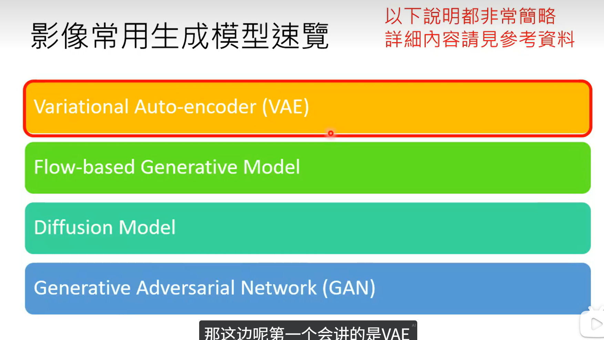

所有模型本质不是使用gpt图像生成法而是先计算normal distribution 

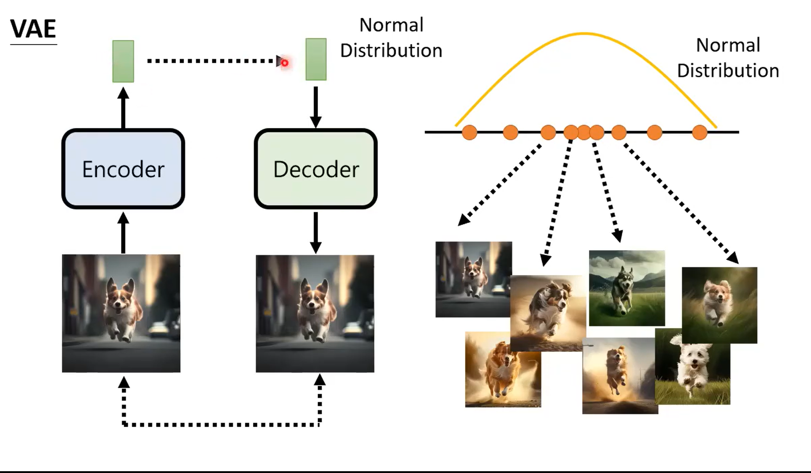

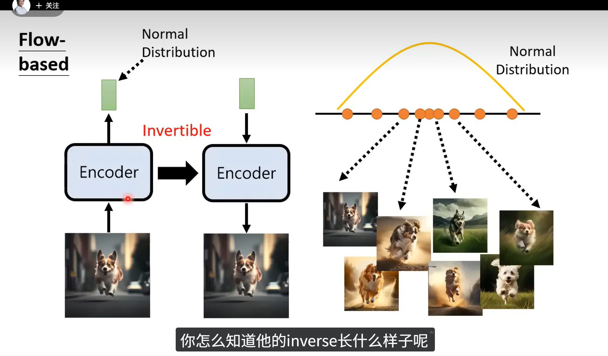


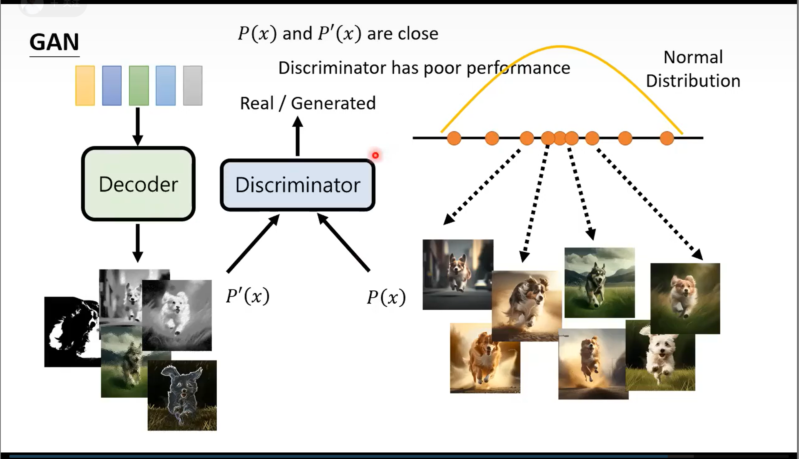

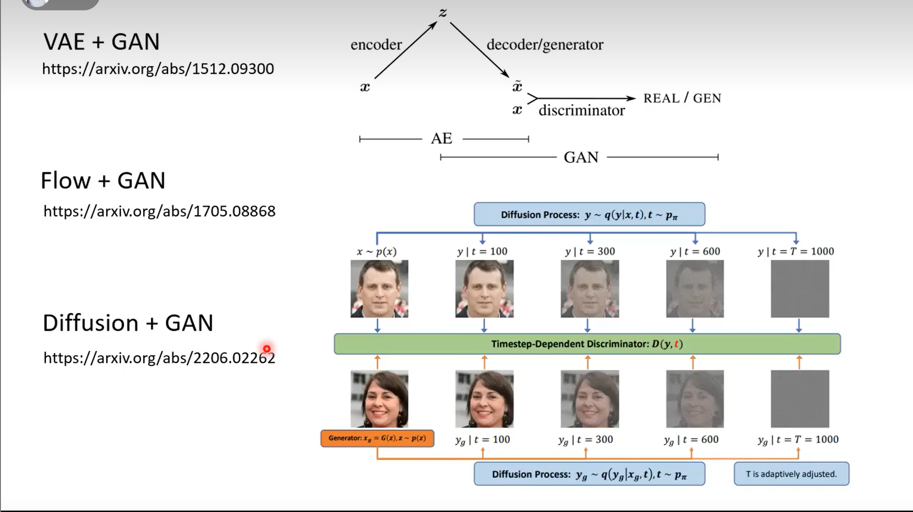

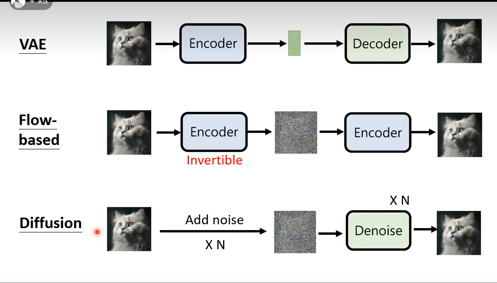

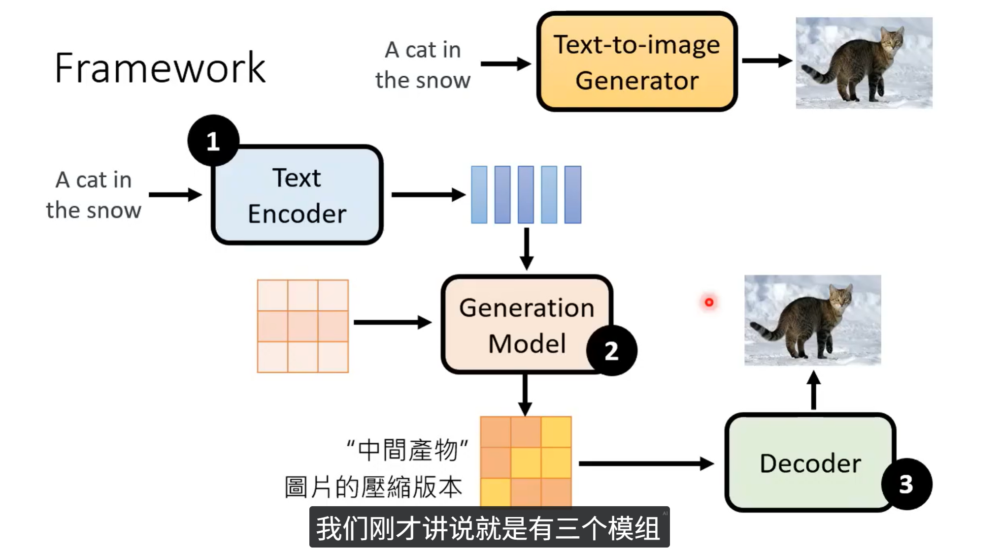

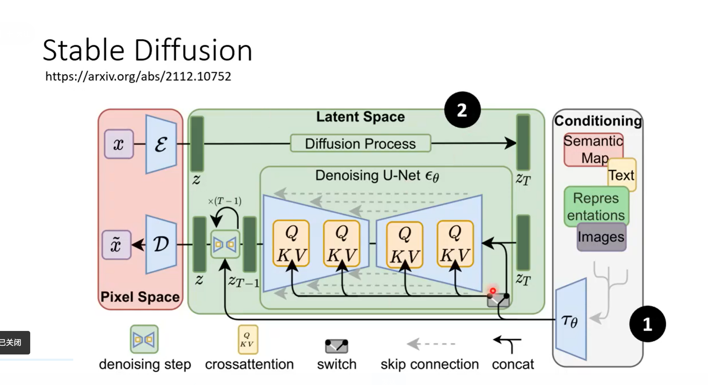

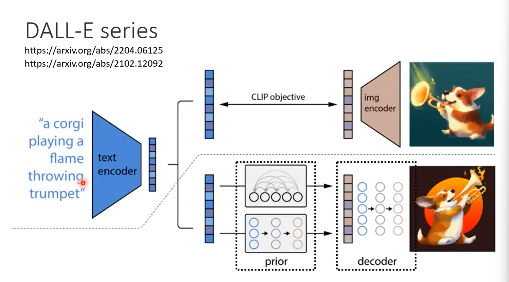

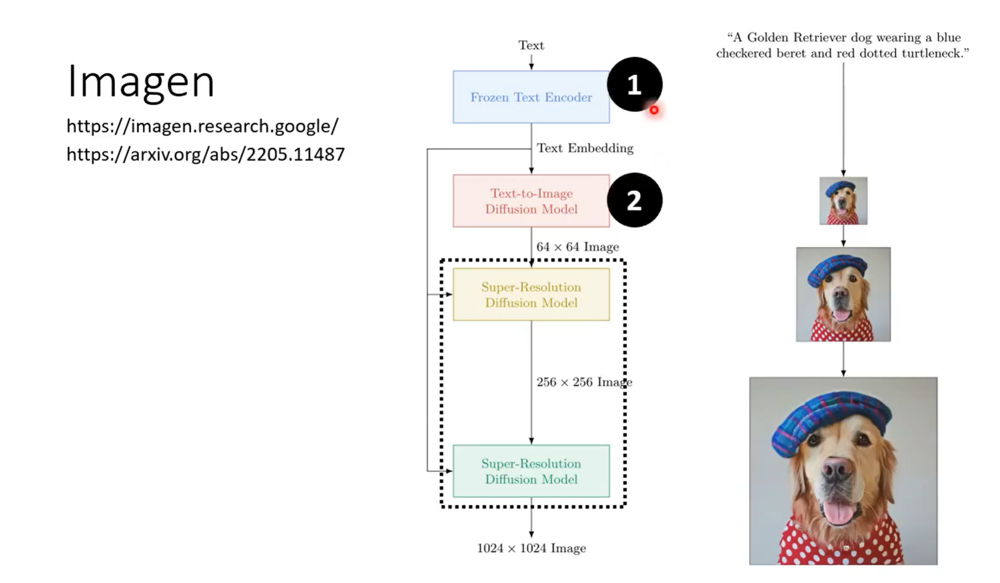

文字decoder：

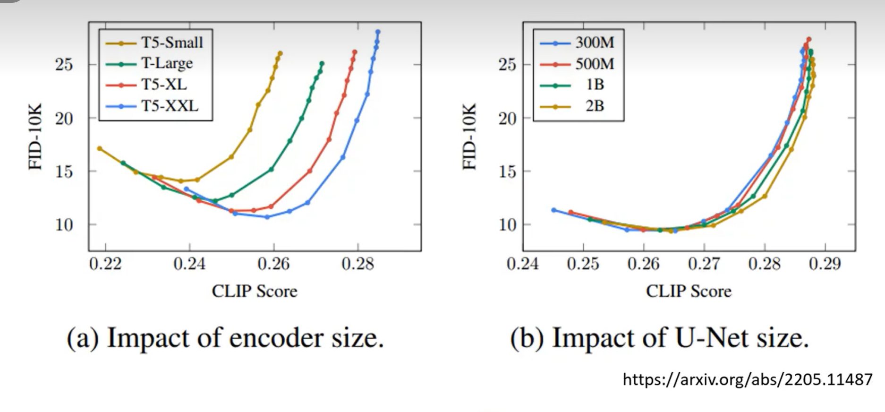

FID去衡量图片生成效果 clipscore

现有个train好的cnnmodle

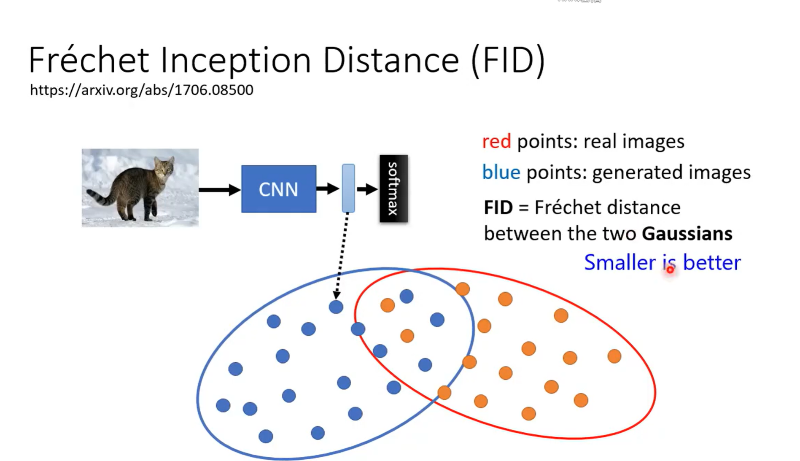


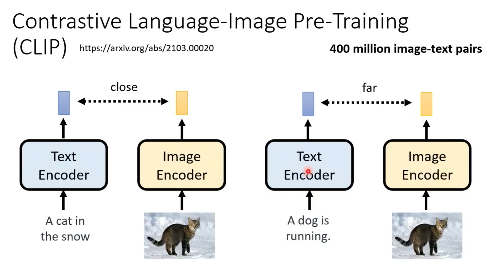


```mermaid
flowchart LR
  subgraph EEG_Encoder["EEG‑MoRAE 编码器"]
    X[EEG x: B×C×T]
    AD[Conv1d Adapter: C→128]:::enc
    BB[MAEforEEG Encoder → latent B×N×1024]:::enc
    FEAT[mean tokens (¬CLS) → B×1024]:::enc

    VH[Visual Head 1024→512]:::head
    SH[Semantic Head 1024→512]:::head
    FH[Fusion Head 1024→512]:::head

    RP[AdaptiveAvgPool1d → B×C]:::router
    RT[Router MLP → gates (g_vis_img,g_fus_img; g_sem_txt,g_fus_txt)]:::router

    IMG[(g_vis*emb_vis + g_fus*emb_fus)]:::mix
    TXT[(g_sem*emb_sem + g_fus_txt*emb_fus)]:::mix
    NIMG[L2 normalize → EEG→Image Emb B×512]:::out
    NTXT[L2 normalize → EEG→Text Emb B×512]:::out
  end

  subgraph CLIP_Loss["CLIP/InfoNCE 对齐"]
    IIMG[Image Emb (B×512) 归一化]:::tgt
    ITXT[Text Emb (B×512) 归一化]:::tgt
    LS[logit_scale = exp(θ)]:::temp

    Simg[(EIMG·IIMG^T)]:::sim
    Stxt[(ETXT·ITXT^T)]:::sim
    Limg[[L_img = S_img × logit_scale]]:::sim
    Ltxt[[L_txt = S_txt × logit_scale]]:::sim

    CEi1[CE(L_img, diag)]:::loss
    CEi2[CE(L_img^T, diag)]:::loss
    CEt1[CE(L_txt, diag)]:::loss
    CEt2[CE(L_txt^T, diag)]:::loss
    LIMG_SUM[Loss_img = (CEi1+CEi2)/2]:::loss
    LTXT_SUM[Loss_txt = (CEt1+CEt2)/2]:::loss
    TOTAL[[Total = α·Loss_img + (1−α)·Loss_txt]]:::sum
  end

  classDef enc fill:#e8f5e9,stroke:#2e7d32,color:#2e7d32
  classDef head fill:#e3f2fd,stroke:#1565c0,color:#1565c0
  classDef router fill:#fff3e0,stroke:#ef6c00,color:#ef6c00
  classDef mix fill:#fce4ec,stroke:#ad1457,color:#ad1457
  classDef out fill:#ede7f6,stroke:#4527a0,color:#4527a0
  classDef tgt fill:#bbdefb,stroke:#1565c0
  classDef temp fill:#ffe0b2,stroke:#ef6c00
  classDef sim fill:#fffde7,stroke:#f9a825
  classDef loss fill:#f3e5f5,stroke:#6a1b9a
  classDef sum fill:#ede7f6,stroke:#4527a0

  X -->|if C≠128| AD --> BB --> FEAT
  X -->|else| BB --> FEAT
  FEAT --> VH --> EV[emb_vis]
  FEAT --> SH --> ES[emb_sem]
  FEAT --> FH --> EF[emb_fus]
  X --> RP --> RT
  RT -->|normalize branches| IMG
  RT -->|normalize branches| TXT
  EV --> IMG; EF --> IMG
  ES --> TXT; EF --> TXT
  IMG --> NIMG; TXT --> NTXT

  NIMG --> Simg; IIMG --> Simg; LS --> Limg; Simg --> Limg
  NTXT --> Stxt; ITXT --> Stxt; LS --> Ltxt; Stxt --> Ltxt
  Limg --> CEi1; Limg --> CEi2; CEi1 --> LIMG_SUM; CEi2 --> LIMG_SUM
  Ltxt --> CEt1; Ltxt --> CEt2; CEt1 --> LTXT_SUM; CEt2 --> LTXT_SUM
  LIMG_SUM --> TOTAL; LTXT_SUM --> TOTAL
```


