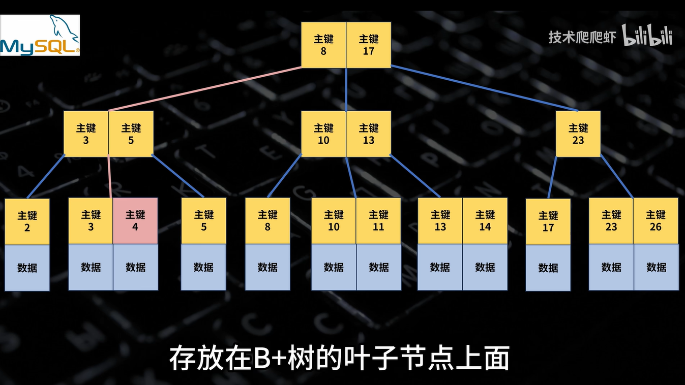
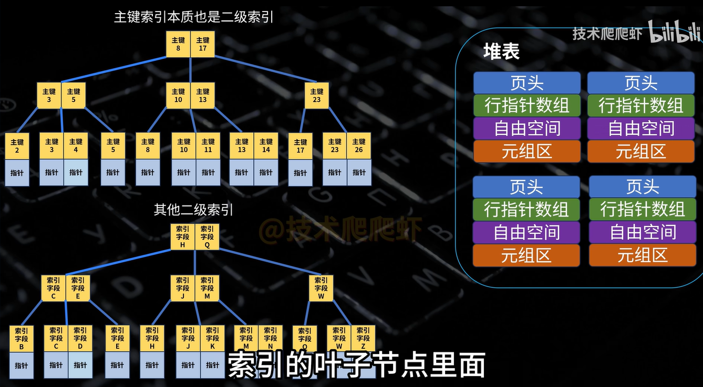
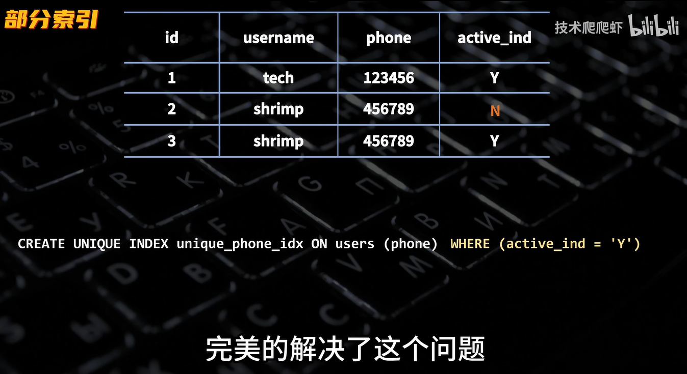
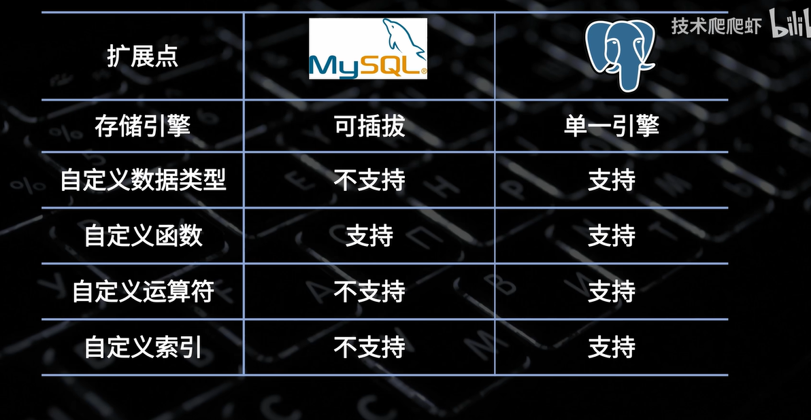
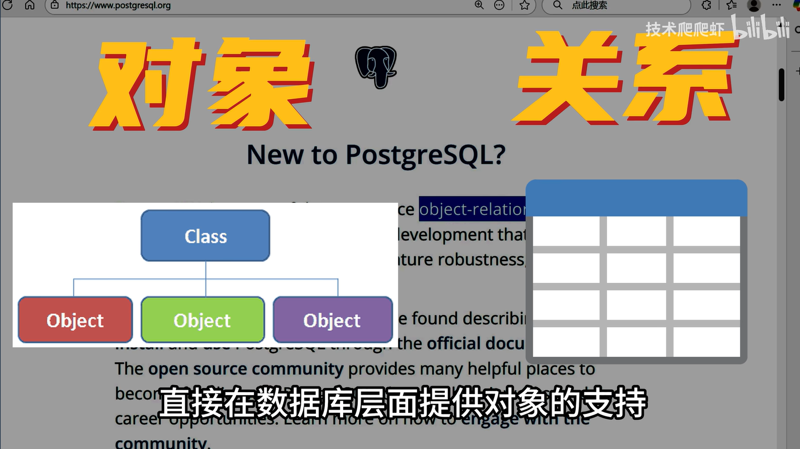
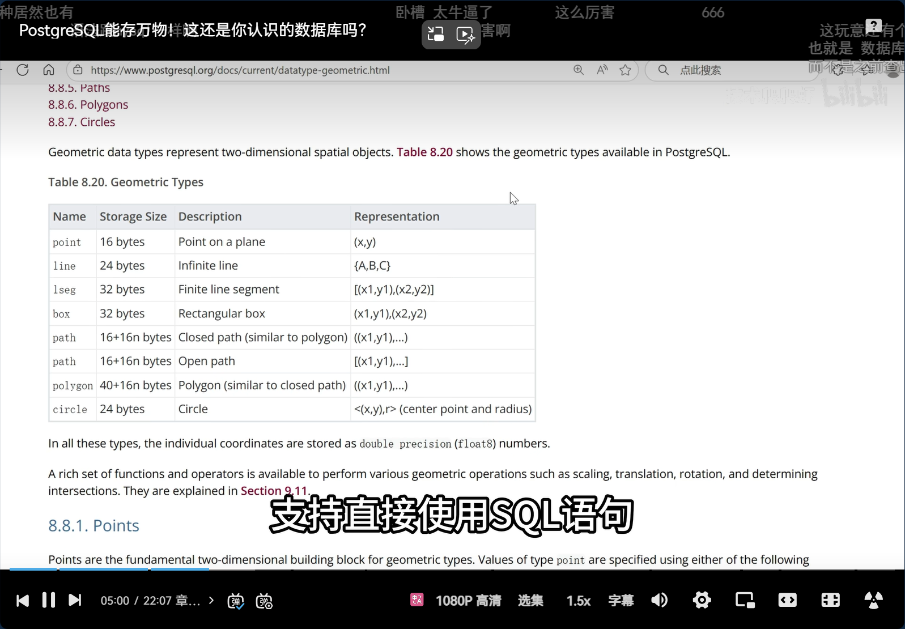
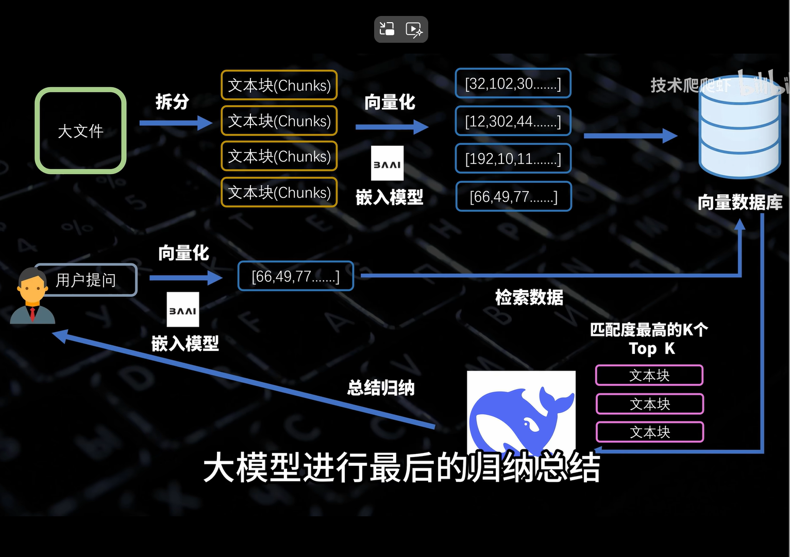

## postgresql

## 1. 资料索引

[PostgreSQL能存万物！这还是你认识的数据库吗？_哔哩哔哩_bilibili](https://www.bilibili.com/video/BV1FUYQz7E4H?spm_id_from=333.788.player.switch&vd_source=8b69015a784e94f6a869001308d33fa5&trackid=web_related_0.router-related-2206146-q9d4h.1761396611636.640)

## 2. 笔记

mysql 和postgresql都是b+树，然后mysql是聚簇索引

GIN索引 GIST索引 部分索引 二分索引 表达式索引 聚簇索引

sql数据库和非sql数据库 mongodb数据库

全盘扫描性能极低 elastic部署复杂

awsome prostgresql 插件大全

向量数据库 langchain pgvector

