# Python 小知识

## anaconda minconda conda知识

【15分钟彻底搞懂！Anaconda Miniconda conda-forge miniforge Mamba】 https://www.bilibili.com/video/BV1Fm4ZzDEeY/?share_source=copy_web&vd_source=b1560a316ec9a486cde3dbbfef0ffd0f

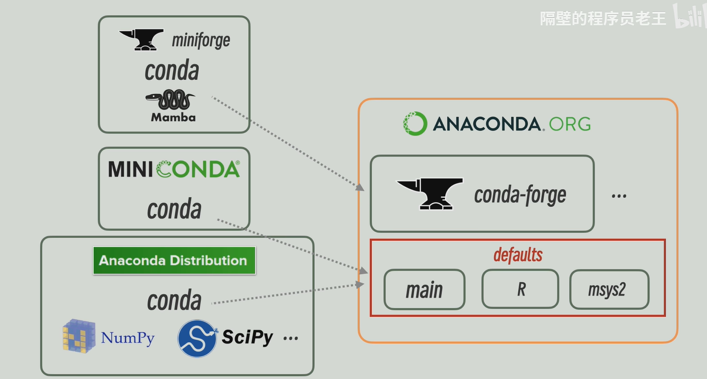

conda 最主要交互是python

ai系列依赖是最麻烦的 依赖地狱彼此强依赖

python -m venv .venv

主流是认定.venv

修改了sys.path 逐个查找指导找到 Flask是被放到虚拟环境

pip feeze 分不出什么是直接依赖 分不清间接依赖处理不好依赖关系

pip freeze > requirements.txt

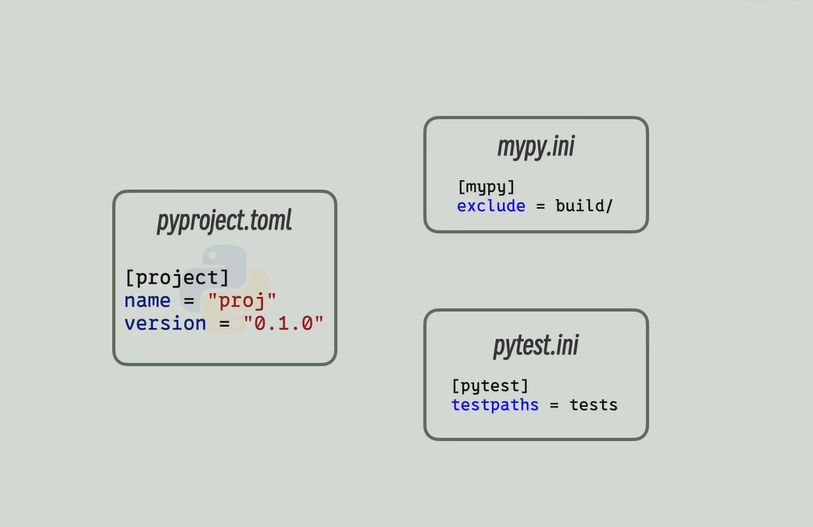

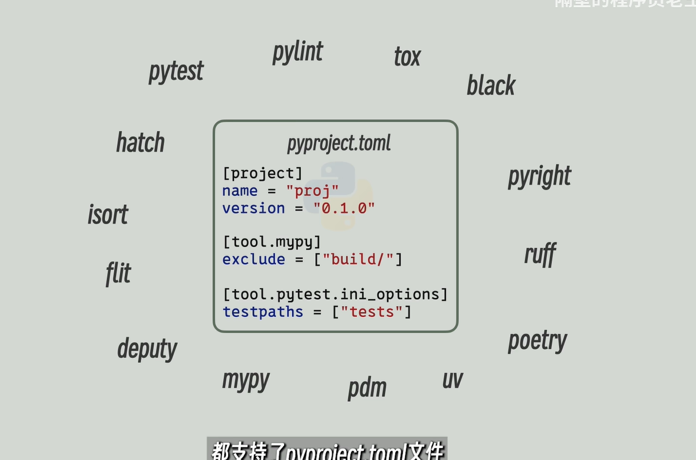

pyproject替换freeze 查看配置然后打包安装包

site-package上检查会看到我们的代码也被保存进去

pip install -e .安装时就不会把源代码放到site-packages目录中了，创建链接文件，顺着快捷方式找到源文件，这种方法需要查到版本号写入到toml配置文件

手动配置流程

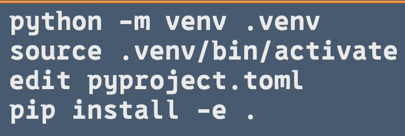

uv管理 poetry PDM

whl文件

库文件夹下属有各种.py

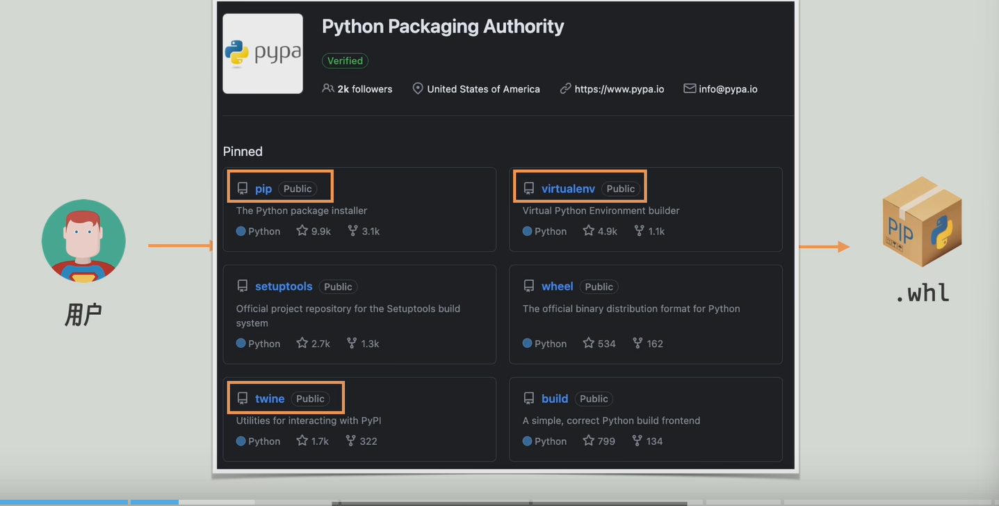

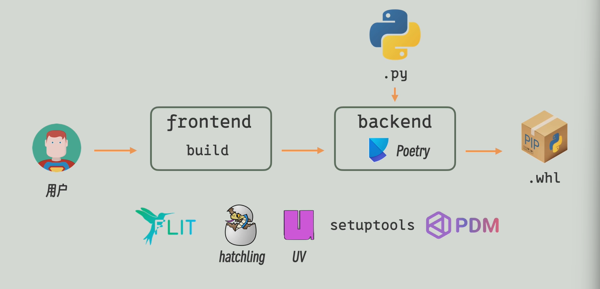

中间这两个可以排列组合的形式替换

build+hatchling

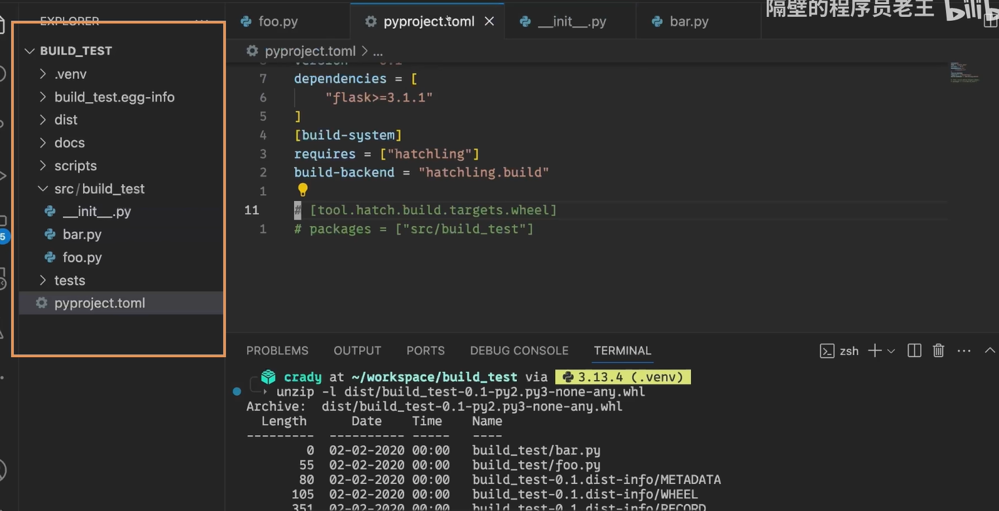

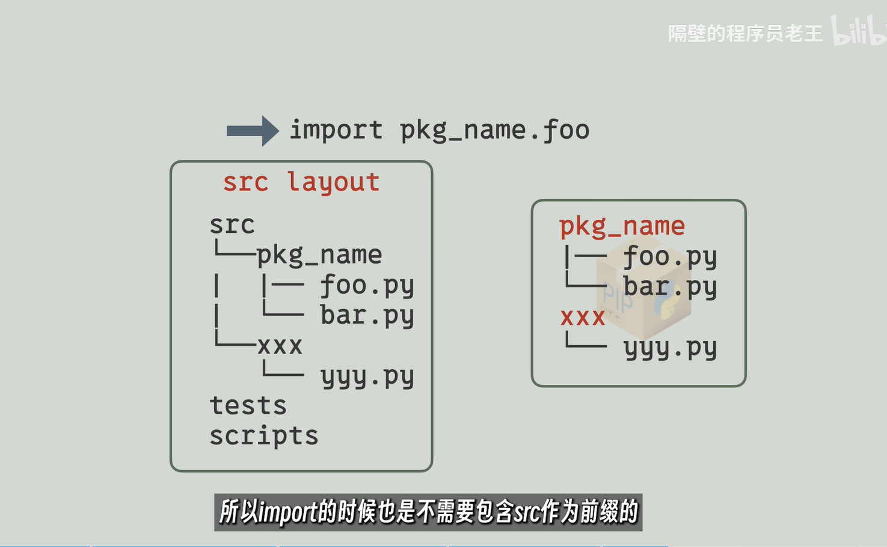

flat_layout src_layout

## agent promote MCP

autogpt 写好文件的函数给到autogpt生成一个systemprompt 本质上就是让ai具备实际操作的能力

agenttool  clie出现问题就重试

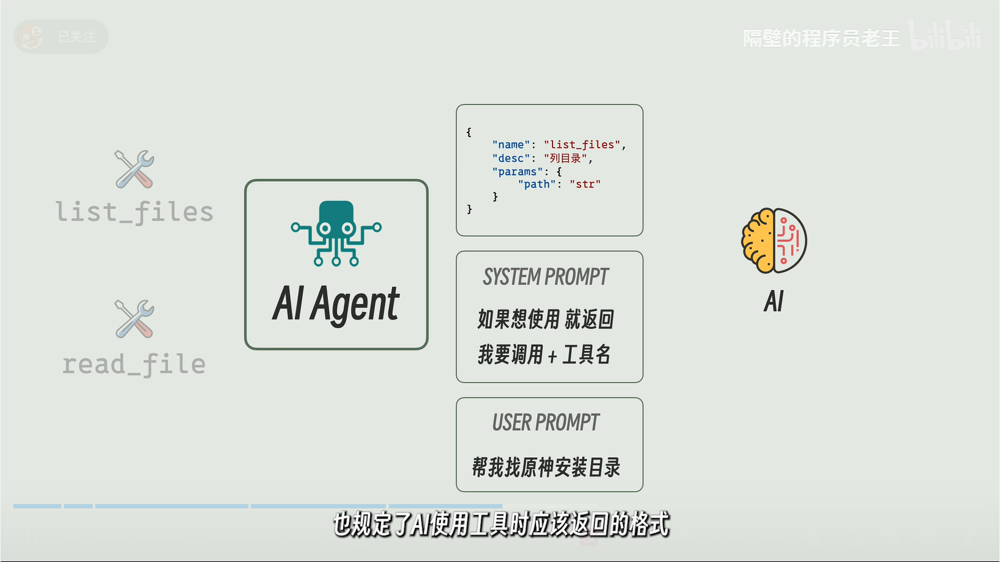

所以工具描述放到同一个地方使用相同格式systempromet 和 function calling两种方式

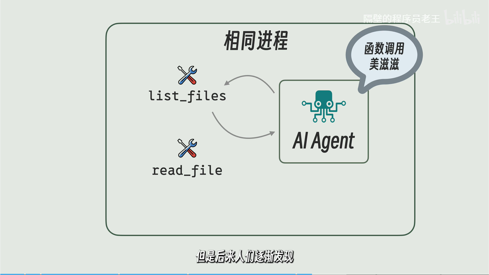

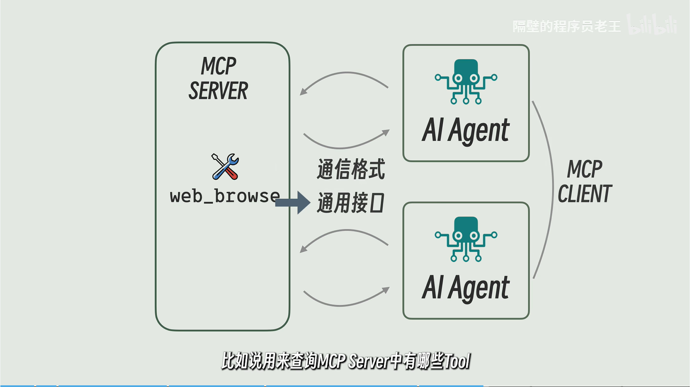

tools resources promote->mcp server mcp只负责管理而不管模型 

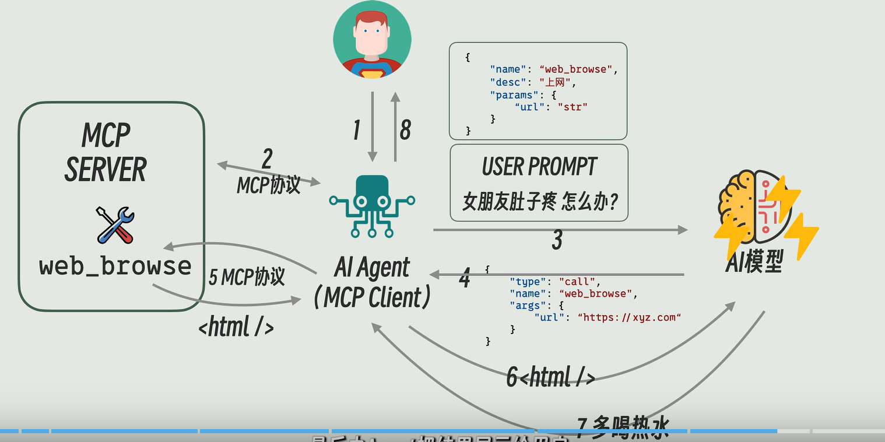

