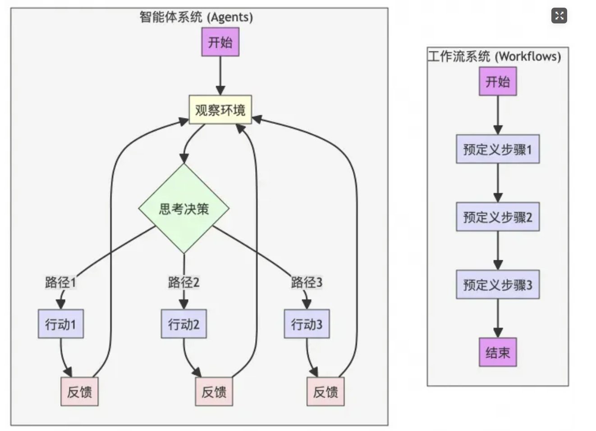
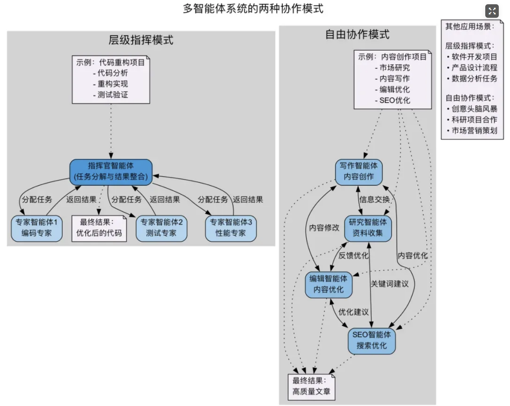
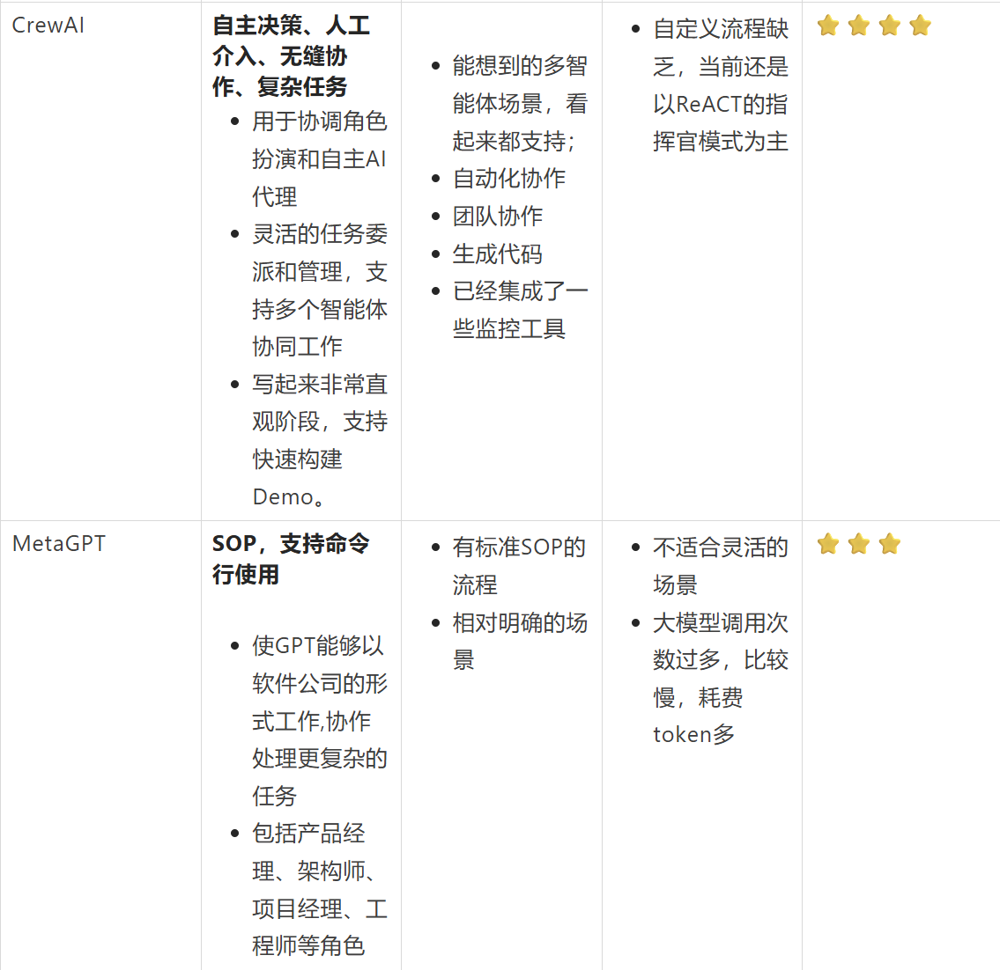
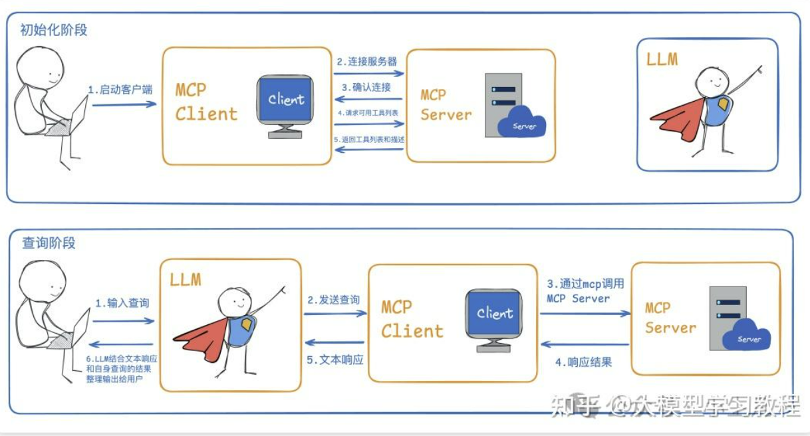
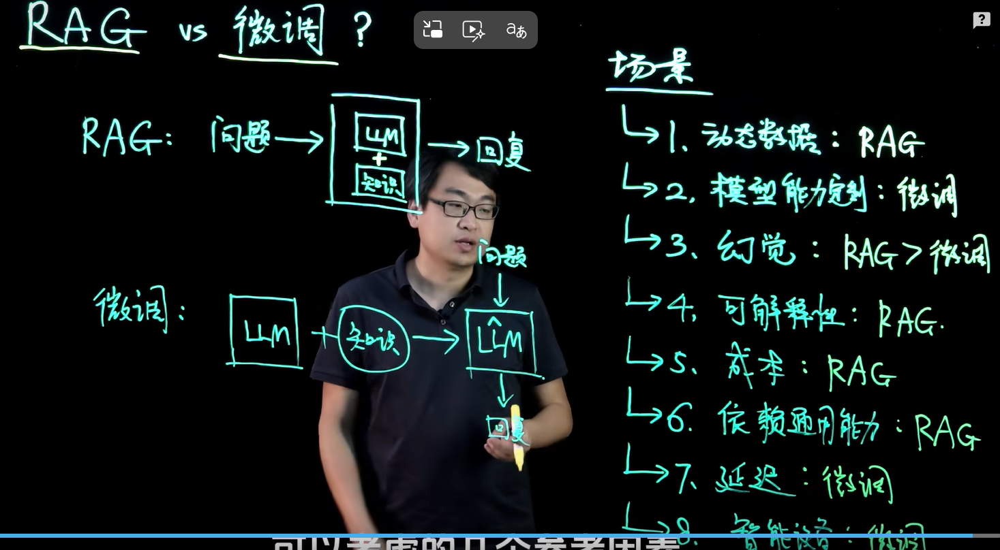
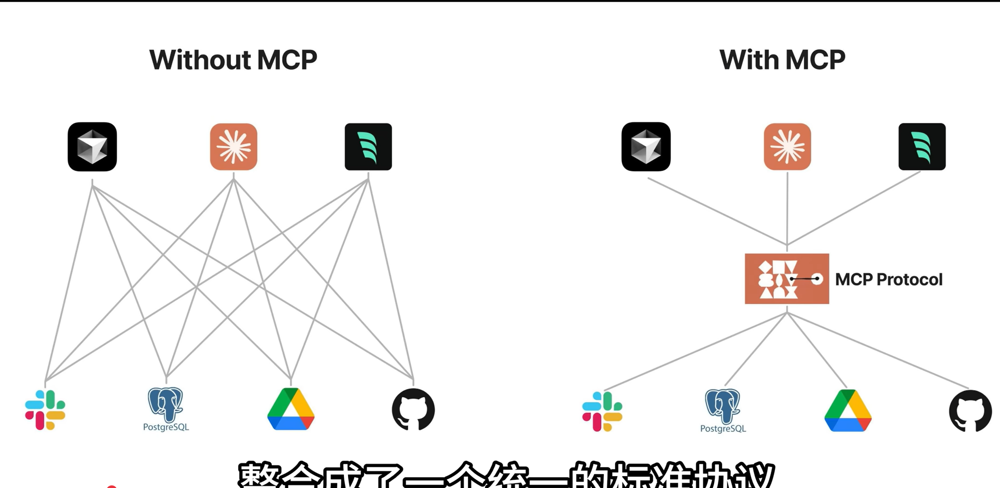

# 大模型

## 1.资料

[(93 封私信 / 82 条消息) 【LLaMA-Factory 微调教程】LoRA 微调 改变大模型的自我认知 - 知乎](https://zhuanlan.zhihu.com/p/24909312513)

## 2.笔记

### 2.1 大模型微调

模型路径 huggingface

默认或者只选lora

 rope插值加速方式去掉

不要使用量化功能，需要安装auto-gpt、vllm包，这里坑很多。因为很容易有环境的冲突。

只提供数据加载json，格式Alpaca 和 ShareGPT 两种数据格式，分别适用于指令监督微调和多轮对话任务

Alpaca 格式：

\- 适用于单轮任务，如问答、文本生成、摘要、翻译等。
\- 结构简洁，任务导向清晰，适合低成本的指令微调。

ShareGPT 格式：

\- 适用于多轮对话系统的训练，如聊天机器人、客服助手等。
\- 能够捕捉上下文信息和多轮交互，更贴近真实的人机对话场景。

**训练阶段（训练方式）**

Supervised Fine-Tuning （监督微调）

Reward Modeling（奖励建模）

PPO（Proximal Policy Optimization）

DPO （Direct Preference Optimization）

学习率写死 训练轮次按数据集调整选择默认（随时停止）

最大样本数：根据数据集大小和训练需求设置。主要是防止数据量过大导致的内存溢出问题（写死最保险）

梯度：根据显存情况调整

计算类型：这里支持混合精度训练选择（fp16或 bf16）bf16的效果更佳一些。 bf16对某些架构是不支持的，和硬件有关（GPU的架构）。如果你的硬件不支持 BF16，可以选择 FP16 进行混合精度训练。 NVIDIA 4090 支持 BF16运算。我的服务器是 NVIDIA A10 GPU，是基于 Ampere 架构 的 GPU。同样也支持bf16运算。可以先选择bf16，如果不支持会报错，然后再选择fp16就行，直接FP16

截断长度默认

LoRA秩：LoRA秩越大模型越大，默认秩是8

多卡deepseed 单卡禁用

保存间隔为0

lr0 0.0001

lrf 0.0001

weight_decay 0.0001

optimizer AdamW

## 多智能体

[(99+ 封私信 / 82 条消息) 当一个智能体不够用：多智能体协同的路径与挑战 - 知乎](https://zhuanlan.zhihu.com/p/1929279908141572273)

- **Planner（规划者）**：负责任务拆解与分发。
- **Researcher（研究员）**：执行信息收集与归纳总结。
- **Executor（执行者）**：调用工具、完成任务。
- **Evaluator（评估者）**：验证结果质量并给出反馈。

### 协作模式

### 架构

[一文讲清最近2年的多智能体框架以及其5种设计模式-CSDN博客](https://blog.csdn.net/qq_35082030/article/details/149172011)

## MCP

[MCP 协议 | 菜鸟教程](https://www.runoob.com/np/mcp-protocol.html)

GitHub：https://github.com/zhixiangxue/chak-ai

[什么是 MCP？为什么AI 想落地必须懂 MCP！从 “只会说” 到 “能做事”，这篇讲透核心逻辑-CSDN博客](https://blog.csdn.net/llooyyuu/article/details/155323400)

[(99+ 封私信 / 82 条消息) 什么是MCP｜工作原理｜如何使用MCP｜图解MCP - 知乎](https://zhuanlan.zhihu.com/p/32975857666)

[liaokongVFX/MCP-Chinese-Getting-Started-Guide: Model Context Protocol(MCP) 编程极速入门](https://github.com/liaokongVFX/MCP-Chinese-Getting-Started-Guide?tab=readme-ov-file)

[(99+ 封私信 / 82 条消息) 了解本地和远程模型上下文协议 - 知乎](https://zhuanlan.zhihu.com/p/1915474433482663347)

[🚀 MCP中文教程概览 | 模型上下文协议——MCP](https://mcp.meetcoding.cn/00-tutorial-overview.html)

https://mcp.meetcoding.cn/01-introduction/what-is-mcp.html

## 总体框架

**模型/计算层 -> 推理/服务层 -> 框架/编排层 -> 应用/平台层**

1.推理与服务框架

这类工具的核心目标是**高效、稳定地将训练好的大模型运行起来，并提供API服务**

**vLLM**：**PagedAttention** 算法，类似于操作系统的虚拟内存分页管理，能极大优化 GPU 显存的使用效率，尤其是在处理长序列和并发请求时，性能提升非常显著。是目前最流行的开源高性能推理框架之一

2.模型与库

**Hugging Face**：是**整个开源AI生态的中心**，提供数据集，模型，开源库

**Transformers**：是 Hugging Face 开发的一个**Python 库**。提供了数万个预训练模型的统一、易用的接口（如 `AutoModel`, `AutoTokenizer`），让用户可以用几行代码就加载、使用、微调各种类型的 Transformer 架构的模型（如 BERT, GPT, T5）。它是**使用 Hugging Face 上模型的主要工具**。

3.AI 应用开发框架与平台

**LangChain**：一个用于开发大模型应用的**开源框架**。提供了一系列“链”的抽象，将调用模型、处理数据、执行逻辑等步骤连接起来。它内置了大量组件，如与向量数据库交互、智能体（Agent）工具调用等。是早期的行业标准框架，功能强大但有时显得笨重。

**LangGraph**：可以看作是 LangChain 的补充或升级，专注于构建有**状态、多步骤的循环应用**。使用图结构来定义工作流，特别适合构建复杂的**智能体**，其中代理需要根据情况反复执行任务、使用工具。它比 LangChain 的简单“链”更能表达复杂的控制流。

agent：一个**概念或架构模式**，而非特定工具，一个大模型作为“大脑”，可以根据目标**自主地规划、调用工具（如计算器、搜索引擎、API）、执行动作**，最终完成复杂任务。LangChain 和 LangGraph 都是实现 Agent 的流行框架。

**MCP**：**模型上下文协议**，由 Anthropic 提出的一种**开放标准**。解决智能体生态中“工具调用”的碎片化问题。它定义了一个标准协议，让任何工具（如日历、数据库）都可以用统一的方式被任何兼容 MCP 的客户端（如 Claude Desktop， 未来的 LangChain 等）调用。**意在成为工具领域的“USB 标准”**。

**Dify / Coze**：**无代码/低代码的 AI 应用开发平台**。提供可视化界面，通过拖拽和配置就能构建基于 Prompt 的应用程序、工作流甚至智能体，无需或只需少量代码。它们通常集成了模型、RAG、Agent 等能力，降低了开发门槛。Dify 是开源可自托管的，Coze 是字节跳动的海外产品。

**RAGFlow**：一个开源的、基于深度文档理解的 **RAG 引擎**。专注于 RAG 管道中的文档解析和文本切分环节，能更好地处理复杂格式的文档（如 PDF 中的表格、图表），提高检索质量。可以看作是一个垂直领域的、更专业的 RAG 工具。

cline和cursor+mcp

smithery ai

MCP是啥？技术原理是什么？一个视频搞懂MCP的一切。Windows系统配置MCP，Cursor,Cline 使用MCPhttps://youtu.be/McNRkd5CxFY?si=fRwPGqsFUr6T6vQe

mcp本质就是用户用命令行调用了nodejs程序或者python程序去调用

Agent Skill 从使用到原理，一次讲清：https://youtu.be/yDc0_8emz7M?si=st7DnmUluekPKlrT

