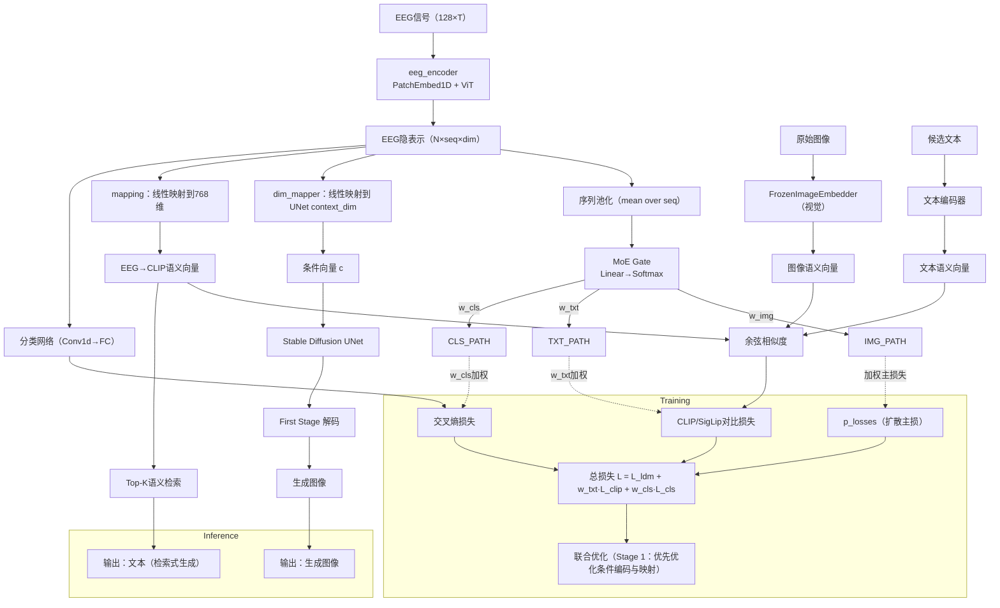

# 脑机

## 1.资料

[(90 封私信 / 64 条消息) 【脑电波与LLM】Thought2Text: Text Generation from EEG Signal using Large Language Models (LLMs) - 知乎](https://zhuanlan.zhihu.com/p/19134219322)

[清华&腾讯提出DreamDiffusion：你大脑中的画面，可以高清还原了！-CSDN博客](https://blog.csdn.net/amusi1994/article/details/131651269)

Brain2Qwerty：https://mp.weixin.qq.com/s/avxYI8VYOYpg-3FoEUrHfA

DreamDiffusion：https://mp.weixin.qq.com/s/YY_7HtXKjMzr9S_rqfwGTA

AI+脑科学：EEG × 深度学习的五大前沿应用全解析：https://mp.weixin.qq.com/s/LqdCGwHalqrOJIClgeBfMg

Are EEG-to-Text Models Working？：https://mp.weixin.qq.com/s/aVKJFco18wam0DTlUUuqWQ

[(95 封私信 / 82 条消息) 【AI论文学习笔记】看穿大脑：从人脑信号中重建视觉感知的图像 - 知乎](https://zhuanlan.zhihu.com/p/650910933)

## 2.笔记

### 2.1 EEG-CLIP：

https://arxiv.org/abs/2503.16531

https://github.com/tidiane-camaret/EEGClip 

用于匹配图像及其文本说明，随后利用文本类别提示成功实现了零样本解码，一种对比学习框架 EEG-CLIP，该框架将 EEG 时间序列和相应的临床文本描述对齐到共享的嵌入空间中

#### 2.1.1研究内容：

EEG-CLIP 旨在解决脑电图（EEG）解码中的任务特定性问题，即传统深度学习方法通常只能针对单一任务（如病理检测或年龄预测）进行训练，缺乏通用性。本研究提出一种任务无关的方法，通过对比学习框架对齐EEG时间序列和临床文本描述（如医疗报告），在共享嵌入空间中学习通用的EEG表示。核心目标是实现EEG信号的零样本和少样本解码，从而降低对标注数据的依赖，并提升模型在多种下游任务（如病理分类、年龄和性别预测）中的泛化能力。

#### 2.1.2相关研究的不足：

**基于深度学习的EEG解码**：传统方法依赖任务特定模型（如CNN、RNN），虽在特定任务（如运动想象分类）中表现良好，但表示缺乏通用性。近期工作开始探索多模态融合（如EEG与fNIRS结合），但未充分利用文本监督。

**对比学习与多模态对齐**：受CLIP（Contrastive Language-Image Pre-training）启发，本研究将图像-文本对齐范式扩展到EEG领域。CLIP通过对比损失对齐海量图像-文本对，实现零样本推理，EEG-CLIP借鉴此思路，利用临床报告作为自然语言监督源。

**EEG与文本结合的新进展**：类似工作如Gijsen & Ritter (2024) 的EEG-语言模型专注于病理检测，而EEG-CLIP首次系统评估多任务解码（包括年龄、性别和药物预测），强调通用表示学习。

#### 2.1.3方法模块及对应解决的问题

**EEG编码器**：

- **模块描述**：采用Deep4 CNN架构（四层卷积-池化块），输入为预处理后的EEG信号，输出128维嵌入。该网络专为EEG的时空特征优化，包含批归一化和丢弃层以提升鲁棒性。
- **解决问题**：克服EEG信号的高噪声、低空间分辨率及个体差异问题，通过深层网络提取鲁棒的时空表示。

**文本编码器**：

- **模块描述**：基于预训练的BERT模型（如ClinicalBERT），将临床报告转换为嵌入。文本输入为医疗报告的分段（如"IMPRESSION"章节），输出128维嵌入。
- **解决问题**：利用预训练语言模型的语义理解能力，处理临床文本的多样性和复杂性，实现EEG与文本的语义对齐。

#### 2.1.4实验内容

**分类任务性能**：

**零样本分类**：

**少样本学习**：

**消融与分析**：

**可解释性分析**：

#### 2.1.5创新点

首次将CLIP风格的对比学习应用于EEG-文本对齐，突破任务特定模型的限制。

#### 2.1.6其他

选择21个通用电极，排除首分钟数据，使用后续2分钟片段。

裁剪幅度至±800μV，重采样至100Hz，归一化方差。

- EEG编码器（Deep4 CNN）处理信号，输出嵌入。
- 文本编码器（BERT）处理报告分段，输出嵌入。
- 双模态嵌入经投影头映射至64维共享空间。

最小化对比损失，拉近匹配的EEG-文本对。

投影头在对比学习中的作用：

投影头（Projection Head）在多模态对比学习中是关键组件，负责将不同模态（如EEG信号和文本）的嵌入映射到统一的共享嵌入空间，使对比损失能够有效对齐异构数据。其设计直接影响模态间语义对齐的精度和泛化能力。

EEG-CLIP的投影头方法：

**结构设计**：采用多层感知机（MLP），包含3个全连接层，每层使用ReLU激活函数，最终输出64维嵌入向量。这种深层非线性结构旨在捕捉EEG信号与文本描述间的复杂映射关系。

**维度选择**：共享嵌入空间被压缩至64维（见第4.3.2节），实验表明较小维度（32-128）比更大维度（256-512）更有效，因压缩过程能过滤噪声，强化关键特征对齐。

**训练细节**：投影头与双编码器联合训练，通过对比损失优化。文本编码器（如ClinicalBERT）的微调学习率被设置为EEG编码器的10^-3倍，以平衡语言知识的保留与域适应（第4.3.1节）。

| **特征**         | **EEG-CLIP**                           | **原始CLIP**                       | **区别意义**                                                 |
| :--------------- | :------------------------------------- | :--------------------------------- | :----------------------------------------------------------- |
| **投影头结构**   | 3层MLP（非线性，ReLU激活）             | 通常为2层MLP或线性层               | EEG-CLIP的更深层结构适应EEG信号的时序复杂性和临床文本的专业性，需更强非线性变换。 |
| **输出维度**     | 64维（小维度）                         | 通常512维（大维度）                | EEG数据噪声高、维度低，小维度压缩能提炼本质特征；CLIP的大维度保留图像丰富细节。 |
| **模态特性适配** | 针对EEG的时空局部性和文本的临床术语    | 针对图像的全局特征和文本的通用描述 | EEG-CLIP需处理生理信号的细粒度模式（如频段特征），而CLIP关注视觉语义的宏观对齐。 |
| **数据规模与域** | 临床EEG数据集（TUAB，数千样本）        | 互联网图像-文本对（4亿样本）       | EEG-CLIP在有限数据下依赖投影头的强正则化（如维度压缩）防止过拟合；CLIP依赖大数据容量。 |
| **优化策略**     | 文本编码器低学习率微调（防灾难性遗忘） | 端到端均衡优化                     | 临床文本编码器需保留领域知识，故EEG-CLIP采用非对称学习率；CLIP的通用文本编码器可充分更新。 |

脑机：

创新点1：

目标是“输入 EEG，同时输出高质量图像与对应文本”，并且希望用多任务或更创新的联合训练方式。

建议采用“共享 EEG 编码器 + 两个任务头”的多任务结构：

- 图像头：沿用当前的 Stable Diffusion 条件分支（EEG→cross-attn tokens），生成图像
- 文本头：新增一个文本生成分支（EEG→文本），与图像头共享 EEG 表征，并联合训练

共享表征

继续用 eeg_encoder 提供序列特征（ code/sc_mbm/mae_for_eeg.py:337 ），沿用 Stage A 的自监督预训练以确保鲁棒性

图像生成头

保持现有 cond_stage_model 中的 EEG→SD 条件映射（ code/dc_ldm/ldm_for_eeg.py:29 ）

通过 channel_mapper 将序列长度映射到 77 tokens，通过 dim_mapper 将维度映射到 context_dim=768 （ code/dc_ldm/ldm_for_eeg.py:48 、 code/dc_ldm/ldm_for_eeg.py:52 ）

文本生成头（新增）

两条实现路线可选：

- 轻量映射+检索：把 EEG pooled 特征映射到 CLIP 文本嵌入（768），做最近邻检索或分类到一组模板（如 ImageNet 类名的短句），输出文本
- 自回归文本生成：用一个小型语言模型（如 DistilGPT2 / T5-small ）作为 decoder，将 EEG特征作为前缀或 cross-attn 条件，直接按 token 生成句子

与图像头共享 eeg_encoder ，在训练中加语言建模损失

多任务联合：

扩散损失：SD 路径的标准噪声预测损失（现有 DDPM.p_losses ， code/dc_ldm/models/diffusion/ddpm.py:311 ）

文本损失：
- 检索式：对齐损失， eeg→CLIP_text_embed 与目标文本嵌入的余弦相似度
- 生成式：交叉熵语言建模损失（teacher-forcing）

多模态对齐：

- 现有 clip_tune ： eeg 与图像 CLIP 嵌入的对齐（ code/dc_ldm/ldm_for_eeg.py:83 ），建议保留
- 额外增加 eeg↔text 对齐，稳定文本任务的学习

一致性约束（可选创新）：
- 图像-文本一致：用预训练图像描述器（BLIP）从生成图像得到 caption，与文本头输出做相似度（如 CLIP 文本空间或 token 级教师信号），提高跨任务一致性

数据集：

MOABB、CVPR2017

指标：

BLEU、FID

**DreamDiffusion**:

提出直接从EEG信号生成高质量图像的方法，无需中间文本转换。

采用时间掩码信号建模（Temporal Masked Signal Modeling）预训练EEG编码器，解决EEG噪声和个体差异问题。

利用CLIP图像编码器提供额外监督，对齐EEG、文本和图像嵌入空间。

**Thought2Text**

首次使用指令调优的大型语言模型（LLMs）从EEG信号直接生成文本，实现“思维到文本”转换。

设计三阶段流程：EEG编码器训练、LLM多模态微调、EEG嵌入优化，强调语言无关的视觉刺激避免语言处理复杂性。

通过CLIP对齐EEG和图像嵌入，提升文本生成的准确性和流畅性。

**EEG-CLIP**

首创对比学习框架，对齐EEG时间序列和临床文本描述，学习通用EEG表示。

支持零样本和少样本分类，通过自然语言提示实现任务无关解码（如病理、年龄、性别预测）

证明小嵌入维度（32-128）优于大维度，强调紧凑空间中的语义蒸馏

**跨模态生成统一化**：DreamDiffusion（图像生成）和Thought2Text（文本生成）均依赖EEG编码和CLIP对齐，可合并为单一管道，实现EEG到多模态输出（如图像+文本描述）。

**表示学习增强**：EEG-CLIP的对比学习机制可提升DreamDiffusion和Thought2Text的嵌入对齐质量，减少对配对数据的依赖。

**解决共性挑战**：所有文档提及EEG的噪声、个体差异和数据稀缺问题，结合后可通过共享预训练策略（如掩码建模）提升鲁棒性。




```mermaid
flowchart LR
  %% 数据与预处理
  DSET[EEGDataset<br/>(eeg,label,image,image_raw)] --> EEG_IN[EEG信号]
  DSET --> IMG_RAW[image_raw]
  DSET --> LABEL[label]

  %% 编码器层
  EEG_IN -->|流1| MAE[eeg_encoder (MAE/ViT)]
  EEG_IN -->|流2| CNN[Deep4Net/Conv Stem]
  MAE --> FUSE[特征融合<br/>Concat + 投影]
  CNN --> FUSE
  FUSE --> LATENT[EEG隐表示<br/>(seq×dim)]

  %% MoE 路由
  LATENT --> POOL[序列池化]
  POOL --> GATE[MoE Gate<br/>Linear→Softmax]
  GATE -->|w_img| HEAD_IMG
  GATE -->|w_txt| HEAD_TXT
  GATE -->|w_cls| HEAD_CLS

  %% 图像生成头（DC-LDM）
  subgraph Image Generation
    LATENT --> DIM_MAP[dim_mapper→context_dim]
    DIM_MAP --> C[cross-attn 条件 c]
    C --> UNET[Stable Diffusion UNet]
    UNET --> FIRST[First-Stage 解码]
    FIRST --> IMG_OUT[生成图像]
    HEAD_IMG -.权重 w_img 加到主损.-> LDM_LOSS[p_losses]
  end

  %% 语义对齐头（EEG-CLIP 风格）
  subgraph Text/Image Alignment
    LATENT --> MAP768[mapping→768维]
    MAP768 --> EEG_EMB[EEG→CLIP语义向量]
    IMG_RAW --> CLIP_V[FrozenImageEmbedder]
    CLIP_V --> IMG_EMB[图像语义向量]
    TXT_CAND[候选文本] --> TXT_ENC[TextEncoder]
    TXT_ENC --> TXT_EMB[文本语义向量]
    EEG_EMB --> SIM[余弦/对比相似度]
    IMG_EMB --> SIM
    TXT_EMB --> SIM
    SIM --> LOSS_CLIP[ClipLoss/SigLipLoss]
    HEAD_TXT -.权重 w_txt 加到辅助损.-> LOSS_CLIP
  end

  %% 分类头（可选）
  subgraph Classification
    LATENT --> CLS_NET[classify_network]
    CLS_NET --> LOSS_CE[交叉熵损失]
    HEAD_CLS -.权重 w_cls 加到辅助损.-> LOSS_CE
  end

  %% 训练与推理
  LDM_LOSS --> L_TOTAL[总损失 L = L_ldm + w_txt·L_clip + w_cls·L_ce]
  LOSS_CLIP --> L_TOTAL
  LOSS_CE --> L_TOTAL
  L_TOTAL --> OPT[联合优化/阶段化微调]
  IMG_OUT --> OUT_IMG[输出图像]
  EEG_EMB --> RETR[Top-K检索] --> OUT_TXT[输出文本（检索式）]
```

四、实验设置

对比实验

reamDiffusion 在定性上与Brain2Image（一个基于GAN/VAE的方法）对比。具体地，在少数类别（如Airliner、Jack-o-Lantern、Panda）上进行了主观评估，显示DreamDiffusion生成图像质量显著更高（Figure 5）。

DreamDiffusion生成的图像更真实、细节更丰富，而Brain2Image输出模糊且语义不一致。

消融实验

DreamDiffusion

通过Table 1评估不同组件的影响，包括掩码信号建模（MSM）预训练、CLIP微调、掩码比率和模型参数。

- 无预训练（模型1-4）导致准确率骤降（如从45.8%降至4.2%），凸显预训练必要性。
- 掩码比率0.75时性能最优（模型6），过高或过低比率均有害（模型5、7）。
- CLIP对齐至关重要：无CLIP监督（模型13-14）时性能下降约10-15%。
- 同时微调编码器和注意力头（E+A）比仅微调编码器（E only）效果更好。

实验设置

- **数据集**：EEG预训练：约120,000个EEG样本（来自MOABB平台），覆盖400+受试者，通道数30-128。配对数据：ImageNet-EEG数据集，6名受试者观看2000张图像（40类），EEG记录为128通道、0.5秒刺激。
- **模型配置**：EEG编码器：基于ViT-Large的时序掩码建模，掩码比率75%，预训练500轮。生成模型：Stable Diffusion v1.5，微调300轮，使用交叉注意力机制集成EEG嵌入。优化：AdamW，学习率1e-4，批量大小16。
- **预处理**：EEG信号过滤（5-95 Hz），截取长度512，通道数统一为128（填充处理）。

评估指标

- **主要指标**：50-way top-1分类准确率——使用ImageNet预训练分类器评估生成图像的语义正确性（生成与真实图像分类一致视为正确）。
- **辅助指标**：定性视觉比较（如Figure 4、5、6）、失败案例分析（Figure 7）。
- **消融指标**：准确率百分比，直接反映组件贡献（Table 1）。


Thought2Text

**多基线比较**：在Table 2中，与多种基线方法对比：

- ONLY_OBJ：仅使用对象标签生成文本。
- OBJ+RAND_EMB：对象标签加随机嵌入。
- NO_STAGE2：省略第二阶段（LLM图像嵌入微调）。
- ONLY_EEG：仅使用EEG嵌入，忽略对象标签。

完整模型（ALL）在ROUGE、BLEU等指标上显著优于基线。例如，LLaMA3-8B-ALL的ROUGE-1为30.0%，而ONLY_OBJ仅9.8%。

消融实验

### 2.2 eeg情感分类
