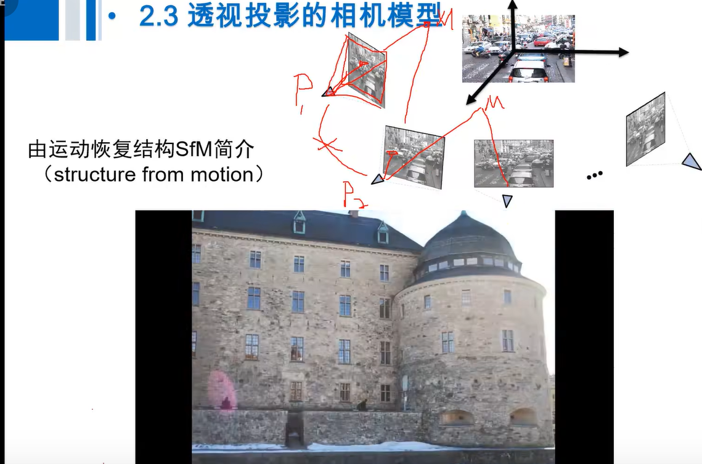
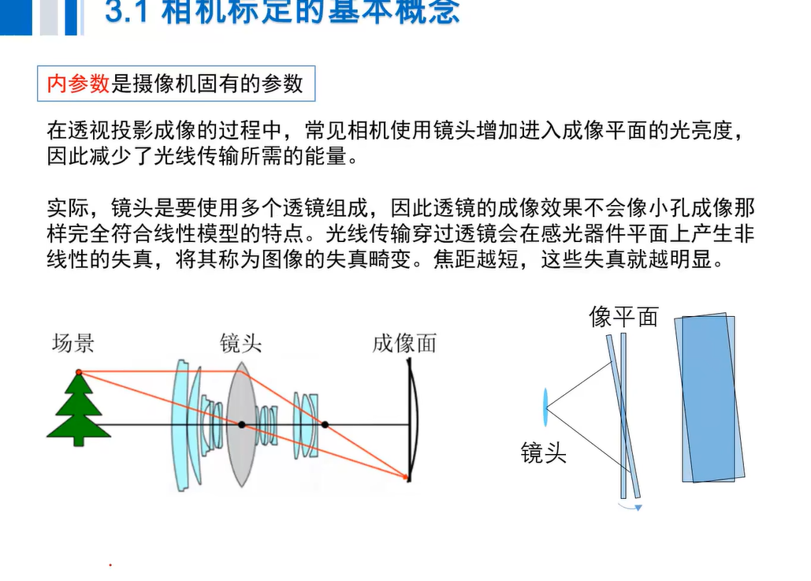

## 计算机视觉三维测量

## 第一章_绪论

计算机视觉算法与应用

计算机视觉 机器视觉 摄影测量与遥感

特征匹配在形变上的问题 镜头焦距变化的飘逸问题

## 第二章_图像的感知和获取

## 2.2坐标转化基础

## 2.3透视投影相机模型

线性 实际空间

光心 主光轴构建相似三角形

把世界坐标投影到相机空间坐标系然后再转到像平面坐标系

slm 视觉测量 二维转三维 缺失了深度，因为在延长到射线上的任意一点投影到像平面同一点，放过来，就是会与主光轴形成图像。一张图像上没有约束条件，单目深度估计。

双图像去做 特征匹配点去做

f_x是像素 然后x_m/z_m量纲消除了，从米转到像素

相机矩阵 世界坐标——>像坐标系

自由度DOF：多少个不相关的变量能够确定一个数学模型

光心 焦距 本质上就不算是二维了而是立体罪行，必须知道摄像机两个都对应姿态

同名点 要有交叉点部分 特征匹配找到相机的位置姿态，然后影像可以重建 稀疏然后三角形填充，

交互测量发 共线方程

## 2.4射影几何基础

射影集合包含欧氏几何

欧式空间在数学上不存在相交

在射影空间平行线和平行面无穷远相交

数学模型反映这个现象

