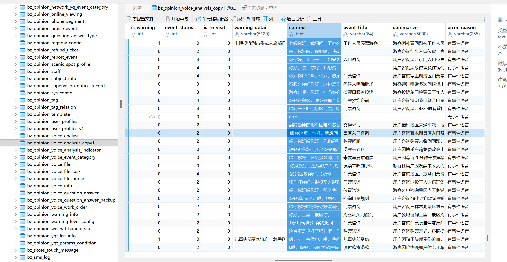
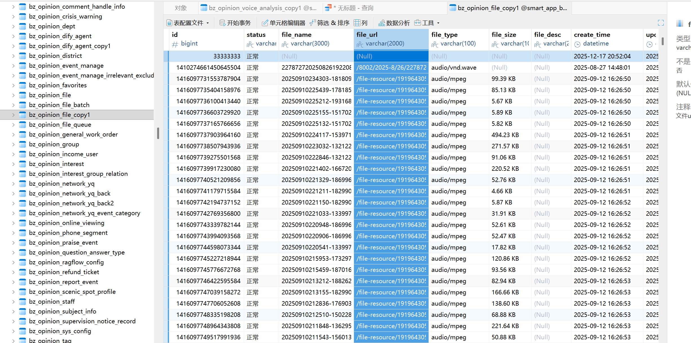

# 4.语音分离的数据库更新

bz_opinion_file @smart_app_bzopinion (smart_app_bzopinionyuqing) -表

bz_opinion_voice_analysis @smart app_bzopinion (smart app_bzopinionyuqing) - 表

/file-resource/1919643053772152833/bz_opinion_analysis_file/analysis/20250910234303-18180999219-S20250910234301470900AC130E1705370884-0000107800187006_1757665608957.mp3

```
查询特定位置的context是否被更改
SELECT 
    f.id, 
    f.file_url, 
    v.file_id, 
    v.context,
    -- 检查 JSON 是否合法：1 为合法，0 为非法
    JSON_VALID(v.context) AS is_json_valid,
    -- 计算解析出的对话条数
    JSON_LENGTH(v.context) AS dialog_count
FROM bz_opinion_file_copy1 f
LEFT JOIN bz_opinion_voice_analysis_copy1 v ON f.id = v.file_id
WHERE f.id = 1416097737165766656;
```

## 4.1 公司地址

cd /data/upload_file/05_zhishiku/mxx/updatevociecontext 公司地址192.168.30.214

## 4.2 配置miniconda开发环境

wget https://repo.anaconda.com/miniconda/Miniconda3-latest-Linux-x86_64.sh 下载miniconda

wget https://mirrors.tuna.tsinghua.edu.cn/anaconda/miniconda/Miniconda3-latest-Linux-x86_64.sh 清华源

**安装**： `bash Miniconda3-latest-Linux-x86_64.sh`

**激活**： `source ~/miniconda3/bin/activate`

删除下载损坏的安装包 rm -f Miniconda3-latest-Linux-x86_64.sh 

删除安装失败的残留文件夹 rm -rf /root/miniconda3

source /root/miniconda3/bin/activate 如果source ~/.bashrc没反应手动激活

## 4.3 screen使用教程

```
问题：
(base) root@ituu:/data/upload_file/05_zhishiku/mxx# screen -r updatecontext
There is a screen on:
        316054.updatecontext    (12/22/2025 02:44:39 PM)        (Attached)
There is no screen to be resumed matching updatecontext.

解决方案：
强制剥离并连接（最推荐）
screen -d -r updatecontext
```

```
完整返回
{"status":"success","result":{"file":"20250811142333-18679590406-S20250811142333431037AC130E1711279928-0000107800184263_1763022114938.mp3","language":"zh","outputs":{"csv":"/app/results/ef1d0f4e-a9db-4db8-9de2-8d760c09b9e5_20250811142333-18679590406-S20250811142333431037AC130E1711279928-0000107800184263_1763022114938_with_roles.csv"},"output_contents":{"csv":[{"time":{"start":"00:00:00,060","end":"00:00:02,935"},"role":"游客","text":""},{"time":{"start":"00:00:00,180","end":"00:00:07,060"},"role":"客服","text":"你好,赛里木湖景区你好,我想问一下那个北门早上最早几点钟能进啊?"},{"time":{"start":"00:00:14,400","end":"00:00:19,820"},"role":"游客","text":"喂,你好哎,你好八点八点吗?"},{"time":{"start":"00:00:19,980","end":"00:00:23,360"},"role":"客服","text":"最早八点才能进嗯这是八点钟人工上班是吗?"},{"time":{"start":"00:00:23,400","end":"00:00:30,500"},"role":"客服","text":"嗯哦,那我们拿那个温泉县的那个发票是不是可以免一下门票然后这架票再另外付就可以了"},{"time":{"start":"00:00:31,660","end":"00:00:35,860"},"role":"游客","text":"就是那个,哦对,一张180一个门票"},{"time":{"start":"00:00:37,040","end":"00:00:41,500"},"role":"客服","text":"好的,就是一张180发票能免一个人对吧如果两张就是免两个人"},{"time":{"start":"00:00:42,180","end":"00:00:42,720"},"role":"游客","text":"嗯,是的"},{"time":{"start":"00:00:43,920","end":"00:00:45,140"},"role":"客服","text":"嗯,谢谢"}]}}}


```

## 4.4 docker部署

```
实时查看容器日志：
docker logs -f voice-sync-task
进入容器查看：
docker exec -it voice-sync-task /bin/bash
查看容器内的日志文件：cat logs/sync_task.log

查看环境变量是否传进来：env | grep DB

退出容器：输入 exit 或按 Ctrl + D

停止并清除容器：docker stop voice-sync-app 
docker rm voice-sync-app

docker restart

```

## 4.5 构建镜像

```
docker build -t voice-sync-task:v1 .
```

## 4.6 启动容器

```
docker run -d \
  --name voice-app_update_v2 \
  -e DB_HOST="192.168.30.62" \
  -e DB_PASS="smart_app_bzopinion@la22" \
  -e TABLE_FILE="bz_opinion_file" \
  -e TABLE_ANALYSIS="bz_opinion_voice_analysis" \
  -v $(pwd)/logs:/app/logs \
  -v $(pwd)/updatecontent.py:/app/updatecontent.py \
  --restart always \
  voice-sync-task:v1
  
  
 生产： 
 cd /home/szbz/mxx_linshi/updatevociecontext/

  docker run -d \
  --name voice-app_update \
  -e DB_HOST="10.253.97.190" \
  -e DB_PASS="smart_app_bzopinion@la22" \
  -e TABLE_FILE="bz_opinion_file" \
  -e TABLE_ANALYSIS="bz_opinion_voice_analysis" \
  -e MINIO_URL="http://10.253.63.201:50079" \
  -e API_URL="http://10.253.63.200:50086/diarize" \
  -v $(pwd)/logs:/app/logs \
  -v $(pwd)/updatecontent.py:/app/updatecontent.py \
  --restart always \
  voice-sync-task:v1
  
  支持挂载宿主机代码

```

## 4.7 查看运行日志

```
docker logs -f voice-sync-app
docker logs -f 3f1e569a3b2fa835a43d806d407064b492eb9b1cc4ed187d3a6e87b7634be89a
```


## 4.8 进入容器内部查看

```
docker exec -it voice-sync-app /bin/bash
```

## 4.9 生产docker部署（无网络环境）

```
docker build -t voice-sync-task:v1 .

docker save -o voice-sync-task_v1.tar voice-sync-task:v1

docker load -i voice-sync-task_v1.tar

docker images

docker run -d voice-sync-task:v1
```

## 4.10 传参样例

```
DB_CONFIG = {
    "host": os.getenv("DB_HOST", "192.168.30.62"),   // 数据库位置
    "port": int(os.getenv("DB_PORT", 3306)),
    "user": os.getenv("DB_USER", "smart_app_bzopinion"),
    "password": os.getenv("DB_PASS", "smart_app_bzopinion@la22"),
    "database": os.getenv("DB_NAME", "smart_app_bzopinion"),
    "charset": "utf8mb4"
}
MINIO_BASE_URL = os.getenv("MINIO_URL", "http://192.168.30.165")  // 音频放置位置
API_URL = os.getenv("API_URL", "http://192.168.30.220:8000/diarize") // 语音分离服务请求


TABLE_FILE = os.getenv("TABLE_FILE", "bz_opinion_file_copy1")  地址的表
TABLE_ANALYSIS = os.getenv("TABLE_ANALYSIS", "bz_opinion_voice_analysis_copy1") context的表
```

bz_opinion_voice_analysis_copy1:



bz_opinion_file_copy1:



## 4.11 数据库查询：

```
SELECT 
    f.id, 
    f.file_url, 
    v.file_id, 
    v.context,
    -- 检查 JSON 是否合法：1 为合法，0 为非法
    JSON_VALID(v.context) AS is_json_valid,
    -- 计算解析出的对话条数
    JSON_LENGTH(v.context) AS dialog_count
FROM bz_opinion_file f
LEFT JOIN bz_opinion_voice_analysis v ON f.id = v.file_id
WHERE f.id = 1438564778296475648;
```


# 5.人声分离部署

```
cd /data/xyx/diarization-api
export HF_ENDPOINT="https://hf-mirror.com"
设置huggingface
export HF_HOME="/path/to/your/big_disk/huggingface"

开放环境启动容器：
docker run -d --name diarization_container \
  --gpus all \
  --network host \
  -e HF_ENDPOINT=https://hf-mirror.com \
  -e HF_HUB_ENABLE_HF_TRANSFER=0 \
  -e CUDNN_LIB_DIR=/opt/conda/lib/python3.11/site-packages/nvidia/cudnn/lib \
  -e LD_LIBRARY_PATH=/opt/conda/lib/python3.11/site-packages/nvidia/cudnn/lib \
  -v $(pwd)/results:/app/results \
  -v /data/xyx/diarization-api/huggingface:/root/.cache/huggingface \
  -v /data/xyx/diarization-api/torch:/root/.cache/torch \
  diarization-api:latest
  
  
测试：
  curl -X POST "http://localhost:8000/diarize"   -F "url=http://192.168.30.165/file-resource/1919643053772152833/bz_opinion_analysis_file/analysis/20250811142333-18679590406-S20250811142333431037AC130E1711279928-0000107800184263_1763022114938.mp3"   -F "language=zh"   -F "whisper_model=medium"   -F "device=cuda"   -F "no_stem=true" 
  
删除容器：
docker stop 497b1966f4c8
docker rm 497b1966f4c8

```

## 5.1 堡垒机权限设置与指令

```
写入权限被限制
sudo chmod 777 /data
```

## 5.2 生产部署

```
curl -X POST "http://10.253.63.200:50086/diarize"   -F "url=http://10.253.63.201:50079/file-resource/1919643053772152833/bz_opinion_analysis_file/analysis/20251213120942-15542659021-S20251213120942e62e96a93f79416d9-0000101004691001_1765599358973.mp3"   -F "language=zh"   -F "whisper_model=medium"   -F "device=cuda"   -F "no_stem=true"
```

## 5.3 Bash配置

